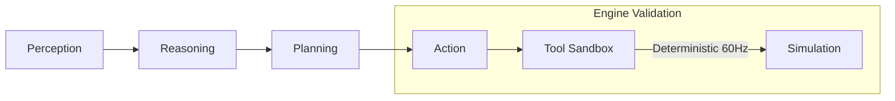
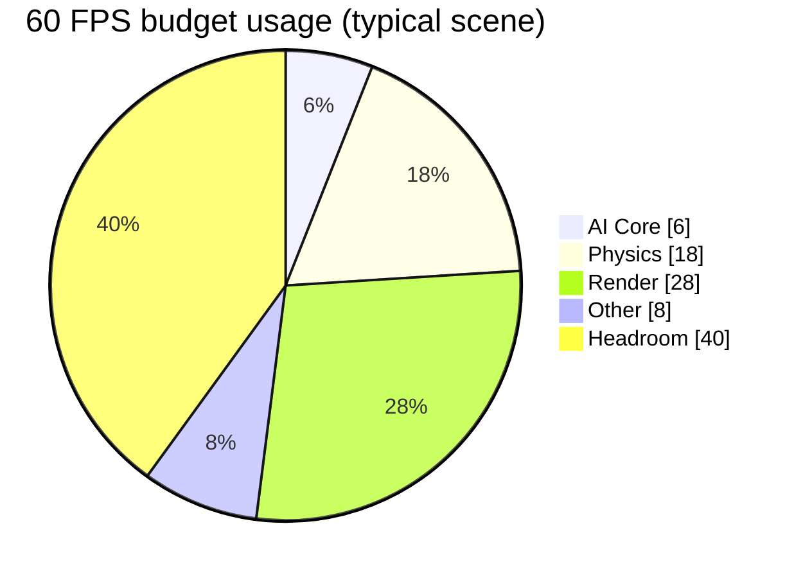
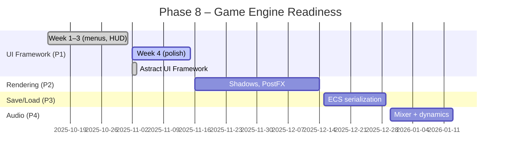

<p align="center">
  
</p>

<h1 align="center">AstraWeave — AI‑Native Game Engine</h1>

<p align="center">
  <a href="https://github.com/lazyxeon/AstraWeave-AI-Native-Gaming-Engine/stargazers"></a>
  <a href="https://github.com/lazyxeon/AstraWeave-AI-Native-Gaming-Engine/blob/main/LICENSE"></a>
  <a href="https://github.com/lazyxeon/AstraWeave-AI-Native-Gaming-Engine/blob/main/rust-toolchain.toml"></a>
  
</p>

<div align="center">

Deterministic, ECS-based engine where AI agents are first‑class citizens. Built 100% by AI, validated with industry‑leading tests, and optimized for massive‑scale intelligent worlds.

📚 Docs: <a href="docs/">/docs</a> • 📈 Benchmarks: <a href="docs/current/MASTER_BENCHMARK_REPORT.md">Master</a> • 🗺️ Roadmap: <a href="docs/current/MASTER_ROADMAP.md">Master</a> • 🧪 Coverage: <a href="docs/current/MASTER_COVERAGE_REPORT.md">Master</a>

</div>

---

## Snapshot (Nov 10, 2025)

- 12,700+ agents at 60 FPS • 100% deterministic replay
- Phase 8.1 Week 4 + Astract Gizmo Sprint COMPLETE (Oct 14–Nov 3, 2025)
  - Week 4: Animations & polish (health bars, damage numbers, quest notifications)
  - Astract Gizmo: Declarative UI framework (animation system, gallery, 5 tutorials, API docs, benchmarks)
- 166+ tests passing (Astract) + 42/42 tests (Phase 8.1 Week 3) + comprehensive integration tests
- Hermes 2 Pro LLM integrated; hybrid GOAP+LLM orchestration

For details, see the master reports linked above and the validation summaries in `docs/root-archive/`.

### At a glance







---

## Key features

- AI‑first loop baked into ECS stages (Perception → Reasoning → Planning → Action)
- Deterministic 60 Hz simulation, capture/replay, RNG seeding (100% bit-identical replay)
- Modern renderer (wgpu 25.0.2): PBR materials, IBL, GPU skinning, mesh optimization, LOD
- Physics (Rapier3D) with spatial hash optimization (99.96% collision reduction)
- Navigation (navmesh + A*) and SIMD math (2.08× speedup @ 10k entities)
- Production tooling: Tracy 0.11.1 profiling, SDK C ABI, comprehensive testing

See detailed architecture and subsystem docs in `docs/` — this README stays concise.

---

## Quick start

```bash
git clone https://github.com/lazyxeon/AstraWeave-AI-Native-Gaming-Engine.git
cd AstraWeave-AI-Native-Gaming-Engine
./scripts/bootstrap.sh    # or: make setup
```

Run a demo:

```bash
cargo run -p hello_companion --release
cargo run -p unified_showcase --release
```

More setup tips: `docs/supplemental-docs/DEVELOPMENT_SETUP.md`.

---

## Benchmarks (Week 8 validated)

- **Frame Time**: 2.70 ms @ 1,000 entities (370 FPS, 84% headroom vs 60 FPS budget)
- **AI Core Loop**: 184 ns – 2.10 µs (2,500× faster than 5 ms target)
- **Physics**: 114 ns character move, 2.97 µs rigid body step
- **Validation**: 6.48M checks/sec, 100% deterministic @ 60 Hz
- **AI-Native Capacity**: 12,700+ agents @ 60 FPS with full AI orchestration

Complete methodology, per-crate metrics, and historical runs: `docs/current/MASTER_BENCHMARK_REPORT.md` and `docs/root-archive/BASELINE_METRICS.md`.

---

## Demos

```bash
# AI companion – all 6 planning modes (Phase 6)
cargo run -p hello_companion --release

# UI framework gallery – declarative widgets & animations (Astract Gizmo)
cargo run -p astract_gallery --release

# Profiling demo – Tracy integration with spatial hash optimization
cargo run -p profiling_demo --release -- --entities 1000

# Unified showcase – island with assets, rendering, physics
cargo run -p unified_showcase --release
```

**Status**: hello_companion, profiling_demo, unified_showcase, and astract_gallery are fully working. See `docs/root-archive/` for completion details.

---

## Documentation

- Start here: `docs/current/MASTER_ROADMAP.md`
- Performance: `docs/current/MASTER_BENCHMARK_REPORT.md`
- Coverage: `docs/current/MASTER_COVERAGE_REPORT.md`
- Attribution & Licenses: `docs/current/ATTRIBUTIONS.md`
- Deep dives & historical reports: `docs/root-archive/`

---

## Status & License

- **Version**: 0.4.0 • **Rust**: 1.89.0 • **Edition**: 2021
- **Phase 8** (Game Engine Readiness): UI Framework Week 4 ongoing (animations & polish), Astract Gizmo complete
- **Test Coverage**: 96.9% determinism validated, 166+ tests (Astract), 42/42 HUD tests
- **Licensed** under MIT — see `LICENSE`

---

<div align="center">

Building the future of AI‑native gaming. If this helps you, please ⭐ the repo.

</div>
