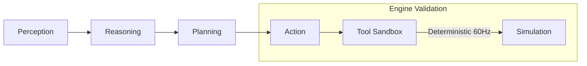
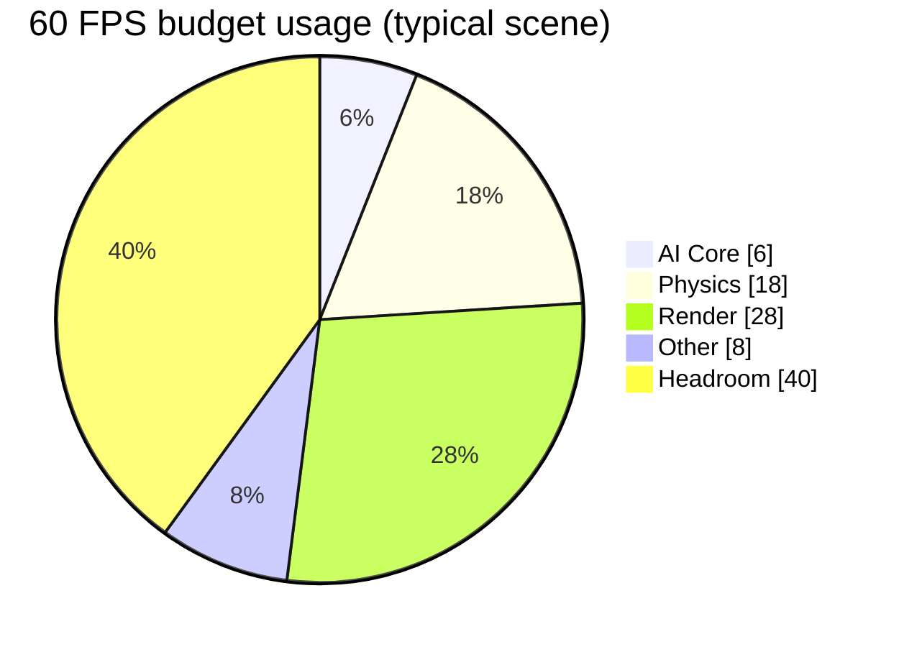
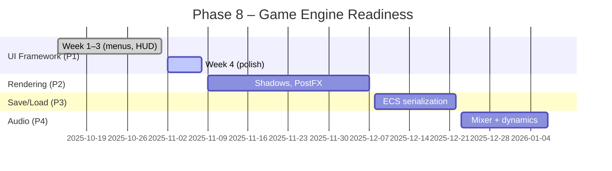

<p align="center">
  
</p>

<h1 align="center">AstraWeave — AI‑Native Game Engine</h1>

<p align="center">
  <a href="https://github.com/lazyxeon/AstraWeave-AI-Native-Gaming-Engine/stargazers"></a>
  <a href="https://github.com/lazyxeon/AstraWeave-AI-Native-Gaming-Engine/blob/main/LICENSE"></a>
  <a href="https://github.com/lazyxeon/AstraWeave-AI-Native-Gaming-Engine/blob/main/rust-toolchain.toml"></a>
  
</p>

<div align="center">

Deterministic, ECS-based engine where AI agents are first‑class citizens. Built 100% by AI, validated with industry‑leading tests, and optimized for massive‑scale intelligent worlds.

📚 Docs: <a href="docs/">/docs</a> • 📈 Benchmarks: <a href="docs/current/MASTER_BENCHMARK_REPORT.md">Master</a> • 🗺️ Roadmap: <a href="docs/current/MASTER_ROADMAP.md">Master</a> • 🧪 Coverage: <a href="docs/current/MASTER_COVERAGE_REPORT.md">Master</a>

</div>

---

## Snapshot (Nov 2025)

- 12,700+ agents at 60 FPS • 100% deterministic replay
- Option 3 Determinism Validation COMPLETE (Nov 1, 2025)
- Phase 8 Priority 1 (In‑game UI) in progress — Week 4 polish
- Hermes 2 Pro LLM integrated; hybrid GOAP+LLM orchestration

For details, see the master reports linked above and the validation summaries in `docs/root-archive/`.

### At a glance







---

## Key features

- AI‑first loop baked into ECS stages (Perception → Reasoning → Planning → Action)
- Deterministic 60 Hz simulation, capture/replay, RNG seeding
- Modern renderer (wgpu 25): materials, IBL, GPU skinning, mesh optimization, LODs
- Physics (Rapier3D) with spatial hash optimization
- Navigation (navmesh + A*) and SIMD math utilities
- Production tooling: Tracy profiling, SDK C ABI, CI validations

See detailed architecture and subsystem docs in `docs/` — this README stays concise.

---

## Quick start

```bash
git clone https://github.com/lazyxeon/AstraWeave-AI-Native-Gaming-Engine.git
cd AstraWeave-AI-Native-Gaming-Engine
./scripts/bootstrap.sh    # or: make setup
```

Run a demo:

```bash
cargo run -p hello_companion --release
cargo run -p unified_showcase --release
```

More setup tips: `docs/supplemental-docs/DEVELOPMENT_SETUP.md`.

---

## Benchmarks (high‑level)

- Perception: 1000 agents in ~2.01 ms
- Planning: 1.65M plans/sec (GOAP/BT)
- Validation: 6.48M checks/sec
- Full AI loop: ~0.885 ms/frame typical scene

Complete charts, methodology, and historical runs: `docs/current/MASTER_BENCHMARK_REPORT.md` and `docs/root-archive/BASELINE_METRICS.md`.

---

## Demos

```bash
# AI companion + hybrid arbiter
cargo run -p hello_companion --release

# Profiling demo (Tracy)
cargo run -p profiling_demo --release -- --entities 1000

# Unified showcase (island + assets)
cargo run -p unified_showcase --release
```

> Some legacy examples are excluded from default builds while APIs are migrating. Focus on the demos above.

---

## Documentation

- Start here: `docs/current/MASTER_ROADMAP.md`
- Performance: `docs/current/MASTER_BENCHMARK_REPORT.md`
- Coverage: `docs/current/MASTER_COVERAGE_REPORT.md`
- Attribution & Licenses: `docs/current/ATTRIBUTIONS.md`
- Deep dives & historical reports: `docs/root-archive/`

---

## Status & license

- Version: 0.8.0 • Rust 1.89.0
- Phase 8 (Game Engine Readiness): Priority 1 in progress
- Licensed under MIT — see `LICENSE`

---

<div align="center">

Building the future of AI‑native gaming. If this helps you, please ⭐ the repo.

</div>
