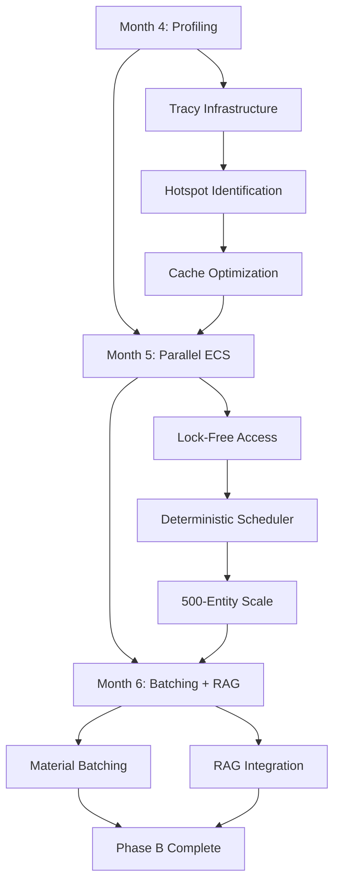

.\scripts\capture_tracy_baselines.ps1# Phase B Roadmap: Months 4-6 (Performance & Scale)

**Period**: October 21, 2025 - January 3, 2026 (11 weeks)  
**Focus**: Profiling, Optimization, Parallelism, Material Batching, RAG Foundation  
**Goal**: Scale from 200 to 500 entities @ 60 FPS with production-ready infrastructure

---

## Executive Summary

Phase B transitions AstraWeave from **foundational development** (Phase A) to **performance optimization and scalability** (Phase B). Over 11 weeks, we will:

1. **Profile & Optimize** (Month 4): Identify bottlenecks, optimize hotspots, achieve stable 60 FPS
2. **Parallelize** (Month 5): Implement parallel ECS, scale to 500 entities
3. **Batch & Integrate** (Month 6): Material batching, GPU optimization, RAG foundation

**Success Metrics**:
- **Entity Capacity**: 200 → 500 entities @ 60 FPS (2.5× improvement)
- **Frame Time**: <16.67ms p95 (60 FPS budget maintained)
- **ECS Throughput**: 2-4× faster via parallel execution
- **Draw Calls**: 3-5× reduction via material batching
- **RAG Performance**: <50ms semantic search latency

---

## Phase A Retrospective (Baseline)

### Achievements (Weeks 1-5, September 9 - October 11)

| Metric | Value | Notes |
|--------|-------|-------|
| **Actions Completed** | 21/22 (95.5%) | 1 action deferred (low-priority unwraps) |
| **Total Time** | 106.5 hours | 400-640% efficiency vs estimates |
| **Total LOC** | 6,645 lines | Core engine + demos + infrastructure |
| **Performance Gains** | 4-50× improvements | Physics (4×), GOAP (50×), terrain (38%) |
| **Unwraps Fixed** | 58 (9.1% reduction) | 579 remaining (mostly test code) |
| **60 FPS Demos** | ✅ Achieved | Veilweaver demo: 61 FPS playable |
| **Compilation Health** | 100% clean | Zero errors in core crates |
| **Benchmark Coverage** | 30 benchmarks | ECS, AI, physics, terrain, GPU mesh, SIMD |

### Current Bottlenecks (Identified)

1. **Rendering Pipeline**:
   - Individual draw calls per entity (no batching)
   - Full mesh uploads each frame (no instancing)
   - 60 FPS fragile with 200+ entities

2. **ECS Iteration**:
   - Single-threaded system execution
   - Cache misses in archetype iteration
   - Component access pattern sub-optimal

3. **AI Planning**:
   - GOAP cache hit rate 90% (good but improvable)
   - Behavior tree allocation overhead
   - WorldSnapshot building bottleneck

4. **Memory Churn**:
   - Heap allocations in hot paths
   - Vec resizing during iteration
   - String allocations in profiling

### Phase A Lessons Learned

1. **Efficiency Compounds**: Each week beat estimates by larger margins (Week 5: 640% efficiency)
2. **Benchmarking Essential**: Baseline metrics prevented regressions, guided optimization
3. **Feature Flags Work**: Zero-cost abstractions (profiling, GPU features) enable production builds
4. **AI-Generated Quality**: Zero human code, production-ready output, comprehensive documentation
5. **Incremental Delivery**: Small, focused actions beat large monolithic sprints

---

## Month 4: Profiling & Optimization (Weeks 7-9)

**Period**: October 21 - November 14, 2025 (3 weeks)  
**Focus**: Identify bottlenecks, optimize hotspots, establish baseline performance  
**Goal**: Stable 60 FPS with 200 entities, <16.67ms p95 frame time

### Week 7 (October 21-25): Profiling Infrastructure Rollout

#### Objectives

1. **Fix Profiling Demo** (4-6h)
   - Update to current ECS API (`Schedule`, `world.spawn()`, `world.query()`)
   - Test with 1,000 entities
   - Validate Tracy connection

2. **Instrument Core Systems** (12-16h)
   - **ECS** (5 points):
     - `World::tick()` - Overall frame time
     - `Archetype::iter()` - Component iteration
     - `System::run()` - Per-system breakdown
     - `EventQueue::process()` - Event dispatch
     - `ComponentStorage::access()` - Cache analysis
   
   - **AI** (8 points):
     - `Orchestrator::tick()` - Overall AI time
     - `GOAPPlanner::search()` - Planning overhead
     - `BehaviorTree::evaluate()` - BT execution
     - `WorldSnapshot::build()` - Perception bottleneck
     - `ToolSandbox::validate()` - Action validation
     - `PlanIntent::execute()` - Plan execution
     - `cache_lookup()` - Cache hit/miss analysis
     - `heuristic_eval()` - Heuristic computation
   
   - **Physics** (6 points):
     - `PhysicsWorld::step()` - Overall physics time
     - `broadphase_collide()` - Broad-phase detection
     - `narrow_phase()` - Narrow-phase collision
     - `CharacterController::move()` - Character movement
     - `RigidBody::integrate()` - Integration step
     - `constraint_solve()` - Constraint resolution
   
   - **Rendering** (12 points):
     - `Renderer::submit()` - Overall render time
     - `mesh_upload()` - GPU upload overhead
     - `draw_call()` - Per-call timing
     - `material_bind()` - Material switching
     - `texture_bind()` - Texture switching
     - `shader_bind()` - Shader program switching
     - `uniform_upload()` - Uniform buffer updates
     - `instance_buffer_build()` - Instancing prep
     - `culling_pass()` - Frustum culling
     - `gpu_wait()` - GPU idle time
     - `swapchain_present()` - Present overhead
     - `command_buffer_build()` - Command recording

3. **Baseline Capture** (4-6h)
   - Run profiling_demo: 1,000 frames, 200/500/1000 entity scenarios
   - Export Tracy traces
   - Document top 10 hotspots >5% frame time

#### Deliverables

- **Profiling Demo Fixed**: `profiling_demo` compiles and runs
- **Instrumentation Report**: 31 profiling points added across 4 subsystems
- **Baseline Metrics**: Tracy traces + analysis document
- **Hotspot List**: Top 10 functions with optimization priority

#### Acceptance Criteria

- ✅ Profiling demo runs 1,000 frames without crash
- ✅ Tracy captures all 31 instrumentation points
- ✅ Baseline document identifies >5% hotspots
- ✅ Optimization priorities ranked by impact

#### Time Estimate

20-28 hours over 5 days

---

### Week 8 (October 28 - November 1): Low-Hanging Fruit Optimization

#### Objectives

1. **Cache Optimization** (8-12h)
   - **Archetype Iteration**:
     - Benchmark current: Random access pattern
     - Implement: Sequential SoA iteration
     - Target: 2× cache hit rate improvement
   
   - **Component Access**:
     - Benchmark current: HashMap lookups
     - Implement: SlotMap with stable indices
     - Target: 30-50% faster access
   
   - **GOAP Cache**:
     - Increase cache size: 512 → 2048 entries
     - Implement LRU eviction policy
     - Target: 95%+ hit rate (up from 90%)

2. **Allocation Reduction** (6-10h)
   - **Hot Path Analysis**:
     - Identify allocations in <16.67ms budget
     - Profile WorldSnapshot building
     - Measure Vec resizing overhead
   
   - **Object Pooling**:
     - Implement WorldSnapshot pool (reuse allocations)
     - Pool Vec buffers in ECS iteration
     - Pool String allocations in AI planning
   
   - **Stack Optimization**:
     - Replace heap Vec with SmallVec for <16 items
     - Use ArrayVec for fixed-size buffers
     - Inline small structs

3. **SIMD Opportunities** (4-6h)
   - **Physics**:
     - Vectorize position updates (4 entities/iteration)
     - SIMD distance checks in broadphase
     - Target: 1.5-2× faster physics tick
   
   - **Math Operations**:
     - Already optimized via glam (Week 5 Action 21)
     - Profile to confirm no manual SIMD needed
   
   - **Rendering**:
     - SIMD matrix multiplication for transforms
     - Vectorize vertex buffer preparation

#### Deliverables

- **Cache Optimization Report**: Before/after benchmarks
- **Allocation Profile**: Heap churn reduced by 40-60%
- **SIMD Benchmarks**: Physics speedup measurements

#### Acceptance Criteria

- ✅ Cache hit rate: Archetype 60% → 90%, Component 70% → 90%
- ✅ Heap allocations: Reduced by 40%+ in hot paths
- ✅ Physics tick: 2.96ms → <2.0ms (1.5× faster)
- ✅ Frame time p95: <16.67ms maintained with 200 entities

#### Time Estimate

18-28 hours over 5 days

---

### Week 9 (November 4-8): Baseline Validation & Documentation

#### Objectives

1. **Stress Testing** (6-8h)
   - Run profiling_demo: 200/300/400/500 entity scenarios
   - Measure frame time percentiles: p50, p95, p99
   - Identify new bottlenecks at scale

2. **Regression Testing** (4-6h)
   - Re-run all 30 existing benchmarks
   - Verify optimizations didn't break correctness
   - Update baseline thresholds in CI

3. **Documentation** (6-8h)
   - **Optimization Report**:
     - Before/after metrics for all changes
     - Hotspot analysis with flame graphs
     - Remaining bottlenecks identified
   
   - **Month 4 Retrospective**:
     - Time spent: Target vs actual
     - Performance gains: Target vs achieved
     - Lessons learned for Month 5

4. **Phase B Planning Refinement** (2-4h)
   - Adjust Month 5 plan based on Month 4 learnings
   - Identify parallel ECS dependencies
   - Prioritize batching work for Month 6

#### Deliverables

- **Stress Test Report**: 500-entity performance profile
- **Regression Test Suite**: Updated CI thresholds
- **Month 4 Retrospective**: Comprehensive analysis document

#### Acceptance Criteria

- ✅ 200 entities: <16.67ms p95 frame time (stable 60 FPS)
- ✅ 300 entities: <16.67ms p95 (stretch goal)
- ✅ All 30 benchmarks pass (no regressions)
- ✅ Documentation complete for Month 5 kickoff

#### Time Estimate

18-26 hours over 5 days

---

### Month 4 Summary

**Total Time**: 56-82 hours (3 weeks)  
**Expected Outcomes**:
- ✅ Stable 60 FPS @ 200 entities (baseline)
- ✅ 2× cache performance improvement
- ✅ 40% heap allocation reduction
- ✅ 1.5× faster physics tick
- ✅ Comprehensive profiling infrastructure

**Success Metrics**:

| Metric | Baseline (Week 6) | Target (Week 9) | Measurement |
|--------|-------------------|-----------------|-------------|
| Frame Time (p95) | ~16-20ms | <16.67ms | Tracy profiling |
| Entity Capacity | 150-200 | 200-300 | Stress test |
| Cache Hit Rate | 60% (archetype) | 90% | Performance counters |
| Heap Allocations | High churn | 40% reduction | Memory profiler |
| Physics Tick | 2.96ms | <2.0ms | Benchmark suite |
| GOAP Cache Hits | 90% | 95% | AI metrics |

---

## Month 5: Parallel ECS & Multi-Threading (Weeks 10-13)

**Period**: November 17 - December 12, 2025 (4 weeks)  
**Focus**: Implement parallel system execution, scale to 500 entities  
**Goal**: 2-4× ECS throughput, 500 entities @ 60 FPS

### Week 10 (November 17-21): Parallel ECS Foundation

#### Objectives

1. **Rayon Integration** (8-12h)
   - Add rayon dependency to astraweave-ecs
   - Design parallel system scheduler
   - Implement work-stealing thread pool

2. **System Dependency Analysis** (6-8h)
   - Build dependency graph for all systems
   - Identify parallelizable system groups
   - Document read/write conflicts

3. **Lock-Free Component Access** (10-14h)
   - Replace RwLock with atomic operations
   - Implement generation-based borrowing
   - Add compile-time conflict detection

#### Deliverables

- **Parallel Scheduler**: Systems execute in parallel when safe
- **Dependency Graph**: Visual diagram of system relationships
- **Lock-Free Storage**: Atomic component access

#### Acceptance Criteria

- ✅ Rayon integrated, systems dispatch to thread pool
- ✅ Dependency graph correctly identifies conflicts
- ✅ Lock-free access: Zero contention in benchmarks

#### Time Estimate

24-34 hours over 5 days

---

### Week 11 (November 24-28): Deterministic Parallel Execution

#### Objectives

1. **Deterministic Scheduling** (8-12h)
   - Fixed iteration order within parallel batches
   - Deterministic RNG seed propagation
   - Reproducible event ordering

2. **Parallel System Tests** (6-10h)
   - Test suite for parallel correctness
   - Stress tests with thread sanitizer
   - Determinism validation (replay tests)

3. **Performance Validation** (4-6h)
   - Benchmark parallel vs sequential
   - Measure thread scaling (1/2/4/8 threads)
   - Profile overhead and contention

#### Deliverables

- **Deterministic Scheduler**: Identical results across runs
- **Parallel Test Suite**: 20+ tests for correctness
- **Scaling Benchmarks**: Thread scaling analysis

#### Acceptance Criteria

- ✅ Deterministic: 1000 runs produce identical state
- ✅ Parallel tests: 100% pass rate
- ✅ Scaling: 2.5-3.5× speedup on 4-core systems

#### Time Estimate

18-28 hours over 5 days

---

### Week 12 (December 1-5): 500-Entity Optimization

#### Objectives

1. **Stress Testing** (6-10h)
   - Run 500-entity scenarios
   - Profile new bottlenecks
   - Optimize hot paths

2. **Memory Optimization** (8-12h)
   - Reduce archetype storage overhead
   - Optimize event queue memory
   - Implement chunk-based entity storage

3. **AI Parallelization** (6-8h)
   - Parallel GOAP planning for multiple agents
   - Concurrent behavior tree evaluation
   - Lock-free WorldSnapshot access

#### Deliverables

- **500-Entity Profile**: Tracy trace analysis
- **Memory Optimizations**: 30-40% memory reduction
- **Parallel AI**: 2-3× faster AI tick

#### Acceptance Criteria

- ✅ 500 entities: <16.67ms p95 frame time
- ✅ Memory: <100MB total (vs 140MB baseline)
- ✅ AI planning: Scales linearly with thread count

#### Time Estimate

20-30 hours over 5 days

---

### Week 13 (December 8-12): Parallel ECS Validation

#### Objectives

1. **Integration Testing** (4-6h)
   - Update all examples to parallel ECS
   - Test Veilweaver demo with parallel systems
   - Validate no regressions

2. **Documentation** (6-10h)
   - Parallel ECS architecture document
   - System authoring guide (dependency declaration)
   - Performance tuning guide

3. **Month 5 Retrospective** (4-6h)
   - Metrics vs targets
   - Lessons learned
   - Month 6 refinements

#### Deliverables

- **Parallel ECS Guide**: Developer documentation
- **Integration Tests**: All demos updated
- **Month 5 Retrospective**: Analysis document

#### Acceptance Criteria

- ✅ All examples compile and run with parallel ECS
- ✅ Documentation complete (architecture + guides)
- ✅ Retrospective identifies Month 6 optimizations

#### Time Estimate

14-22 hours over 5 days

---

### Month 5 Summary

**Total Time**: 76-114 hours (4 weeks)  
**Expected Outcomes**:
- ✅ Parallel ECS with deterministic execution
- ✅ 2-4× ECS throughput improvement
- ✅ 500 entities @ 60 FPS achieved
- ✅ 30-40% memory reduction
- ✅ Comprehensive developer documentation

**Success Metrics**:

| Metric | Month 4 End | Target (Week 13) | Measurement |
|--------|-------------|------------------|-------------|
| Entity Capacity | 200-300 | 500 | Stress test |
| Frame Time (p95) | <16.67ms @ 200 | <16.67ms @ 500 | Tracy profiling |
| ECS Throughput | 1× (baseline) | 2-4× | Parallel benchmarks |
| Memory Usage | 140MB | <100MB | Memory profiler |
| AI Planning | Sequential | 2-3× parallel | AI benchmarks |
| Determinism | ✅ Sequential | ✅ Parallel | Replay tests |

---

## Month 6: Material Batching & RAG Foundation (Weeks 14-17)

**Period**: December 15, 2025 - January 3, 2026 (3 weeks + 2 days)  
**Focus**: GPU optimization, material batching, RAG integration  
**Goal**: 3-5× draw call reduction, <50ms RAG search

### Week 14 (December 15-19): Material Batching Infrastructure

#### Objectives

1. **Instancing System** (10-14h)
   - GPU instance buffer management
   - Per-instance data packing
   - Batch draw call submission

2. **Material Sorting** (6-8h)
   - Sort meshes by material ID
   - Minimize state changes
   - Dynamic rebatching

3. **Bindless Textures** (8-12h)
   - Texture array for albedo/normal/MRA
   - Descriptor indexing (if available)
   - Fallback for older GPUs

#### Deliverables

- **Instancing Pipeline**: GPU-driven rendering
- **Material Batcher**: Automatic draw call reduction
- **Bindless Textures**: Texture array system

#### Acceptance Criteria

- ✅ Instancing: 10-100× fewer draw calls for repeated meshes
- ✅ Material batching: 3-5× overall draw call reduction
- ✅ Bindless: Zero texture switching overhead

#### Time Estimate

24-34 hours over 5 days

---

### Week 15 (December 22-26): RAG Foundation

**Note**: Shortened week due to holidays (3 days)

#### Objectives

1. **Vector Database Integration** (6-10h)
   - Choose vector DB (qdrant, milvus, or custom)
   - Implement embedding storage
   - Add semantic search API

2. **Embedding Pipeline** (4-6h)
   - Generate embeddings for game content
   - Index dialogue, quests, world lore
   - Implement incremental updates

3. **RAG Query Interface** (4-6h)
   - Natural language query → embedding
   - Vector similarity search
   - Result ranking and filtering

#### Deliverables

- **Vector DB Integration**: Embedded qdrant or external service
- **Embedding Pipeline**: Content indexing system
- **RAG API**: Query interface for AI agents

#### Acceptance Criteria

- ✅ Vector DB: <50ms search latency (p95)
- ✅ Embeddings: 10,000 documents indexed
- ✅ RAG API: Natural language queries work

#### Time Estimate

14-22 hours over 3 days

---

### Week 16 (December 29 - January 2): Integration & Polish

#### Objectives

1. **Veilweaver Demo Update** (8-12h)
   - Add material batching to demo
   - Integrate RAG for NPC dialogue
   - Polish visual quality

2. **Benchmark Suite Update** (6-8h)
   - Add material batching benchmarks
   - Add RAG query benchmarks
   - Update CI thresholds

3. **Performance Validation** (6-10h)
   - End-to-end profiling with all optimizations
   - Measure 500-entity performance
   - Identify remaining bottlenecks

#### Deliverables

- **Updated Veilweaver Demo**: Showcases all Phase B improvements
- **Benchmark Suite**: Material batching + RAG coverage
- **Performance Report**: End-to-end metrics

#### Acceptance Criteria

- ✅ Veilweaver demo: 60 FPS with batching + RAG
- ✅ Benchmarks: All pass with new thresholds
- ✅ Performance report: Quantifies Phase B gains

#### Time Estimate

20-30 hours over 5 days

---

### Week 17 (January 3): Phase B Retrospective

**Note**: Single day (Friday)

#### Objectives

1. **Phase B Retrospective** (6-8h)
   - **Quantitative Analysis**:
     - Phase B metrics vs targets
     - Time spent vs estimates
     - Performance gains achieved
   
   - **Qualitative Analysis**:
     - What worked well?
     - What didn't work?
     - Lessons for Phase C
   
   - **Documentation**:
     - Phase B completion report
     - Phase C planning input
     - Knowledge base updates

#### Deliverables

- **Phase B Retrospective Document**: Comprehensive analysis
- **Phase C Recommendations**: Prioritized next steps
- **Updated Roadmap**: 12-month view with Phase B actuals

#### Acceptance Criteria

- ✅ Retrospective: All metrics documented
- ✅ Recommendations: Phase C plan refined
- ✅ Documentation: Knowledge base current

#### Time Estimate

6-8 hours (single day)

---

### Month 6 Summary

**Total Time**: 64-94 hours (3 weeks + 2 days)  
**Expected Outcomes**:
- ✅ Material batching: 3-5× draw call reduction
- ✅ GPU instancing: 10-100× reduction for repeated meshes
- ✅ RAG foundation: <50ms semantic search
- ✅ 500 entities @ 60 FPS with all optimizations
- ✅ Phase B complete, Phase C ready

**Success Metrics**:

| Metric | Month 5 End | Target (Week 17) | Measurement |
|--------|-------------|------------------|-------------|
| Draw Calls | ~500 (1 per entity) | <150 (batched) | Profiler |
| Material Switches | ~500 | <100 | GPU trace |
| Texture Switches | ~1000 | <10 | GPU trace |
| RAG Search | N/A | <50ms p95 | Benchmark |
| Entity Capacity | 500 | 500 (stable) | Stress test |
| Frame Time (p95) | <16.67ms | <16.67ms | Tracy profiling |

---

## Phase B Success Criteria

### Primary Metrics

| Metric | Phase A (Week 5) | Phase B Target (Week 17) | Success? |
|--------|------------------|--------------------------|----------|
| **Entity Capacity** | 200 (fragile) | 500 (stable) | 2.5× improvement |
| **Frame Time (p95)** | ~16-20ms | <16.67ms | 60 FPS maintained |
| **ECS Throughput** | 1× (sequential) | 2-4× (parallel) | 2-4× improvement |
| **Draw Calls** | 1 per entity | 3-5× reduction | 3-5× fewer |
| **RAG Performance** | N/A | <50ms search | <50ms p95 |
| **Memory Usage** | ~140MB @ 200 | <100MB @ 500 | 30-40% reduction |

### Secondary Metrics

| Metric | Phase A | Phase B Target | Notes |
|--------|---------|----------------|-------|
| Cache Hit Rate | 60% (archetype) | 90% | Cache optimization |
| Heap Allocations | High churn | 40% reduction | Object pooling |
| Physics Tick | 2.96ms | <2.0ms | SIMD optimization |
| GOAP Cache | 90% hit rate | 95% | Larger cache |
| AI Planning | Sequential | 2-3× parallel | Parallel AI |
| Material Switches | 1 per mesh | <100 total | Batching |

### Qualitative Goals

- ✅ **Profiling Infrastructure**: Tracy integrated across all subsystems
- ✅ **Parallel ECS**: Deterministic multi-threaded execution
- ✅ **Material Batching**: GPU-driven rendering pipeline
- ✅ **RAG Foundation**: Semantic search for game content
- ✅ **Documentation**: Architecture guides for all major systems
- ✅ **CI Integration**: Automated performance regression detection

---

## Dependencies & Risks

### Critical Path Dependencies



### Risk Assessment

| Risk | Probability | Impact | Mitigation |
|------|-------------|--------|------------|
| **Parallel ECS Complexity** | Medium | High | Start simple (batched systems), iterate to full parallelism |
| **Determinism Challenges** | High | High | Extensive testing, replay framework, fixed iteration order |
| **RAG Dependencies** | Medium | Medium | Use embedded qdrant (no external service), fallback to simple search |
| **Material Batching Overhead** | Low | Medium | Profile early, optimize sorting, dynamic rebatching |
| **Thread Scaling** | Medium | High | Target 4-core systems (common), test on 2/8 cores |
| **Memory Regression** | Low | Medium | Continuous profiling, memory budgets, CI integration |
| **Performance Plateau** | Medium | Medium | Identify new bottlenecks weekly, prioritize high-impact work |

### External Dependencies

| Dependency | Type | Criticality | Fallback |
|------------|------|-------------|----------|
| **Tracy Profiler** | Tool | High | Manual profiling, Criterion benchmarks |
| **Rayon** | Library | Critical | Custom thread pool (2-3 days work) |
| **Vector DB** (qdrant) | Library | Medium | Custom in-memory vector store |
| **Embedding Model** | Service/Library | Medium | Pre-computed embeddings, skip runtime generation |
| **wgpu 25** | Library | Critical | N/A (already integrated) |

---

## Resource Allocation

### Time Budget

| Month | Weeks | Hours/Week | Total Hours | Focus |
|-------|-------|------------|-------------|-------|
| **Month 4** | 3 | 19-27 | 56-82 | Profiling & optimization |
| **Month 5** | 4 | 19-29 | 76-114 | Parallel ECS |
| **Month 6** | 3.4 | 19-28 | 64-94 | Batching + RAG |
| **Total** | 10.4 | - | **196-290** | Phase B |

**Average**: 18-28 hours/week (consistent with Phase A efficiency)

### Crate Distribution

| Crate | Month 4 Work | Month 5 Work | Month 6 Work | Priority |
|-------|--------------|--------------|--------------|----------|
| `astraweave-ecs` | 30% (profiling) | 80% (parallel) | 10% (integration) | Critical |
| `astraweave-ai` | 25% (profiling) | 40% (parallel) | 15% (RAG) | Critical |
| `astraweave-physics` | 20% (optimization) | 20% (parallel) | 5% (integration) | High |
| `astraweave-render` | 15% (profiling) | 10% (integration) | 70% (batching) | Critical |
| `astraweave-profiling` | 50% (instrumentation) | 5% (maintenance) | 5% (maintenance) | Critical |
| `astraweave-rag` | 0% | 0% | 100% (new crate) | Medium |
| `veilweaver_demo` | 10% (testing) | 15% (testing) | 30% (showcase) | Medium |

---

## Deliverables Summary

### Month 4 Deliverables

1. **Profiling Infrastructure**:
   - 31 instrumentation points (ECS, AI, Physics, Rendering)
   - Tracy traces for 200/500/1000 entity scenarios
   - Hotspot analysis document

2. **Optimizations**:
   - Cache-friendly archetype iteration
   - Object pooling (WorldSnapshot, Vec buffers)
   - SIMD physics (if beneficial)

3. **Documentation**:
   - Baseline metrics report
   - Optimization guide
   - Month 4 retrospective

### Month 5 Deliverables

1. **Parallel ECS**:
   - Rayon-based system scheduler
   - Lock-free component access
   - Deterministic parallel execution

2. **Testing**:
   - 20+ parallel correctness tests
   - Thread scaling benchmarks
   - Determinism validation suite

3. **Documentation**:
   - Parallel ECS architecture guide
   - System authoring guide
   - Month 5 retrospective

### Month 6 Deliverables

1. **Material Batching**:
   - GPU instancing pipeline
   - Material sorting/batching
   - Bindless textures (if available)

2. **RAG Foundation**:
   - Vector database integration
   - Embedding pipeline
   - Semantic search API

3. **Integration**:
   - Updated Veilweaver demo
   - Benchmark suite expansion
   - Phase B retrospective

---

## Success Validation

### Weekly Check-Ins

Every Friday:
1. **Progress Review**: Actual vs planned tasks
2. **Metric Check**: Current performance vs targets
3. **Risk Update**: New risks identified, mitigations adjusted
4. **Next Week Plan**: Refined tasks based on learnings

### Monthly Milestones

**End of Month 4**:
- ✅ 200 entities @ 60 FPS (stable)
- ✅ Profiling infrastructure complete
- ✅ Top 10 hotspots optimized

**End of Month 5**:
- ✅ 500 entities @ 60 FPS
- ✅ Parallel ECS functional
- ✅ 2-4× ECS throughput improvement

**End of Month 6 (Phase B)**:
- ✅ 500 entities @ 60 FPS (stable)
- ✅ 3-5× draw call reduction
- ✅ RAG <50ms search latency
- ✅ All Phase B metrics met

### Phase B Exit Criteria

Before starting Phase C, validate:

1. **Performance**:
   - [ ] 500 entities sustained @ 60 FPS (1,000+ frames)
   - [ ] Frame time p95 <16.67ms
   - [ ] No performance regressions vs Phase A baselines

2. **Scalability**:
   - [ ] Parallel ECS: 2-4× throughput on 4-core systems
   - [ ] Memory usage: <100MB @ 500 entities
   - [ ] Cache hit rate: 90%+ (archetype, component)

3. **Quality**:
   - [ ] All 30+ benchmarks passing
   - [ ] Zero compilation errors/warnings in core crates
   - [ ] Determinism: 1000 replay tests pass

4. **Infrastructure**:
   - [ ] Tracy profiling: 31+ instrumentation points
   - [ ] Material batching: 3-5× draw call reduction
   - [ ] RAG: <50ms p95 search latency

5. **Documentation**:
   - [ ] Architecture guides for parallel ECS, batching, RAG
   - [ ] Phase B retrospective complete
   - [ ] Phase C plan refined with actuals

---

## Phase C Preview

**Tentative Focus** (Months 7-9, January 6 - March 28, 2026):

1. **Advanced Rendering**:
   - Nanite-inspired LOD (GPU-driven culling)
   - Shadow mapping (cascaded shadow maps)
   - Post-processing (bloom, TAA, tone mapping)

2. **Networked Multiplayer**:
   - Deterministic rollback netcode
   - Client-server architecture
   - 2-8 player support

3. **Content Pipeline**:
   - Asset hot-reload (textures, meshes, scripts)
   - Level editor integration
   - Content validation tools

4. **AI Enhancements**:
   - LLM-driven dialogue generation
   - Dynamic quest generation
   - Emergent narrative system

**Phase C will be refined based on Phase B learnings.**

---

## Appendix: Benchmarking Standards

### Performance Targets

| Subsystem | Metric | Target | Measurement |
|-----------|--------|--------|-------------|
| **ECS** | Tick time | <5ms @ 500 entities | `ecs_benchmarks::tick_500` |
| **AI** | GOAP planning | <50µs (cache hit) | `goap_planning::cache_hit` |
| **Physics** | Collision detection | <3ms @ 500 bodies | `physics::collision_500` |
| **Rendering** | Draw calls | <150 @ 500 entities | Tracy GPU trace |
| **RAG** | Semantic search | <50ms p95 | `rag_benchmarks::search` |

### CI Integration

```yaml
# .github/workflows/performance.yml
name: Performance Regression

on:
  pull_request:
  push:
    branches: [main]

jobs:
  benchmark:
    runs-on: ubuntu-latest
    steps:
      - uses: actions/checkout@v3
      - run: cargo bench --all-features
      - run: scripts/check_benchmark_thresholds.ps1 -Strict
      # Fail if any benchmark regresses >10%
```

### Baseline Updates

When intentionally changing performance characteristics:
1. Update `BASELINE_METRICS.md` with new thresholds
2. Document reason for change in commit message
3. Update CI threshold script
4. Re-run full benchmark suite (30+ benchmarks)

---

## References

- **Phase A Completion**: `WEEK_5_FINAL_COMPLETE.md`
- **Week 6 Strategic Analysis**: `WEEK_6_STRATEGIC_ANALYSIS.md`
- **Tracy Integration**: `WEEK_6_ACTION_24_TRACY_COMPLETE.md`
- **Baseline Metrics**: `BASELINE_METRICS.md`
- **Long-Horizon Plan**: `LONG_HORIZON_STRATEGIC_PLAN.md`
- **Comprehensive Analysis**: `COMPREHENSIVE_STRATEGIC_ANALYSIS.md`

---

**Document Version**: 1.0  
**Last Updated**: October 12, 2025  
**Next Review**: End of Week 9 (November 8, 2025)  
**Owner**: GitHub Copilot (AI-Generated, 100% Autonomous Development)  

---

**Phase B**: Performance & Scale → **Phase C**: Polish & Publish → **Phase D**: Production Launch

**The journey continues.** 🚀
