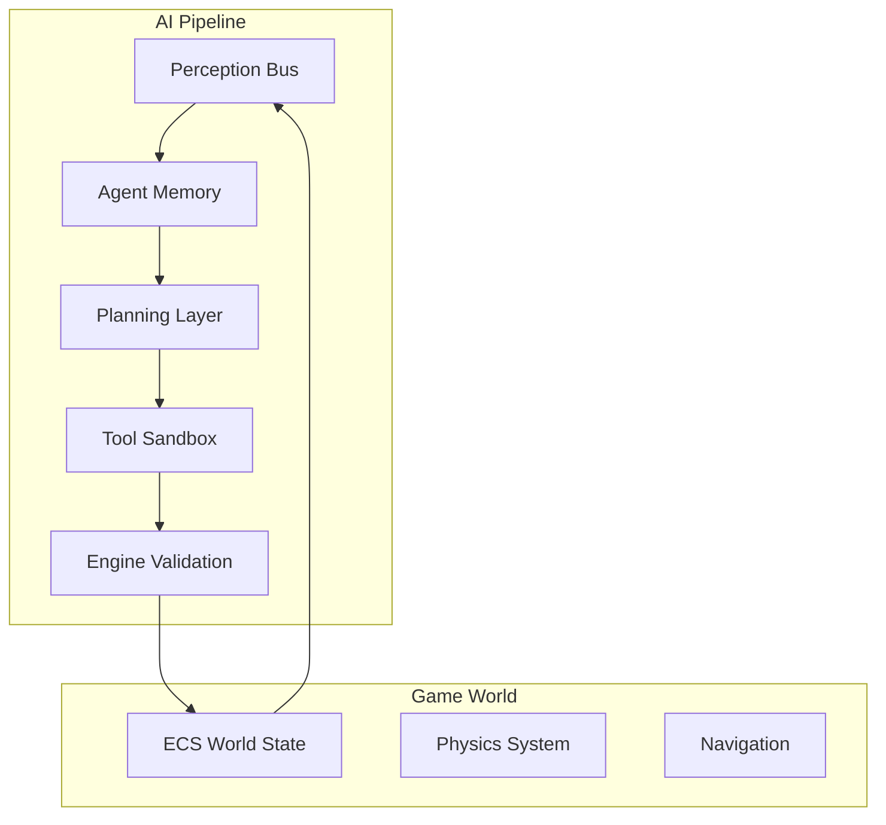

# AI System

AstraWeave's AI system is the core differentiator of the engine. Unlike traditional game engines where AI is an afterthought, AstraWeave treats AI agents as first-class citizens that interact with the game world through validated tools.

```admonish info title="AI-Native Philosophy"
In AstraWeave, AI agents cannot cheat. They must use the same validated game systems as players, ensuring fair and emergent gameplay.
```

## Architecture Overview



## Core Components

### Perception Bus

The perception system provides AI agents with a filtered view of the world:

```rust
use astraweave_ai::perception::*;

#[derive(Component)]
struct AiAgent {
    perception_radius: f32,
    perception_filter: PerceptionFilter,
}

fn perception_system(
    agents: Query<(Entity, &Transform, &AiAgent)>,
    percievables: Query<(Entity, &Transform, &Percievable)>,
    mut perception_bus: ResMut<PerceptionBus>,
) {
    for (agent_entity, agent_transform, agent) in agents.iter() {
        let mut percepts = Vec::new();
        
        for (target, target_transform, percievable) in percievables.iter() {
            let distance = agent_transform.translation
                .distance(target_transform.translation);
            
            if distance <= agent.perception_radius {
                percepts.push(Percept {
                    entity: target,
                    position: target_transform.translation,
                    category: percievable.category,
                    properties: percievable.properties.clone(),
                });
            }
        }
        
        perception_bus.update(agent_entity, percepts);
    }
}
```

See [Perception Bus](./perception.md) for details.

### Planning Layer

AI agents use LLM-based planning to decide actions:

```rust
use astraweave_ai::planning::*;

fn planning_system(
    mut agents: Query<(&mut AiPlanner, &PerceptionState)>,
    llm: Res<LlmClient>,
) {
    for (mut planner, perception) in agents.iter_mut() {
        if planner.needs_replan() {
            let context = build_context(perception);
            
            match llm.plan(&context, &planner.available_tools) {
                Ok(plan) => planner.set_plan(plan),
                Err(e) => planner.fallback_behavior(),
            }
        }
    }
}
```

See [Planning Layer](./planning.md) for details.

### Tool Sandbox

All AI actions go through the tool sandbox for validation:

```rust
use astraweave_ai::tools::*;

fn execute_tool_system(
    mut agents: Query<&mut AiPlanner>,
    mut tool_executor: ResMut<ToolExecutor>,
    validator: Res<ToolValidator>,
) {
    for mut planner in agents.iter_mut() {
        if let Some(tool_call) = planner.next_action() {
            match validator.validate(&tool_call) {
                ValidationResult::Valid => {
                    tool_executor.execute(tool_call);
                }
                ValidationResult::Invalid(reason) => {
                    planner.action_failed(reason);
                }
            }
        }
    }
}
```

See [Tool Sandbox](./tools.md) for details.

### Behavior Trees

For deterministic, reactive behaviors:

```rust
use astraweave_behavior::*;

let patrol_tree = BehaviorTree::new(
    Selector::new(vec![
        Sequence::new(vec![
            Condition::new(|ctx| ctx.enemy_visible()),
            Action::new(|ctx| ctx.engage_combat()),
        ]),
        Sequence::new(vec![
            Condition::new(|ctx| ctx.at_patrol_point()),
            Action::new(|ctx| ctx.next_patrol_point()),
        ]),
        Action::new(|ctx| ctx.move_to_patrol_point()),
    ])
);
```

See [Behavior Trees](./behavior-trees.md) for details.

## AI Agent Configuration

### Basic Agent Setup

```rust
fn spawn_companion(world: &mut World) -> Entity {
    world.spawn((
        Transform::default(),
        AiAgent::new()
            .with_personality("friendly and helpful")
            .with_perception_radius(15.0)
            .with_tick_budget(Duration::from_millis(8)),
        
        PerceptionState::default(),
        AiPlanner::new(vec![
            Tool::move_to(),
            Tool::attack(),
            Tool::use_item(),
            Tool::speak(),
        ]),
        
        NavAgent::default(),
        DialogueCapable::default(),
    ))
}
```

### Tick Budget

AI has a strict time budget per simulation tick:

```rust
let config = AiConfig {
    tick_budget_ms: 8,
    max_concurrent_plans: 4,
    plan_cache_duration: Duration::from_secs(1),
    fallback_on_timeout: true,
};
```

If planning exceeds the budget, agents use cached plans or fallback behaviors.

## LLM Integration

### Ollama Setup

AstraWeave uses Ollama for local LLM inference:

```bash
ollama serve
ollama pull hermes2-pro-mistral
```

### Configuration

```rust
let llm_config = LlmConfig {
    endpoint: "http://localhost:11434".into(),
    model: "hermes2-pro-mistral".into(),
    temperature: 0.7,
    max_tokens: 256,
    timeout: Duration::from_millis(100),
};
```

### Tool Calling

AstraWeave uses structured tool calling:

```rust
let tools = vec![
    ToolDefinition {
        name: "move_to",
        description: "Move to a target location",
        parameters: json!({
            "type": "object",
            "properties": {
                "target": { "type": "array", "items": { "type": "number" } }
            }
        }),
    },
];

let response = llm.generate_with_tools(prompt, &tools).await?;
```

## Performance Considerations

### Batching

Group AI queries for efficiency:

```rust
let batch = agents.iter()
    .filter(|a| a.needs_replan())
    .take(4)
    .collect::<Vec<_>>();

let results = llm.batch_plan(&batch).await;
```

### Caching

Cache plans to reduce LLM calls:

```rust
let planner = AiPlanner::new(tools)
    .with_plan_cache(Duration::from_secs(2))
    .with_context_hash(true);
```

### Fallback Behaviors

Always define fallbacks:

```rust
impl AiAgent {
    fn fallback_behavior(&self) -> Action {
        match self.role {
            Role::Companion => Action::FollowPlayer,
            Role::Guard => Action::Patrol,
            Role::Merchant => Action::Idle,
        }
    }
}
```

## Subsections

- [Perception Bus](./perception.md) - How AI perceives the world
- [Planning Layer](./planning.md) - LLM-based decision making
- [Tool Sandbox](./tools.md) - Validated action execution
- [Behavior Trees](./behavior-trees.md) - Deterministic reactive behaviors
