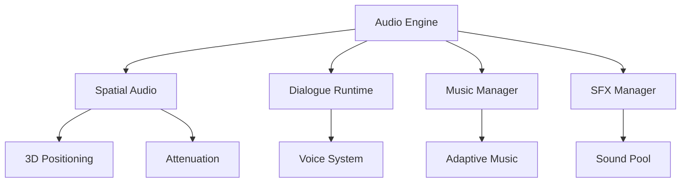
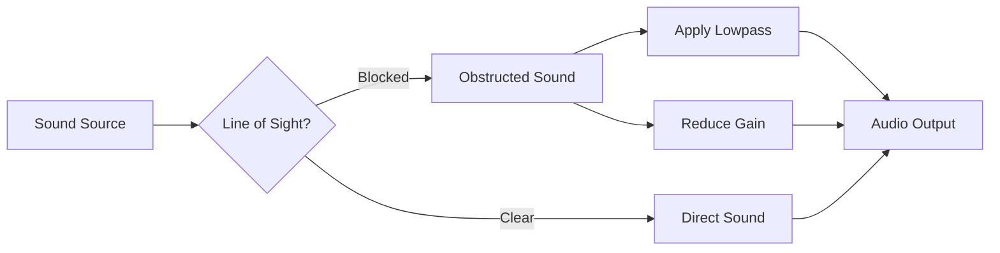
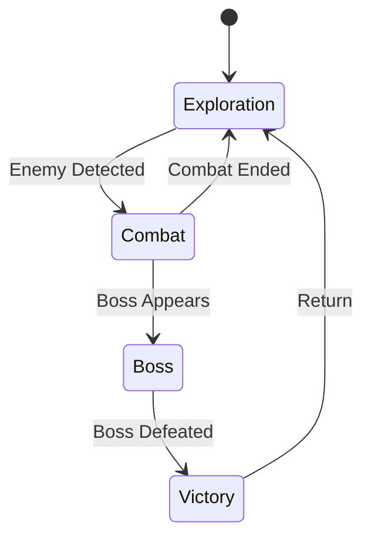

# Audio System

AstraWeave's audio system provides comprehensive spatial audio, dialogue management, and music/SFX playback capabilities using modern Rust audio libraries (kira/rodio).

## Architecture Overview

The audio system is designed for real-time game audio with low latency, spatial positioning, and dynamic mixing.



### Key Components

- **Audio Engine**: Core audio processing and device management
- **Spatial Audio**: 3D positional audio with HRTF and distance attenuation
- **Dialogue Runtime**: Conversation system with voice line playback
- **Music Manager**: Adaptive music with crossfading and layering
- **SFX Manager**: Sound effect pooling and priority management

```admonish info
The audio system supports multiple backends (WASAPI, ALSA, CoreAudio) and automatically selects the best available option for the platform.
```

## Audio Engine Initialization

### Basic Setup

```rust
use astraweave_audio::{AudioEngine, AudioConfig};

let config = AudioConfig {
    sample_rate: 48000,
    buffer_size: 512,
    num_channels: 2,
    enable_spatial_audio: true,
    max_voices: 64,
    ..Default::default()
};

let mut audio_engine = AudioEngine::new(config)?;
```

### Backend Selection

```rust
use astraweave_audio::backend::{AudioBackend, BackendType};

// Explicitly select backend
let backend = AudioBackend::new(BackendType::WASAPI)?;
let audio_engine = AudioEngine::with_backend(backend, config)?;

// Or use automatic selection
let audio_engine = AudioEngine::auto_detect(config)?;
```

```admonish tip
For lowest latency on Windows, use WASAPI in exclusive mode. For compatibility, use the automatic backend selection.
```

## Spatial Audio

AstraWeave's spatial audio system provides realistic 3D sound positioning with distance attenuation, obstruction, and HRTF (Head-Related Transfer Function) support.

### 3D Audio Listener

```rust
use astraweave_audio::spatial::{AudioListener, ListenerOrientation};

// Create listener (typically attached to camera/player)
let mut listener = AudioListener::new();

// Update listener position and orientation each frame
listener.set_position([player_pos.x, player_pos.y, player_pos.z]);
listener.set_orientation(ListenerOrientation {
    forward: [forward.x, forward.y, forward.z],
    up: [up.x, up.y, up.z],
});

audio_engine.set_listener(listener);
```

### Spatial Sound Sources

```rust
use astraweave_audio::spatial::{SpatialSound, AttenuationModel};

// Load and play spatial sound
let sound = audio_engine.load_sound("assets/audio/footstep.ogg")?;

let spatial_sound = SpatialSound::new(sound)
    .with_position([10.0, 0.0, 5.0])
    .with_velocity([0.0, 0.0, 0.0]) // For Doppler effect
    .with_attenuation(AttenuationModel::InverseDistance {
        reference_distance: 1.0,
        max_distance: 50.0,
        rolloff_factor: 1.0,
    })
    .with_cone(90.0, 180.0, 0.5) // Directional sound
    .with_volume(0.8);

let handle = audio_engine.play_spatial(spatial_sound)?;
```

### Attenuation Models

AstraWeave supports multiple distance attenuation models:

| Model | Formula | Use Case |
|-------|---------|----------|
| **Linear** | `1 - d/max` | Simple, predictable falloff |
| **Inverse Distance** | `ref / (ref + rolloff * (d - ref))` | Realistic physical attenuation |
| **Exponential** | `(d / ref)^(-rolloff)` | Dramatic falloff for emphasis |
| **Custom** | User-defined curve | Complete control |

```rust
use astraweave_audio::spatial::AttenuationModel;

// Custom attenuation curve
let custom_attenuation = AttenuationModel::Custom(Box::new(|distance| {
    if distance < 5.0 {
        1.0
    } else if distance < 20.0 {
        1.0 - ((distance - 5.0) / 15.0).powi(2)
    } else {
        0.0
    }
}));
```

### Doppler Effect

```rust
// Enable Doppler shift based on velocity
spatial_sound.set_doppler_factor(1.0); // 1.0 = realistic, 0.0 = disabled
spatial_sound.set_velocity([velocity.x, velocity.y, velocity.z]);
```

### Obstruction and Occlusion

```rust
use astraweave_audio::spatial::Obstruction;

// Simple obstruction (lowpass filter based on raycast)
if raycast_to_listener_blocked {
    spatial_sound.set_obstruction(Obstruction {
        direct_gain: 0.3,      // Reduce direct sound
        lowpass_cutoff: 1000.0, // Apply lowpass filter
    });
} else {
    spatial_sound.clear_obstruction();
}
```



## Dialogue Runtime

The dialogue runtime manages conversation playback with support for branching, voice lines, and subtitles.

### Dialogue Graph

```rust
use astraweave_audio::dialogue::{DialogueGraph, DialogueNode, DialogueChoice};

let mut dialogue = DialogueGraph::new();

// Add dialogue nodes
let node1 = dialogue.add_node(DialogueNode {
    id: "greeting",
    speaker: "NPC_Guard",
    text: "Halt! What's your business here?",
    voice_line: Some("assets/voice/guard_greeting.ogg"),
    duration: 3.0,
});

let node2 = dialogue.add_node(DialogueNode {
    id: "response_friendly",
    speaker: "Player",
    text: "Just passing through, friend.",
    voice_line: Some("assets/voice/player_friendly.ogg"),
    duration: 2.5,
});

let node3 = dialogue.add_node(DialogueNode {
    id: "response_hostile",
    speaker: "Player",
    text: "None of your concern.",
    voice_line: Some("assets/voice/player_hostile.ogg"),
    duration: 2.0,
});

// Add choices
dialogue.add_choice(node1, DialogueChoice {
    text: "Be friendly",
    next_node: node2,
    condition: None,
});

dialogue.add_choice(node1, DialogueChoice {
    text: "Be hostile",
    next_node: node3,
    condition: None,
});
```

### Playing Dialogue

```rust
use astraweave_audio::dialogue::DialoguePlayer;

let mut player = DialoguePlayer::new(&audio_engine);

// Start dialogue
player.start_dialogue(dialogue, "greeting")?;

// Update each frame
loop {
    player.update(delta_time)?;
    
    if let Some(current_node) = player.current_node() {
        println!("Speaker: {}", current_node.speaker);
        println!("Text: {}", current_node.text);
        
        // Display choices when node finishes
        if player.is_waiting_for_choice() {
            let choices = player.available_choices();
            for (idx, choice) in choices.iter().enumerate() {
                println!("{}: {}", idx, choice.text);
            }
        }
    }
    
    if player.is_finished() {
        break;
    }
}

// Handle player input
player.select_choice(0)?; // Select first choice
```

### Voice System

```rust
use astraweave_audio::voice::{VoiceConfig, VoiceEffect};

// Configure voice processing
let voice_config = VoiceConfig {
    normalize: true,
    compress: true,      // Dynamic range compression
    eq_preset: Some(VoiceEffect::RadioFilter), // Apply effects
    ducking: true,       // Duck music/sfx during dialogue
};

player.set_voice_config(voice_config);
```

### Subtitle Synchronization

```rust
use astraweave_audio::dialogue::SubtitleTrack;

// Load subtitle track
let subtitles = SubtitleTrack::load("assets/dialogue/quest1.srt")?;
player.set_subtitles(subtitles);

// Get current subtitle
if let Some(subtitle) = player.current_subtitle() {
    ui.draw_subtitle(subtitle.text, subtitle.speaker);
}
```

```admonish warning
Ensure voice line durations match actual audio file lengths. Use the `analyze_duration()` function to automatically detect durations from audio files.
```

## Music Manager

The music manager provides adaptive music with layering, crossfading, and dynamic transitions.

### Music Tracks

```rust
use astraweave_audio::music::{MusicManager, MusicTrack, MusicLayer};

let mut music_manager = MusicManager::new(&audio_engine);

// Load music track with layers
let mut combat_music = MusicTrack::new("combat");
combat_music.add_layer(MusicLayer {
    name: "percussion",
    file: "assets/music/combat_percussion.ogg",
    volume: 1.0,
    loop_start: 0.0,
    loop_end: 32.0, // Loop point in seconds
});
combat_music.add_layer(MusicLayer {
    name: "strings",
    file: "assets/music/combat_strings.ogg",
    volume: 0.8,
    loop_start: 0.0,
    loop_end: 32.0,
});
combat_music.add_layer(MusicLayer {
    name: "brass",
    file: "assets/music/combat_brass.ogg",
    volume: 0.6,
    loop_start: 0.0,
    loop_end: 32.0,
});

music_manager.register_track(combat_music);
```

### Adaptive Music System

```rust
// Play music with intensity control
music_manager.play("combat")?;

// Dynamically adjust layers based on game state
match combat_intensity {
    CombatIntensity::Low => {
        music_manager.set_layer_volume("combat", "percussion", 1.0);
        music_manager.set_layer_volume("combat", "strings", 0.3);
        music_manager.set_layer_volume("combat", "brass", 0.0);
    }
    CombatIntensity::Medium => {
        music_manager.set_layer_volume("combat", "percussion", 1.0);
        music_manager.set_layer_volume("combat", "strings", 0.8);
        music_manager.set_layer_volume("combat", "brass", 0.4);
    }
    CombatIntensity::High => {
        music_manager.set_layer_volume("combat", "percussion", 1.0);
        music_manager.set_layer_volume("combat", "strings", 1.0);
        music_manager.set_layer_volume("combat", "brass", 1.0);
    }
}
```

### Crossfading and Transitions

```rust
use astraweave_audio::music::TransitionType;

// Immediate transition
music_manager.transition_to("exploration", TransitionType::Immediate)?;

// Crossfade over 2 seconds
music_manager.transition_to("exploration", TransitionType::Crossfade(2.0))?;

// Wait for musical bar/beat
music_manager.transition_to("exploration", TransitionType::OnBeat {
    bars: 1,  // Wait for next bar
    fade_duration: 1.0,
})?;

// Sequential (finish current, then play next)
music_manager.transition_to("victory", TransitionType::Sequential)?;
```

### Music States

```rust
use astraweave_audio::music::MusicState;

// Create music state machine
let mut music_states = MusicState::new();
music_states.add_state("explore", "exploration_music");
music_states.add_state("combat", "combat_music");
music_states.add_state("boss", "boss_music");

// Define transitions
music_states.add_transition("explore", "combat", TransitionType::Crossfade(1.5));
music_states.add_transition("combat", "explore", TransitionType::OnBeat {
    bars: 2,
    fade_duration: 2.0,
});

// Trigger state changes
music_states.change_state("combat")?;
```



## SFX Manager

The SFX manager handles sound effect pooling, priority management, and one-shot sounds.

### Sound Pool

```rust
use astraweave_audio::sfx::{SfxManager, SoundPool};

let mut sfx_manager = SfxManager::new(&audio_engine);

// Create sound pool for common effects
let footstep_pool = SoundPool::new()
    .add_variant("assets/sfx/footstep_01.ogg")
    .add_variant("assets/sfx/footstep_02.ogg")
    .add_variant("assets/sfx/footstep_03.ogg")
    .add_variant("assets/sfx/footstep_04.ogg")
    .with_random_pitch(0.95, 1.05)
    .with_max_instances(4); // Limit concurrent sounds

sfx_manager.register_pool("footstep", footstep_pool);
```

### Playing Sound Effects

```rust
// Play from pool (automatically selects variant)
sfx_manager.play("footstep")?;

// Play with position
sfx_manager.play_at("footstep", player_position)?;

// Play with custom parameters
sfx_manager.play_with("explosion", SfxParams {
    position: Some(explosion_pos),
    volume: 1.0,
    pitch: 1.0,
    priority: SoundPriority::High,
})?;
```

### Priority System

```rust
use astraweave_audio::sfx::SoundPriority;

// Define sound priorities
pub enum SoundPriority {
    Critical = 100,  // UI, dialogue
    High = 75,       // Explosions, important events
    Medium = 50,     // Gunfire, abilities
    Low = 25,        // Footsteps, ambient
    VeryLow = 10,    // Background details
}

// Priority-based voice stealing
sfx_manager.set_max_voices(32);
sfx_manager.set_voice_stealing(true); // Steal low priority when full
```

### Sound Categories

```rust
use astraweave_audio::sfx::SoundCategory;

// Create categories for volume control
sfx_manager.create_category("master", 1.0);
sfx_manager.create_category("sfx", 0.8);
sfx_manager.create_category("ui", 1.0);
sfx_manager.create_category("ambient", 0.6);

// Assign sounds to categories
sfx_manager.set_category("footstep", "sfx");
sfx_manager.set_category("button_click", "ui");

// Adjust category volumes
sfx_manager.set_category_volume("sfx", 0.5);
```

## Audio Effects and Processing

### Built-in Effects

```rust
use astraweave_audio::effects::{Effect, Reverb, LowPassFilter, HighPassFilter};

// Add reverb to spatial sound
let reverb = Reverb {
    room_size: 0.7,
    damping: 0.5,
    wet: 0.3,
    dry: 0.7,
};
spatial_sound.add_effect(Effect::Reverb(reverb));

// Lowpass filter for underwater effect
let underwater_filter = LowPassFilter {
    cutoff: 800.0,
    resonance: 1.0,
};
audio_engine.add_global_effect(Effect::LowPass(underwater_filter));
```

### Custom DSP

```rust
use astraweave_audio::dsp::{AudioProcessor, AudioBuffer};

struct CustomDistortion {
    gain: f32,
    threshold: f32,
}

impl AudioProcessor for CustomDistortion {
    fn process(&mut self, buffer: &mut AudioBuffer) {
        for sample in buffer.samples_mut() {
            *sample *= self.gain;
            *sample = sample.clamp(-self.threshold, self.threshold);
        }
    }
}

// Apply custom processor
let distortion = CustomDistortion {
    gain: 2.0,
    threshold: 0.8,
};
sfx_manager.add_processor("distortion", Box::new(distortion));
```

## Performance Optimization

### Voice Limiting

```rust
// Limit total active voices
audio_engine.set_max_voices(64);

// Per-pool limiting
let gunshot_pool = SoundPool::new()
    .add_variant("gunshot.ogg")
    .with_max_instances(8); // Max 8 simultaneous gunshots
```

### Streaming vs. Loaded

```rust
// Load small sounds into memory
let ui_click = audio_engine.load_sound_static("click.ogg")?;

// Stream large files (music, ambience)
let music = audio_engine.load_sound_streaming("music.ogg")?;
```

### Audio Budget

```rust
use astraweave_audio::budget::AudioBudget;

let budget = AudioBudget {
    max_memory_mb: 256,
    max_streaming_sources: 4,
    max_static_sources: 60,
};

audio_engine.set_budget(budget);
```

## Complete Example

### Game Audio System

```rust
use astraweave_audio::*;

pub struct GameAudio {
    engine: AudioEngine,
    music: MusicManager,
    sfx: SfxManager,
    dialogue: DialoguePlayer,
}

impl GameAudio {
    pub fn new() -> Result<Self> {
        let mut engine = AudioEngine::new(AudioConfig::default())?;
        let music = MusicManager::new(&engine);
        let sfx = SfxManager::new(&engine);
        let dialogue = DialoguePlayer::new(&engine);
        
        Ok(Self { engine, music, sfx, dialogue })
    }
    
    pub fn update(&mut self, delta_time: f32, listener_pos: Vec3, listener_forward: Vec3) {
        // Update listener
        let mut listener = AudioListener::new();
        listener.set_position([listener_pos.x, listener_pos.y, listener_pos.z]);
        listener.set_orientation(ListenerOrientation {
            forward: [listener_forward.x, listener_forward.y, listener_forward.z],
            up: [0.0, 1.0, 0.0],
        });
        self.engine.set_listener(listener);
        
        // Update managers
        self.music.update(delta_time);
        self.dialogue.update(delta_time).ok();
    }
    
    pub fn play_footstep(&mut self, position: Vec3) {
        self.sfx.play_at("footstep", [position.x, position.y, position.z]).ok();
    }
    
    pub fn start_combat_music(&mut self) {
        self.music.transition_to("combat", TransitionType::Crossfade(1.5)).ok();
    }
}
```

## Related Documentation

- [Asset Pipeline](../pipeline/assets.md) - Audio asset loading and processing
- [ECS Integration](../ecs/audio-components.md) - Audio components and systems
- [Editor Tools](../editor/audio-tools.md) - Audio editing and preview
- [Performance Guide](../optimization/audio.md) - Audio optimization techniques

## API Reference

For complete API documentation, see:
- [astraweave_audio API docs](https://docs.rs/astraweave-audio)
- [kira documentation](https://docs.rs/kira)
- [rodio documentation](https://docs.rs/rodio)
