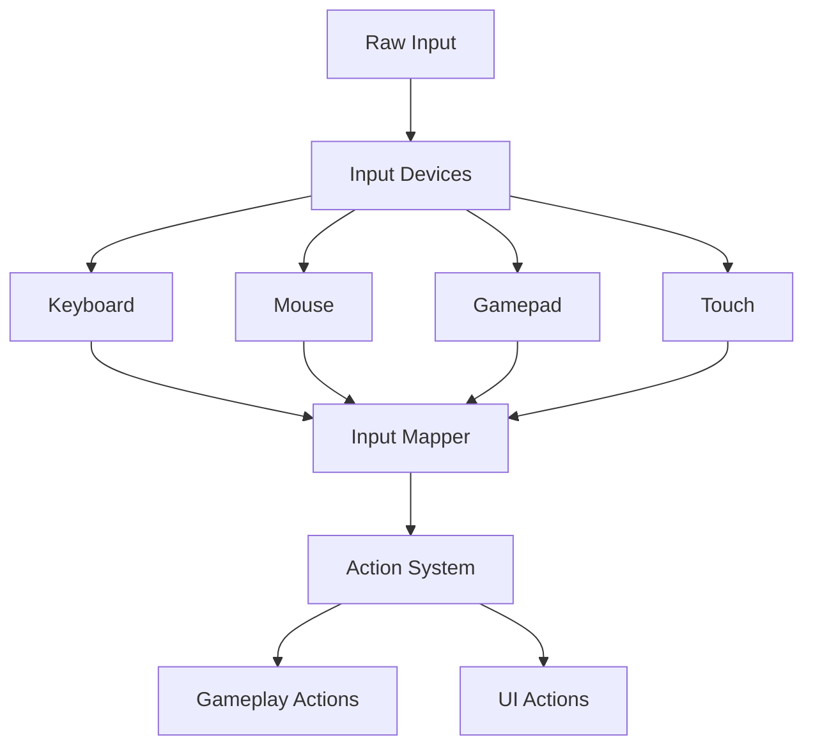

# Input System

AstraWeave's input system provides comprehensive input handling with action mapping, binding system, controller support, input replay, and cross-platform abstraction.

## Architecture Overview

The input system is designed to decouple raw input events from gameplay actions, enabling flexible control schemes and remapping.



### Key Components

- **Input Devices**: Cross-platform abstraction for keyboard, mouse, gamepad, and touch
- **Action Mapping**: Map raw inputs to high-level gameplay actions
- **Binding System**: Customizable control schemes with conflict detection
- **Input Context**: Hierarchical input contexts for different game states
- **Input Replay**: Record and playback input sequences for testing and demos

```admonish info
The input system uses winit for window events and gilrs for gamepad support, providing consistent cross-platform input handling.
```

## Input System Initialization

### Basic Setup

```rust
use astraweave_input::{InputSystem, InputConfig};

let config = InputConfig {
    deadzone: 0.15,              // Gamepad deadzone
    mouse_sensitivity: 1.0,
    enable_raw_mouse_input: true, // For FPS games
    double_click_time_ms: 300,
    key_repeat_delay_ms: 500,
    key_repeat_rate_ms: 50,
    ..Default::default()
};

let mut input_system = InputSystem::new(config);
```

### Processing Window Events

```rust
use winit::event::{Event, WindowEvent};

event_loop.run(move |event, _, control_flow| {
    // Feed events to input system
    input_system.handle_event(&event);
    
    match event {
        Event::WindowEvent { event, .. } => {
            match event {
                WindowEvent::Focused(false) => {
                    input_system.clear_input_state();
                }
                _ => {}
            }
        }
        Event::MainEventsCleared => {
            // Update input system
            input_system.update(delta_time);
            
            // Process actions
            update_game(&input_system);
        }
        _ => {}
    }
});
```

## Action Mapping

### Defining Actions

```rust
use astraweave_input::action::{Action, ActionType};

#[derive(Debug, Clone, Copy, Hash, Eq, PartialEq)]
pub enum GameAction {
    // Movement
    MoveForward,
    MoveBackward,
    MoveLeft,
    MoveRight,
    Jump,
    Crouch,
    Sprint,
    
    // Camera
    LookHorizontal,
    LookVertical,
    
    // Combat
    Fire,
    AimDownSights,
    Reload,
    SwitchWeapon,
    
    // Interaction
    Interact,
    UseItem,
    
    // UI
    OpenMenu,
    Inventory,
}

impl Action for GameAction {
    fn action_type(&self) -> ActionType {
        match self {
            // Button actions (pressed/released)
            GameAction::Jump | GameAction::Fire | GameAction::Interact => {
                ActionType::Button
            }
            // Axis actions (continuous values)
            GameAction::MoveForward | GameAction::LookHorizontal => {
                ActionType::Axis
            }
        }
    }
}
```

### Creating Action Maps

```rust
use astraweave_input::mapping::{ActionMap, InputBinding};
use astraweave_input::device::{Key, MouseButton, GamepadButton, GamepadAxis};

let mut action_map = ActionMap::new("default");

// Keyboard bindings
action_map.bind(GameAction::MoveForward, InputBinding::Key(Key::W));
action_map.bind(GameAction::MoveBackward, InputBinding::Key(Key::S));
action_map.bind(GameAction::MoveLeft, InputBinding::Key(Key::A));
action_map.bind(GameAction::MoveRight, InputBinding::Key(Key::D));
action_map.bind(GameAction::Jump, InputBinding::Key(Key::Space));
action_map.bind(GameAction::Crouch, InputBinding::Key(Key::ControlLeft));
action_map.bind(GameAction::Sprint, InputBinding::Key(Key::ShiftLeft));

// Mouse bindings
action_map.bind(GameAction::Fire, InputBinding::MouseButton(MouseButton::Left));
action_map.bind(GameAction::AimDownSights, InputBinding::MouseButton(MouseButton::Right));
action_map.bind(GameAction::LookHorizontal, InputBinding::MouseAxisX);
action_map.bind(GameAction::LookVertical, InputBinding::MouseAxisY);

// Gamepad bindings
action_map.bind(GameAction::Jump, InputBinding::GamepadButton(GamepadButton::South));
action_map.bind(GameAction::Fire, InputBinding::GamepadButton(GamepadButton::RightTrigger2));
action_map.bind(GameAction::MoveForward, InputBinding::GamepadAxis {
    axis: GamepadAxis::LeftStickY,
    threshold: 0.0,
    inverted: false,
});
action_map.bind(GameAction::LookHorizontal, InputBinding::GamepadAxis {
    axis: GamepadAxis::RightStickX,
    threshold: 0.0,
    inverted: false,
});

// Register action map
input_system.register_action_map(action_map);
```

### Multiple Bindings

```rust
// Bind multiple inputs to the same action
action_map.bind(GameAction::MoveForward, InputBinding::Key(Key::W));
action_map.bind(GameAction::MoveForward, InputBinding::Key(Key::ArrowUp));
action_map.bind(GameAction::MoveForward, InputBinding::GamepadAxis {
    axis: GamepadAxis::LeftStickY,
    threshold: 0.2,
    inverted: false,
});
```

### Input Modifiers

```rust
use astraweave_input::modifier::{InputModifier, ModifierKey};

// Bind with modifier keys (e.g., Shift+E for fast interaction)
action_map.bind_with_modifiers(
    GameAction::Interact,
    InputBinding::Key(Key::E),
    &[ModifierKey::Shift],
);

// Input modifiers for axis scaling
action_map.bind_with_modifier_fn(
    GameAction::LookHorizontal,
    InputBinding::MouseAxisX,
    |value| value * mouse_sensitivity,
);
```

## Querying Input State

### Button State

```rust
// Check if action is currently pressed
if input_system.is_action_pressed(GameAction::Jump) {
    player.jump();
}

// Check if action was just pressed this frame
if input_system.is_action_just_pressed(GameAction::Fire) {
    weapon.fire();
}

// Check if action was just released this frame
if input_system.is_action_just_released(GameAction::AimDownSights) {
    player.stop_aiming();
}

// Get how long action has been held
let sprint_duration = input_system.action_duration(GameAction::Sprint);
if sprint_duration > 2.0 {
    player.start_breathing_heavily();
}
```

### Axis Values

```rust
// Get axis value (-1.0 to 1.0)
let move_forward = input_system.action_value(GameAction::MoveForward);
let move_right = input_system.action_value(GameAction::MoveRight);

// Create movement vector
let movement = Vec3::new(move_right, 0.0, move_forward).normalize_or_zero();
player.move_direction(movement);

// Get raw axis value (before deadzone)
let raw_look = input_system.raw_action_value(GameAction::LookHorizontal);

// Get axis delta (change since last frame)
let look_delta = input_system.action_delta(GameAction::LookHorizontal);
camera.rotate_yaw(look_delta * sensitivity);
```

### Composite Inputs

```rust
use astraweave_input::composite::Vec2Input;

// Create 2D input from multiple actions
let movement_input = Vec2Input::new(
    GameAction::MoveRight,   // X axis
    GameAction::MoveForward, // Y axis
);

let movement = movement_input.get_value(&input_system);
player.move_direction(Vec3::new(movement.x, 0.0, movement.y));
```

## Binding System

### Runtime Rebinding

```rust
use astraweave_input::rebinding::BindingRecorder;

// Start recording new binding
let mut recorder = BindingRecorder::new();
recorder.start_recording(GameAction::Jump);

// Wait for user input
loop {
    input_system.update(delta_time);
    
    if let Some(binding) = recorder.check_input(&input_system) {
        // User pressed a key/button
        println!("New binding: {:?}", binding);
        
        // Check for conflicts
        if let Some(conflict) = action_map.find_conflict(GameAction::Jump, &binding) {
            println!("Warning: {} already bound to {:?}", conflict, binding);
            
            // Optionally swap or clear conflict
            action_map.unbind(conflict, &binding);
        }
        
        // Apply new binding
        action_map.bind(GameAction::Jump, binding);
        break;
    }
}
```

### Saving and Loading Bindings

```rust
use astraweave_input::persistence::BindingProfile;

// Save bindings
let profile = BindingProfile::from_action_map(&action_map);
profile.save_to_file("user_bindings.json")?;

// Load bindings
let profile = BindingProfile::load_from_file("user_bindings.json")?;
let action_map = profile.to_action_map();
input_system.register_action_map(action_map);
```

### Preset Binding Schemes

```rust
// Create multiple preset schemes
let keyboard_mouse = ActionMap::keyboard_mouse_preset();
let gamepad = ActionMap::gamepad_preset();
let left_handed = ActionMap::left_handed_preset();

// Switch schemes
input_system.set_active_action_map("keyboard_mouse");
```

## Input Contexts

Input contexts allow different parts of the game to handle input differently (e.g., gameplay vs. menu).

### Creating Contexts

```rust
use astraweave_input::context::{InputContext, ContextPriority};

// Gameplay context
let mut gameplay_context = InputContext::new("gameplay", ContextPriority::Normal);
gameplay_context.set_action_map(gameplay_action_map);

// UI context (higher priority)
let mut ui_context = InputContext::new("ui", ContextPriority::High);
ui_context.set_action_map(ui_action_map);

// Add contexts to system
input_system.add_context(gameplay_context);
input_system.add_context(ui_context);
```

### Context Activation

```rust
// Activate/deactivate contexts
input_system.activate_context("gameplay");
input_system.deactivate_context("ui");

// Push/pop context stack
input_system.push_context("menu"); // Menu now receives input
// ... menu is open ...
input_system.pop_context(); // Back to previous context

// Query which contexts are active
if input_system.is_context_active("gameplay") {
    // Process gameplay input
}
```

### Input Consumption

```rust
// Higher priority contexts can consume input
ui_context.set_consumes_input(true); // UI blocks input from reaching gameplay

// Check if input was consumed
if !input_system.was_action_consumed(GameAction::Fire) {
    weapon.fire();
}
```

## Controller Support

### Gamepad Detection

```rust
use astraweave_input::gamepad::{Gamepad, GamepadEvent};

// List connected gamepads
for gamepad in input_system.gamepads() {
    println!("Gamepad {}: {}", gamepad.id(), gamepad.name());
}

// Handle gamepad events
while let Some(event) = input_system.poll_gamepad_event() {
    match event {
        GamepadEvent::Connected(id) => {
            println!("Gamepad {} connected", id);
        }
        GamepadEvent::Disconnected(id) => {
            println!("Gamepad {} disconnected", id);
        }
        GamepadEvent::ButtonPressed(id, button) => {
            println!("Gamepad {} button {:?} pressed", id, button);
        }
        _ => {}
    }
}
```

### Vibration/Haptics

```rust
use astraweave_input::gamepad::{VibrationEffect, VibrationDuration};

// Simple vibration
input_system.vibrate_gamepad(
    gamepad_id,
    0.5, // Weak motor (0.0 - 1.0)
    0.8, // Strong motor (0.0 - 1.0)
    VibrationDuration::Milliseconds(200),
);

// Complex effect
let effect = VibrationEffect::explosion()
    .with_intensity(1.0)
    .with_duration_ms(500);

input_system.play_vibration_effect(gamepad_id, effect);
```

### Per-Player Input

```rust
use astraweave_input::player::PlayerInput;

// Assign gamepads to players
let player1_input = PlayerInput::new()
    .with_gamepad(0)
    .with_keyboard_mouse();

let player2_input = PlayerInput::new()
    .with_gamepad(1);

// Query player-specific input
if player1_input.is_action_pressed(&input_system, GameAction::Jump) {
    player1.jump();
}

if player2_input.is_action_pressed(&input_system, GameAction::Jump) {
    player2.jump();
}
```

```admonish tip
For split-screen games, use separate PlayerInput instances to isolate input between players.
```

## Input Replay

Input replay enables testing, demo playback, and replay systems.

### Recording Input

```rust
use astraweave_input::replay::{InputRecorder, InputRecording};

// Start recording
let mut recorder = InputRecorder::new();
recorder.start();

// Update each frame (automatically records input)
loop {
    input_system.update(delta_time);
    recorder.record_frame(&input_system);
    
    // ... game logic ...
}

// Stop and save
recorder.stop();
let recording = recorder.finalize();
recording.save_to_file("replay.bin")?;
```

### Playback

```rust
use astraweave_input::replay::InputPlayer;

// Load recording
let recording = InputRecording::load_from_file("replay.bin")?;
let mut player = InputPlayer::new(recording);

// Playback loop
loop {
    // Apply recorded input to system
    player.update(delta_time, &mut input_system);
    
    // Game state will be driven by recorded input
    update_game(&input_system);
    
    if player.is_finished() {
        break;
    }
}
```

### Replay Controls

```rust
// Pause/resume
player.pause();
player.resume();

// Seek
player.seek_to_time(10.0); // Seek to 10 seconds
player.seek_to_frame(600); // Seek to frame 600

// Playback speed
player.set_playback_speed(0.5); // Half speed
player.set_playback_speed(2.0); // Double speed

// Loop
player.set_loop(true);
```

## Advanced Features

### Input Buffering

```rust
use astraweave_input::buffer::InputBuffer;

// Create input buffer for fighting game-style combo inputs
let mut buffer = InputBuffer::new()
    .with_buffer_duration(0.3) // 300ms window
    .with_max_inputs(8);

// Add inputs to buffer
buffer.record_input(&input_system);

// Check for sequences
if buffer.matches_sequence(&[
    GameAction::MoveForward,
    GameAction::MoveDown,
    GameAction::MoveForward,
    GameAction::Fire,
]) {
    character.perform_special_move("Hadouken");
    buffer.clear();
}
```

### Input Prediction (Networking)

```rust
use astraweave_input::prediction::InputPredictor;

// For networked games, predict input during lag
let mut predictor = InputPredictor::new();

// Record recent inputs
predictor.record(&input_system);

// Predict future input (e.g., during packet loss)
let predicted_input = predictor.predict_next_frame();

// Use predicted input until real input arrives
if network.has_input() {
    apply_input(network.get_input());
} else {
    apply_input(predicted_input);
}
```

### Touch Input

```rust
use astraweave_input::touch::{TouchEvent, TouchPhase};

// Handle touch events (mobile/tablet)
while let Some(event) = input_system.poll_touch_event() {
    match event.phase {
        TouchPhase::Started => {
            println!("Touch started at {:?}", event.position);
        }
        TouchPhase::Moved => {
            let delta = event.position - event.previous_position;
            camera.rotate(delta);
        }
        TouchPhase::Ended => {
            println!("Touch ended");
        }
        TouchPhase::Cancelled => {
            println!("Touch cancelled");
        }
    }
}

// Multi-touch gestures
if let Some(pinch) = input_system.get_pinch_gesture() {
    camera.zoom(pinch.scale);
}

if let Some(swipe) = input_system.get_swipe_gesture() {
    player.dodge(swipe.direction);
}
```

## Complete Example

### FPS Input System

```rust
use astraweave_input::*;

pub struct FPSInput {
    input_system: InputSystem,
    gameplay_context: ContextId,
    menu_context: ContextId,
}

impl FPSInput {
    pub fn new() -> Self {
        let mut input_system = InputSystem::new(InputConfig::default());
        
        // Create gameplay action map
        let mut gameplay_map = ActionMap::new("gameplay");
        gameplay_map.bind(GameAction::MoveForward, InputBinding::Key(Key::W));
        gameplay_map.bind(GameAction::MoveBackward, InputBinding::Key(Key::S));
        gameplay_map.bind(GameAction::MoveLeft, InputBinding::Key(Key::A));
        gameplay_map.bind(GameAction::MoveRight, InputBinding::Key(Key::D));
        gameplay_map.bind(GameAction::Jump, InputBinding::Key(Key::Space));
        gameplay_map.bind(GameAction::Fire, InputBinding::MouseButton(MouseButton::Left));
        gameplay_map.bind(GameAction::LookHorizontal, InputBinding::MouseAxisX);
        gameplay_map.bind(GameAction::LookVertical, InputBinding::MouseAxisY);
        
        // Create menu action map
        let mut menu_map = ActionMap::new("menu");
        menu_map.bind(GameAction::OpenMenu, InputBinding::Key(Key::Escape));
        
        // Register contexts
        let gameplay_context = input_system.add_context(
            InputContext::new("gameplay", ContextPriority::Normal)
                .with_action_map(gameplay_map)
        );
        
        let menu_context = input_system.add_context(
            InputContext::new("menu", ContextPriority::High)
                .with_action_map(menu_map)
                .with_consumes_input(true)
        );
        
        // Start with gameplay active
        input_system.activate_context(gameplay_context);
        
        Self {
            input_system,
            gameplay_context,
            menu_context,
        }
    }
    
    pub fn update(&mut self, delta_time: f32, player: &mut Player, camera: &mut Camera) {
        self.input_system.update(delta_time);
        
        // Handle menu toggle
        if self.input_system.is_action_just_pressed(GameAction::OpenMenu) {
            self.toggle_menu();
        }
        
        // Process gameplay input if not in menu
        if self.input_system.is_context_active(self.gameplay_context) {
            self.process_gameplay_input(player, camera);
        }
    }
    
    fn process_gameplay_input(&self, player: &mut Player, camera: &mut Camera) {
        // Movement
        let move_forward = self.input_system.action_value(GameAction::MoveForward);
        let move_right = self.input_system.action_value(GameAction::MoveRight);
        let movement = Vec3::new(move_right, 0.0, move_forward);
        player.set_movement(movement);
        
        // Jump
        if self.input_system.is_action_just_pressed(GameAction::Jump) {
            player.jump();
        }
        
        // Camera look
        let look_x = self.input_system.action_delta(GameAction::LookHorizontal);
        let look_y = self.input_system.action_delta(GameAction::LookVertical);
        camera.rotate(look_x, look_y);
        
        // Fire weapon
        if self.input_system.is_action_pressed(GameAction::Fire) {
            player.fire_weapon();
        }
    }
    
    fn toggle_menu(&mut self) {
        if self.input_system.is_context_active(self.menu_context) {
            self.input_system.deactivate_context(self.menu_context);
            self.input_system.activate_context(self.gameplay_context);
        } else {
            self.input_system.deactivate_context(self.gameplay_context);
            self.input_system.activate_context(self.menu_context);
        }
    }
    
    pub fn handle_event(&mut self, event: &Event<()>) {
        self.input_system.handle_event(event);
    }
}
```

## Related Documentation

- [Player Controller](../gameplay/player-controller.md) - Character movement and control
- [UI System](../ui/input-handling.md) - UI interaction and focus
- [Networking](../networking/input-sync.md) - Network input synchronization
- [Accessibility](../accessibility/input.md) - Accessible input options

## API Reference

For complete API documentation, see:
- [astraweave_input API docs](https://docs.rs/astraweave-input)
- [winit documentation](https://docs.rs/winit)
- [gilrs documentation](https://docs.rs/gilrs)
