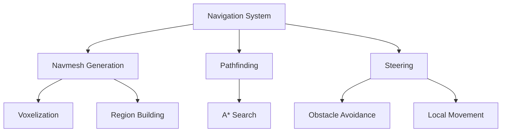
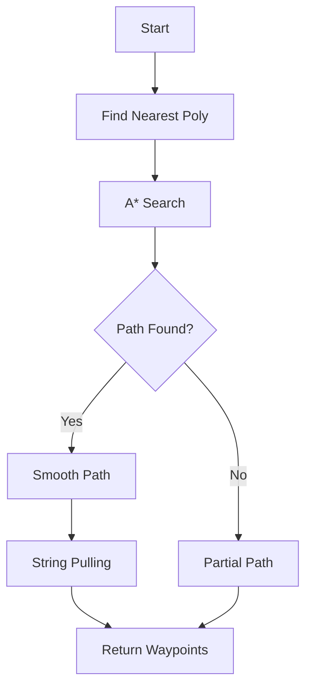

# Navigation System

AstraWeave's navigation system provides robust pathfinding and agent movement with support for dynamic navmesh generation, A* pathfinding, local steering, and obstacle avoidance.

## Architecture Overview

The navigation system consists of multiple layers working together to enable intelligent agent movement.



### Key Components

- **Navmesh Generation**: Automatic navigation mesh creation from level geometry
- **Pathfinding**: A* algorithm with hierarchical path optimization
- **Steering**: Local navigation with obstacle avoidance and crowd simulation
- **Dynamic Updates**: Runtime navmesh modification for destructible environments
- **Off-Mesh Links**: Manual connections for jumps, ladders, and teleports

```admonish info
The navigation system is based on Recast & Detour algorithms, providing industry-standard navmesh generation and pathfinding.
```

## Navmesh Generation

### Basic Navmesh Creation

```rust
use astraweave_nav::{NavmeshBuilder, NavmeshConfig};

let config = NavmeshConfig {
    cell_size: 0.3,           // XZ plane cell size
    cell_height: 0.2,         // Y axis cell size
    agent_height: 2.0,        // Agent height in meters
    agent_radius: 0.6,        // Agent radius in meters
    agent_max_climb: 0.9,     // Max step height
    agent_max_slope: 45.0,    // Max walkable slope in degrees
    region_min_size: 8.0,     // Min region area
    region_merge_size: 20.0,  // Region merge threshold
    edge_max_len: 12.0,       // Max edge length
    edge_max_error: 1.3,      // Edge simplification error
    verts_per_poly: 6,        // Vertices per polygon
    detail_sample_dist: 6.0,  // Detail mesh sample distance
    detail_sample_max_error: 1.0, // Detail mesh error
};

let mut builder = NavmeshBuilder::new(config);
```

### Building from Geometry

```rust
use astraweave_nav::geometry::InputGeometry;

// Collect level geometry
let mut geometry = InputGeometry::new();

// Add static meshes
for mesh in level.static_meshes() {
    geometry.add_mesh(mesh.vertices(), mesh.indices());
}

// Mark areas (walkable, non-walkable, water, etc.)
geometry.mark_area(
    bounding_box,
    AreaType::NonWalkable,
);

// Build navmesh
let navmesh = builder.build(&geometry)?;
```

### Navmesh Configuration Presets

```rust
use astraweave_nav::NavmeshConfig;

// Humanoid character (default)
let human_config = NavmeshConfig::humanoid();

// Small creature (rat, dog)
let small_config = NavmeshConfig::small_creature();

// Large creature (ogre, vehicle)
let large_config = NavmeshConfig::large_creature();

// Flying unit
let flying_config = NavmeshConfig::flying();

// Custom configuration
let custom_config = NavmeshConfig {
    agent_height: 1.5,
    agent_radius: 0.4,
    agent_max_climb: 0.5,
    agent_max_slope: 60.0,
    ..NavmeshConfig::humanoid()
};
```

```admonish tip
Use smaller cell sizes for more detailed navmeshes, but be aware of increased memory usage and build times. A cell size of 0.3m works well for humanoid characters.
```

### Navmesh Layers

```rust
use astraweave_nav::NavmeshLayer;

// Create separate navmeshes for different agent types
let mut nav_system = NavigationSystem::new();

// Layer 0: Infantry
nav_system.add_layer(
    NavmeshLayer::new("infantry")
        .with_config(NavmeshConfig::humanoid())
        .with_geometry(&level_geometry)
);

// Layer 1: Vehicles
nav_system.add_layer(
    NavmeshLayer::new("vehicles")
        .with_config(NavmeshConfig::large_creature())
        .with_geometry(&vehicle_geometry)
);

// Layer 2: Flying
nav_system.add_layer(
    NavmeshLayer::new("flying")
        .with_config(NavmeshConfig::flying())
        .with_geometry(&flying_geometry)
);
```

## A* Pathfinding

### Basic Pathfinding

```rust
use astraweave_nav::{Pathfinder, PathQuery};

let pathfinder = Pathfinder::new(&navmesh);

// Find path from start to end
let query = PathQuery {
    start: [10.0, 0.0, 5.0],
    end: [50.0, 0.0, 30.0],
    extents: [2.0, 4.0, 2.0], // Search extents for nearest poly
    filter: None,
};

let path = pathfinder.find_path(query)?;

// Path is a Vec<[f32; 3]> of waypoints
for waypoint in path.waypoints() {
    println!("Waypoint: {:?}", waypoint);
}
```

### Path Smoothing

```rust
use astraweave_nav::PathSmoothingOptions;

let smoothing = PathSmoothingOptions {
    max_iterations: 100,
    max_smooth_distance: 0.5,
};

let smooth_path = pathfinder.smooth_path(&path, smoothing)?;
```

### Path Filtering

```rust
use astraweave_nav::filter::{PathFilter, AreaFlags};

// Create filter for specific area types
let mut filter = PathFilter::new();
filter.set_area_cost(AreaType::Road, 1.0);      // Prefer roads
filter.set_area_cost(AreaType::Grass, 2.0);     // Neutral
filter.set_area_cost(AreaType::Water, 10.0);    // Avoid water
filter.set_area_cost(AreaType::Lava, f32::MAX); // Never path through lava

filter.exclude_flags(AreaFlags::DISABLED);

let query = PathQuery {
    start: start_pos,
    end: end_pos,
    extents: [2.0, 4.0, 2.0],
    filter: Some(filter),
};

let path = pathfinder.find_path(query)?;
```

### Hierarchical Pathfinding

```rust
use astraweave_nav::hierarchical::HierarchicalPathfinder;

// Create hierarchical graph for long-distance paths
let hpa_pathfinder = HierarchicalPathfinder::new(&navmesh, 32.0); // 32m clusters

// Fast long-distance pathfinding
let long_path = hpa_pathfinder.find_path(query)?;
```



### Partial Paths

```rust
// Allow partial paths when destination unreachable
let query = PathQuery {
    start: start_pos,
    end: unreachable_pos,
    extents: [2.0, 4.0, 2.0],
    filter: None,
};

let result = pathfinder.find_path(query)?;

if result.is_partial() {
    println!("Couldn't reach destination, got {} waypoints", result.waypoints().len());
    // Path goes as close as possible to target
} else {
    println!("Complete path found!");
}
```

## Agent Movement

### Navigation Agent

```rust
use astraweave_nav::agent::{NavAgent, AgentParams};

// Create navigation agent
let agent_params = AgentParams {
    radius: 0.6,
    height: 2.0,
    max_acceleration: 8.0,
    max_speed: 5.5,
    collision_query_range: 2.0,
    path_optimization_range: 5.0,
    separation_weight: 2.0,
    ..Default::default()
};

let mut agent = NavAgent::new(agent_params);

// Set destination
agent.set_destination([50.0, 0.0, 30.0]);

// Update each frame
let delta_time = 0.016; // 60 FPS
agent.update(delta_time, &pathfinder);

// Get current velocity and position
let velocity = agent.velocity();
let position = agent.position();

// Apply to entity transform
entity.position = position;
entity.rotation = Quat::from_rotation_y(velocity.x.atan2(velocity.z));
```

### Agent States

```rust
use astraweave_nav::agent::AgentState;

match agent.state() {
    AgentState::Idle => {
        // Agent has no destination
    }
    AgentState::Moving => {
        // Agent is moving toward destination
    }
    AgentState::Arrived => {
        // Agent reached destination
        agent.stop();
    }
    AgentState::Stuck => {
        // Agent couldn't make progress
        agent.set_destination(fallback_position);
    }
}
```

### Speed Modulation

```rust
// Dynamic speed based on terrain
let current_area = navmesh.get_area_at(agent.position());
let speed_multiplier = match current_area {
    AreaType::Road => 1.2,
    AreaType::Grass => 1.0,
    AreaType::Water => 0.5,
    _ => 1.0,
};

agent.set_max_speed(5.5 * speed_multiplier);
```

## Obstacle Avoidance

### Local Steering

```rust
use astraweave_nav::steering::{SteeringBehavior, AvoidanceParams};

let avoidance = AvoidanceParams {
    horizon_time: 2.5,        // Look-ahead time
    obstacle_margin: 0.3,      // Extra clearance
    max_neighbors: 10,         // Max agents to consider
    neighbor_dist: 10.0,       // Neighbor search radius
    separation_weight: 2.0,    // Separation strength
    alignment_weight: 1.0,     // Velocity alignment
    cohesion_weight: 1.0,      // Group cohesion
};

agent.set_avoidance_params(avoidance);
```

### Dynamic Obstacles

```rust
use astraweave_nav::obstacle::DynamicObstacle;

// Add temporary obstacles
let obstacle = DynamicObstacle::cylinder(
    position,
    1.5,  // radius
    2.0,  // height
);

nav_system.add_obstacle(obstacle);

// Agents will automatically avoid the obstacle

// Remove when no longer needed
nav_system.remove_obstacle(obstacle.id());
```

### Crowd Simulation

```rust
use astraweave_nav::crowd::{CrowdManager, CrowdAgent};

let mut crowd = CrowdManager::new(&navmesh, 100); // Max 100 agents

// Add agents to crowd
let agent_id = crowd.add_agent(CrowdAgent {
    position: start_pos,
    params: agent_params,
});

// Set target
crowd.set_target(agent_id, end_pos);

// Update all agents efficiently
crowd.update(delta_time);

// Get agent state
let agent = crowd.get_agent(agent_id);
println!("Position: {:?}, Velocity: {:?}", agent.position, agent.velocity);
```

```admonish info
CrowdManager uses spatial hashing and optimized neighbor queries to efficiently simulate hundreds of agents with local avoidance.
```

## Off-Mesh Links

Off-mesh links enable navigation across gaps, jumps, ladders, and teleporters.

### Creating Links

```rust
use astraweave_nav::offmesh::{OffMeshLink, OffMeshLinkType};

// Jump down
let jump_link = OffMeshLink {
    start: [10.0, 5.0, 0.0],
    end: [15.0, 0.0, 0.0],
    radius: 0.5,
    bidirectional: false, // One-way
    link_type: OffMeshLinkType::Jump,
    cost: 2.0, // Path cost
};

navmesh.add_offmesh_link(jump_link);

// Ladder (bidirectional)
let ladder_link = OffMeshLink {
    start: [20.0, 0.0, 0.0],
    end: [20.0, 5.0, 0.0],
    radius: 0.5,
    bidirectional: true,
    link_type: OffMeshLinkType::Climb,
    cost: 5.0,
};

navmesh.add_offmesh_link(ladder_link);
```

### Traversing Links

```rust
// Agent detects off-mesh link during pathfinding
if let Some(link) = agent.current_offmesh_link() {
    match link.link_type {
        OffMeshLinkType::Jump => {
            // Play jump animation
            animation.play("jump");
            
            // Arc trajectory
            let t = link.traversal_progress();
            let height = 2.0 * t * (1.0 - t); // Parabolic arc
            agent.position.y += height;
        }
        OffMeshLinkType::Climb => {
            // Play climb animation
            animation.play("climb_ladder");
        }
        OffMeshLinkType::Teleport => {
            // Instant teleport
            agent.position = link.end;
        }
    }
}
```

## Dynamic Navmesh Updates

### Runtime Modifications

```rust
use astraweave_nav::dynamic::{NavmeshModifier, TileCache};

// Create tile cache for dynamic updates
let mut tile_cache = TileCache::new(&navmesh, config);

// Add obstacle (e.g., fallen tree)
let obstacle_id = tile_cache.add_obstacle(
    position,
    bounding_box,
);

// Rebuild affected tiles
tile_cache.update()?;

// Remove obstacle when destroyed
tile_cache.remove_obstacle(obstacle_id);
tile_cache.update()?;
```

### Temporary Blocking

```rust
// Block area temporarily
let blocker_id = nav_system.block_area(
    center,
    radius,
    duration_seconds,
);

// Automatically unblocks after duration
```

## Performance Optimization

### Async Pathfinding

```rust
use astraweave_nav::async_pathfinding::AsyncPathfinder;

let async_pathfinder = AsyncPathfinder::new(&navmesh);

// Request path asynchronously
let path_future = async_pathfinder.find_path_async(query);

// Continue gameplay, path calculated in background

// Check if ready
if let Some(path) = path_future.try_get() {
    agent.set_path(path);
}
```

### Path Caching

```rust
use astraweave_nav::cache::PathCache;

let mut path_cache = PathCache::new(1000); // Cache 1000 paths

// Check cache before pathfinding
let cache_key = PathCache::key(start, end);
if let Some(cached_path) = path_cache.get(&cache_key) {
    return cached_path.clone();
}

// Calculate and cache
let path = pathfinder.find_path(query)?;
path_cache.insert(cache_key, path.clone());
```

### LOD for Distant Agents

```rust
// Reduce update frequency for distant agents
let distance_to_player = (agent.position - player.position).length();

let update_interval = if distance_to_player < 20.0 {
    0.0 // Every frame
} else if distance_to_player < 50.0 {
    0.1 // 10 times per second
} else {
    0.5 // 2 times per second
};

if agent.time_since_update() >= update_interval {
    agent.update(delta_time, &pathfinder);
}
```

## Complete Example

### AI Character with Navigation

```rust
use astraweave_nav::*;

pub struct AICharacter {
    agent: NavAgent,
    current_path: Option<Path>,
    destination: Option<Vec3>,
}

impl AICharacter {
    pub fn new(start_position: Vec3) -> Self {
        let params = AgentParams {
            radius: 0.6,
            height: 2.0,
            max_speed: 5.0,
            max_acceleration: 10.0,
            ..Default::default()
        };
        
        let mut agent = NavAgent::new(params);
        agent.set_position([start_position.x, start_position.y, start_position.z]);
        
        Self {
            agent,
            current_path: None,
            destination: None,
        }
    }
    
    pub fn move_to(&mut self, destination: Vec3, pathfinder: &Pathfinder) -> Result<()> {
        let query = PathQuery {
            start: self.agent.position(),
            end: [destination.x, destination.y, destination.z],
            extents: [2.0, 4.0, 2.0],
            filter: None,
        };
        
        let path = pathfinder.find_path(query)?;
        self.current_path = Some(path);
        self.destination = Some(destination);
        self.agent.set_destination([destination.x, destination.y, destination.z]);
        
        Ok(())
    }
    
    pub fn update(&mut self, delta_time: f32, pathfinder: &Pathfinder) {
        self.agent.update(delta_time, pathfinder);
        
        // Check if arrived
        if self.agent.state() == AgentState::Arrived {
            self.current_path = None;
            self.destination = None;
        }
    }
    
    pub fn position(&self) -> Vec3 {
        let pos = self.agent.position();
        Vec3::new(pos[0], pos[1], pos[2])
    }
    
    pub fn velocity(&self) -> Vec3 {
        let vel = self.agent.velocity();
        Vec3::new(vel[0], vel[1], vel[2])
    }
}

// Usage
fn main() -> Result<()> {
    let navmesh = build_navmesh()?;
    let pathfinder = Pathfinder::new(&navmesh);
    
    let mut character = AICharacter::new(Vec3::new(0.0, 0.0, 0.0));
    character.move_to(Vec3::new(50.0, 0.0, 30.0), &pathfinder)?;
    
    loop {
        let delta_time = 0.016;
        character.update(delta_time, &pathfinder);
        
        println!("Position: {:?}", character.position());
        
        std::thread::sleep(std::time::Duration::from_millis(16));
    }
}
```

## Debugging and Visualization

### Debug Rendering

```rust
use astraweave_nav::debug::NavmeshDebugRenderer;

let mut debug_renderer = NavmeshDebugRenderer::new();

// Render navmesh
debug_renderer.draw_navmesh(&navmesh, Color::GREEN);

// Render path
if let Some(path) = &agent.current_path {
    debug_renderer.draw_path(path, Color::YELLOW);
}

// Render agent
debug_renderer.draw_agent(&agent, Color::RED);

// Render off-mesh links
debug_renderer.draw_offmesh_links(&navmesh, Color::CYAN);
```

## Related Documentation

- [AI System](../ai/behavior-trees.md) - Behavior trees and decision making
- [Physics Integration](../physics/character-controller.md) - Character controllers
- [Level Design](../editor/navigation-tools.md) - Navigation editing tools
- [Performance Guide](../optimization/navigation.md) - Navigation optimization

## API Reference

For complete API documentation, see:
- [astraweave_nav API docs](https://docs.rs/astraweave-nav)
- [Recast & Detour](https://github.com/recastnavigation/recastnavigation)
