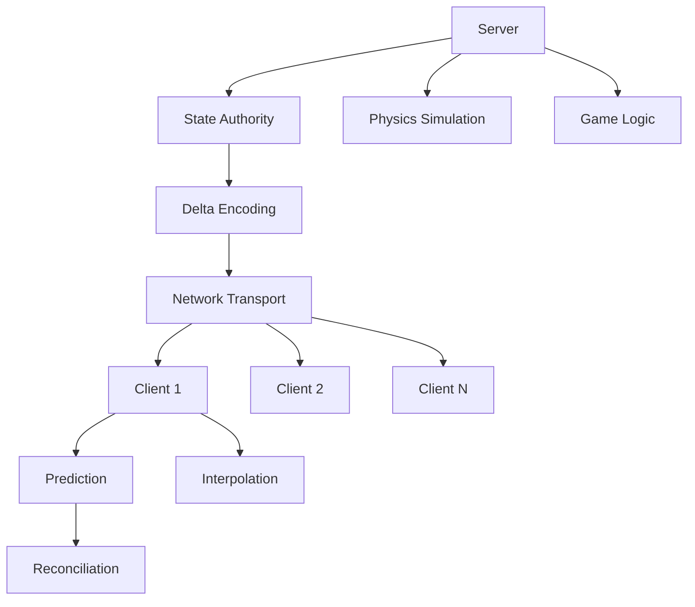
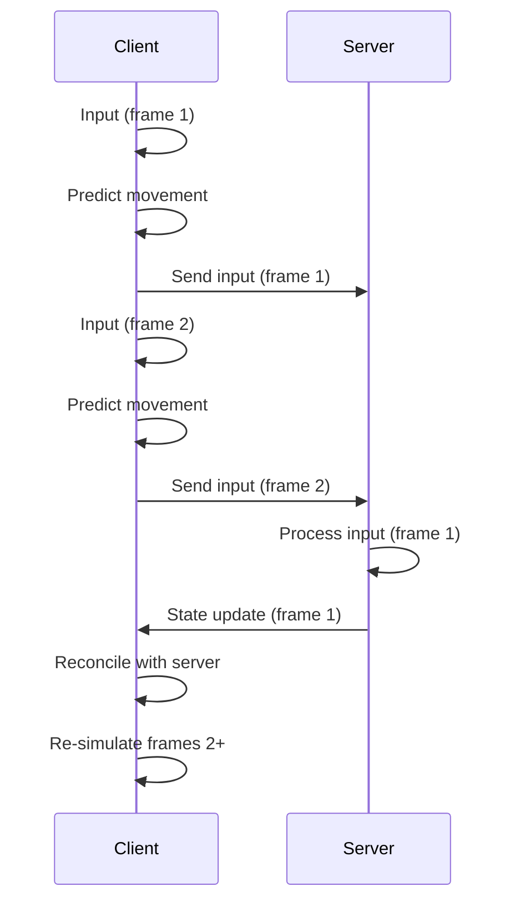

# Networking System

AstraWeave's networking system provides robust client-server architecture with state synchronization, delta encoding, lag compensation, and prediction for responsive multiplayer gameplay.

## Architecture Overview

The networking system is built on a client-server model with authoritative server and client-side prediction.



### Key Components

- **Transport Layer**: UDP-based reliable/unreliable messaging with Quinn (QUIC)
- **State Synchronization**: Efficient delta compression and entity replication
- **Client Prediction**: Responsive input with server reconciliation
- **Lag Compensation**: Server-side hit detection with rewind
- **Network Relevancy**: Bandwidth optimization through spatial partitioning

```admonish info
AstraWeave uses QUIC (via Quinn) for modern, secure, and multiplexed networking with built-in congestion control and 0-RTT connection establishment.
```

## Server Setup

### Creating a Server

```rust
use astraweave_net::{Server, ServerConfig};

let config = ServerConfig {
    bind_address: "0.0.0.0:7777".parse()?,
    max_clients: 64,
    tick_rate: 60,              // Server updates per second
    timeout_seconds: 10.0,
    enable_encryption: true,
    max_bandwidth_kbps: 1024,
    ..Default::default()
};

let mut server = Server::new(config)?;
```

### Server Loop

```rust
use astraweave_net::{ServerEvent, ClientId};

loop {
    let delta_time = 1.0 / 60.0; // 60 Hz tick rate
    
    // Process incoming events
    while let Some(event) = server.poll_event() {
        match event {
            ServerEvent::ClientConnected { client_id, address } => {
                println!("Client {} connected from {}", client_id, address);
                spawn_player(client_id);
            }
            ServerEvent::ClientDisconnected { client_id, reason } => {
                println!("Client {} disconnected: {:?}", client_id, reason);
                despawn_player(client_id);
            }
            ServerEvent::MessageReceived { client_id, message } => {
                handle_client_message(client_id, message);
            }
        }
    }
    
    // Update game state
    update_game_state(delta_time);
    
    // Send state updates to clients
    server.broadcast_state_update(&world_state)?;
    
    // Tick network
    server.tick(delta_time)?;
    
    std::thread::sleep(std::time::Duration::from_secs_f32(delta_time));
}
```

## Client Setup

### Connecting to Server

```rust
use astraweave_net::{Client, ClientConfig};

let config = ClientConfig {
    server_address: "127.0.0.1:7777".parse()?,
    timeout_seconds: 10.0,
    enable_prediction: true,
    interpolation_delay_ms: 100,
    ..Default::default()
};

let mut client = Client::connect(config).await?;
```

### Client Loop

```rust
use astraweave_net::ClientEvent;

loop {
    let delta_time = 1.0 / 60.0;
    
    // Process server events
    while let Some(event) = client.poll_event() {
        match event {
            ClientEvent::Connected => {
                println!("Connected to server");
            }
            ClientEvent::Disconnected { reason } => {
                println!("Disconnected: {:?}", reason);
                break;
            }
            ClientEvent::StateUpdate { state } => {
                apply_state_update(state);
            }
            ClientEvent::MessageReceived { message } => {
                handle_server_message(message);
            }
        }
    }
    
    // Get local input
    let input = gather_input();
    
    // Send input to server
    client.send_input(input)?;
    
    // Client-side prediction
    if config.enable_prediction {
        simulate_local_player(input, delta_time);
    }
    
    // Interpolate remote entities
    interpolate_entities(delta_time);
    
    // Tick network
    client.tick(delta_time)?;
    
    std::thread::sleep(std::time::Duration::from_secs_f32(delta_time));
}
```

## State Synchronization

### Entity Replication

```rust
use astraweave_net::replication::{NetEntity, ReplicationMode};

#[derive(NetEntity)]
pub struct Player {
    #[replicate(mode = ReplicationMode::Always)]
    pub entity_id: u64,
    
    #[replicate(mode = ReplicationMode::OnChange, priority = 10)]
    pub position: Vec3,
    
    #[replicate(mode = ReplicationMode::OnChange, priority = 10)]
    pub rotation: Quat,
    
    #[replicate(mode = ReplicationMode::OnChange, priority = 5)]
    pub velocity: Vec3,
    
    #[replicate(mode = ReplicationMode::OnChange, priority = 2)]
    pub health: f32,
    
    #[replicate(mode = ReplicationMode::OnChange, priority = 1)]
    pub ammo: u32,
    
    // Not replicated
    #[replicate(mode = ReplicationMode::Never)]
    local_animation_state: AnimationState,
}
```

### Replication Modes

| Mode | Description | Use Case |
|------|-------------|----------|
| `Always` | Send every frame | Entity ID, critical state |
| `OnChange` | Send when value changes | Position, health |
| `OnChangeThreshold` | Send when change exceeds threshold | Analog values |
| `Never` | Never replicate | Client-only data |

### World State Updates

```rust
use astraweave_net::state::{WorldState, EntityState};

// Server: Build world state
let mut world_state = WorldState::new();

for player in players.iter() {
    world_state.add_entity(player.entity_id, EntityState {
        position: player.position,
        rotation: player.rotation,
        velocity: player.velocity,
        custom_data: serialize_player_data(player),
    });
}

// Send to all clients
server.broadcast_state_update(&world_state)?;

// Client: Apply state update
fn apply_state_update(state: WorldState) {
    for (entity_id, entity_state) in state.entities() {
        if let Some(entity) = world.get_entity_mut(entity_id) {
            entity.position = entity_state.position;
            entity.rotation = entity_state.rotation;
            entity.velocity = entity_state.velocity;
        }
    }
}
```

## Delta Encoding

Delta encoding dramatically reduces bandwidth by only sending changed values.

### Automatic Delta Compression

```rust
use astraweave_net::delta::{DeltaEncoder, DeltaDecoder};

// Server: Encode state changes
let mut encoder = DeltaEncoder::new();

// First frame: full state
let full_state = encoder.encode_full(&world_state)?;
server.broadcast(full_state)?;

// Subsequent frames: only deltas
loop {
    let new_state = get_current_world_state();
    let delta = encoder.encode_delta(&new_state)?;
    
    if delta.size_bytes() < full_state.size_bytes() * 0.8 {
        server.broadcast(delta)?;
    } else {
        // Send full state if delta is too large
        server.broadcast(encoder.encode_full(&new_state)?)?;
    }
}

// Client: Decode deltas
let mut decoder = DeltaDecoder::new();

match received_message {
    NetworkMessage::FullState(state) => {
        decoder.apply_full_state(state);
    }
    NetworkMessage::DeltaState(delta) => {
        decoder.apply_delta(delta);
    }
}

let current_state = decoder.get_state();
```

### Custom Delta Serialization

```rust
use astraweave_net::serialization::{BitWriter, BitReader};

impl Player {
    pub fn write_delta(&self, previous: &Player, writer: &mut BitWriter) {
        // Position (quantized)
        if self.position != previous.position {
            writer.write_bit(true);
            writer.write_vec3_quantized(self.position, -1000.0, 1000.0, 0.01);
        } else {
            writer.write_bit(false);
        }
        
        // Rotation (quaternion compression)
        if self.rotation != previous.rotation {
            writer.write_bit(true);
            writer.write_quaternion_compressed(self.rotation);
        } else {
            writer.write_bit(false);
        }
        
        // Health (8-bit)
        if self.health != previous.health {
            writer.write_bit(true);
            writer.write_u8((self.health * 255.0) as u8);
        } else {
            writer.write_bit(false);
        }
    }
    
    pub fn read_delta(&mut self, reader: &mut BitReader) {
        if reader.read_bit() {
            self.position = reader.read_vec3_quantized(-1000.0, 1000.0, 0.01);
        }
        if reader.read_bit() {
            self.rotation = reader.read_quaternion_compressed();
        }
        if reader.read_bit() {
            self.health = reader.read_u8() as f32 / 255.0;
        }
    }
}
```

```admonish tip
Quantize floating-point values to reduce precision and save bandwidth. For example, position precision of 1cm (0.01m) is sufficient for most games.
```

## Client Prediction

Client-side prediction makes the game feel responsive despite network latency.

### Input Prediction

```rust
use astraweave_net::prediction::{PredictionSystem, InputBuffer};

pub struct PredictedPlayer {
    // Authoritative state from server
    server_position: Vec3,
    server_velocity: Vec3,
    server_tick: u64,
    
    // Predicted state
    predicted_position: Vec3,
    predicted_velocity: Vec3,
    
    // Input history
    input_buffer: InputBuffer,
}

impl PredictedPlayer {
    pub fn send_input(&mut self, input: PlayerInput, client: &mut Client) {
        // Store input locally
        self.input_buffer.push(input.clone());
        
        // Send to server
        client.send_input(input)?;
        
        // Predict movement
        self.simulate_movement(input, TICK_DELTA);
    }
    
    pub fn reconcile(&mut self, server_state: PlayerState) {
        self.server_position = server_state.position;
        self.server_velocity = server_state.velocity;
        self.server_tick = server_state.tick;
        
        // Start from server state
        self.predicted_position = server_state.position;
        self.predicted_velocity = server_state.velocity;
        
        // Re-simulate inputs after server tick
        for input in self.input_buffer.after_tick(server_state.tick) {
            self.simulate_movement(input, TICK_DELTA);
        }
        
        // Clear old inputs
        self.input_buffer.clear_before_tick(server_state.tick);
    }
    
    fn simulate_movement(&mut self, input: PlayerInput, delta_time: f32) {
        // Same movement code as server
        let acceleration = input.move_direction * MOVE_SPEED;
        self.predicted_velocity += acceleration * delta_time;
        self.predicted_velocity *= 0.9; // Friction
        self.predicted_position += self.predicted_velocity * delta_time;
    }
}
```

### Prediction Error Correction

```rust
// Smooth correction of prediction errors
pub fn correct_prediction_error(&mut self, delta_time: f32) {
    let error = self.server_position - self.predicted_position;
    let error_magnitude = error.length();
    
    if error_magnitude > 0.01 {
        // Smooth correction over time
        let correction_speed = 10.0; // Adjust for smoothness
        let correction = error * correction_speed * delta_time;
        
        self.predicted_position += correction;
    } else {
        // Snap if very close
        self.predicted_position = self.server_position;
    }
}
```



## Entity Interpolation

Remote entities are interpolated between snapshots for smooth movement.

### Snapshot Interpolation

```rust
use astraweave_net::interpolation::{SnapshotBuffer, InterpolationTarget};

pub struct InterpolatedEntity {
    snapshots: SnapshotBuffer<EntitySnapshot>,
    interpolation_delay: f32, // 100ms
}

#[derive(Clone)]
pub struct EntitySnapshot {
    timestamp: f32,
    position: Vec3,
    rotation: Quat,
    velocity: Vec3,
}

impl InterpolatedEntity {
    pub fn add_snapshot(&mut self, snapshot: EntitySnapshot) {
        self.snapshots.push(snapshot);
    }
    
    pub fn interpolate(&self, current_time: f32) -> InterpolationTarget {
        // Render time is current time minus interpolation delay
        let render_time = current_time - self.interpolation_delay;
        
        // Find bracketing snapshots
        let (before, after) = self.snapshots.get_bracketing(render_time);
        
        // Calculate interpolation factor
        let t = (render_time - before.timestamp) / (after.timestamp - before.timestamp);
        let t = t.clamp(0.0, 1.0);
        
        InterpolationTarget {
            position: before.position.lerp(after.position, t),
            rotation: before.rotation.slerp(after.rotation, t),
            velocity: before.velocity.lerp(after.velocity, t),
        }
    }
}
```

### Extrapolation for Missing Snapshots

```rust
pub fn extrapolate(&self, current_time: f32) -> InterpolationTarget {
    let latest = self.snapshots.latest();
    let time_diff = current_time - latest.timestamp;
    
    if time_diff > 0.2 {
        // Too old, don't extrapolate
        return InterpolationTarget {
            position: latest.position,
            rotation: latest.rotation,
            velocity: latest.velocity,
        };
    }
    
    // Linear extrapolation using velocity
    InterpolationTarget {
        position: latest.position + latest.velocity * time_diff,
        rotation: latest.rotation,
        velocity: latest.velocity,
    }
}
```

## Lag Compensation

Server-side lag compensation ensures fair hit detection.

### Rewinding Game State

```rust
use astraweave_net::lag_compensation::{HistoryBuffer, HistoricalState};

pub struct LagCompensationSystem {
    history: HistoryBuffer<WorldSnapshot>,
    max_rewind_ms: u64,
}

impl LagCompensationSystem {
    pub fn record_snapshot(&mut self, world: &World, timestamp: u64) {
        let snapshot = WorldSnapshot {
            timestamp,
            entities: world.entities().map(|e| e.clone()).collect(),
        };
        
        self.history.push(snapshot);
        self.history.prune_older_than(timestamp - self.max_rewind_ms);
    }
    
    pub fn rewind_and_test(&self, client_latency_ms: u64, raycast: Ray) -> Option<Hit> {
        let rewind_time = current_time() - client_latency_ms;
        let snapshot = self.history.get_at_time(rewind_time)?;
        
        // Test hit detection against historical state
        for entity in &snapshot.entities {
            if let Some(hit) = raycast.intersect(&entity.hitbox) {
                return Some(Hit {
                    entity_id: entity.id,
                    position: hit.point,
                    distance: hit.distance,
                });
            }
        }
        
        None
    }
}
```

### Server-Side Hit Validation

```rust
pub fn process_shot(
    &mut self,
    client_id: ClientId,
    shot_data: ShotData,
) -> Result<Option<Hit>> {
    let client = self.clients.get(client_id)?;
    let latency_ms = client.round_trip_time() / 2;
    
    // Rewind to client's view of the world
    let hit = self.lag_compensation.rewind_and_test(
        latency_ms,
        shot_data.raycast,
    );
    
    if let Some(hit) = hit {
        // Validate hit (anti-cheat)
        if validate_shot(&shot_data, &hit) {
            apply_damage(hit.entity_id, shot_data.damage);
            return Ok(Some(hit));
        }
    }
    
    Ok(None)
}
```

```admonish warning
Limit maximum rewind time (typically 200-250ms) to prevent abuse and reduce server memory usage.
```

## Network Relevancy

Only send relevant entities to each client to save bandwidth.

### Spatial Partitioning

```rust
use astraweave_net::relevancy::{RelevancySystem, SpatialGrid};

pub struct RelevancySystem {
    grid: SpatialGrid,
    relevancy_range: f32,
}

impl RelevancySystem {
    pub fn update_relevancy(&mut self, clients: &[Client], entities: &[Entity]) {
        self.grid.clear();
        
        // Insert entities into spatial grid
        for entity in entities {
            self.grid.insert(entity.id, entity.position);
        }
        
        // Calculate relevant entities for each client
        for client in clients {
            let player_pos = client.player_position();
            let relevant = self.grid.query_radius(player_pos, self.relevancy_range);
            client.set_relevant_entities(relevant);
        }
    }
    
    pub fn should_replicate(&self, client_id: ClientId, entity_id: EntityId) -> bool {
        let client = self.clients.get(client_id);
        client.relevant_entities.contains(&entity_id)
    }
}
```

### Priority-Based Updates

```rust
pub struct ReplicationPriority {
    pub distance_factor: f32,
    pub importance: f32,
    pub update_frequency: f32,
}

impl ReplicationPriority {
    pub fn calculate(client_pos: Vec3, entity: &Entity) -> f32 {
        let distance = (entity.position - client_pos).length();
        let distance_priority = 1.0 / (1.0 + distance * 0.1);
        
        let importance_priority = match entity.entity_type {
            EntityType::Player => 1.0,
            EntityType::Projectile => 0.8,
            EntityType::Enemy => 0.6,
            EntityType::Pickup => 0.4,
            EntityType::Decoration => 0.1,
        };
        
        distance_priority * importance_priority
    }
}

// Send high-priority entities every frame, low-priority less often
pub fn send_updates(&mut self, delta_time: f32) {
    for client in &mut self.clients {
        let mut updates = Vec::new();
        
        for entity_id in &client.relevant_entities {
            let entity = self.world.get_entity(*entity_id);
            let priority = ReplicationPriority::calculate(client.position(), entity);
            
            // Update frequency based on priority
            let update_interval = 1.0 / (60.0 * priority);
            
            if entity.time_since_update(client.id) >= update_interval {
                updates.push(entity.create_update());
                entity.mark_updated(client.id);
            }
        }
        
        client.send_updates(updates)?;
    }
}
```

## Complete Example

### Multiplayer FPS Game

```rust
use astraweave_net::*;

// Server
pub struct GameServer {
    server: Server,
    world: World,
    lag_compensation: LagCompensationSystem,
    relevancy: RelevancySystem,
}

impl GameServer {
    pub fn run(&mut self) {
        loop {
            let delta_time = 1.0 / 60.0;
            
            // Process events
            while let Some(event) = self.server.poll_event() {
                match event {
                    ServerEvent::MessageReceived { client_id, message } => {
                        self.handle_message(client_id, message);
                    }
                    _ => {}
                }
            }
            
            // Update game logic
            self.world.update(delta_time);
            
            // Record for lag compensation
            self.lag_compensation.record_snapshot(&self.world, current_time());
            
            // Update relevancy
            self.relevancy.update_relevancy(&self.server.clients(), &self.world.entities());
            
            // Send state updates
            self.send_state_updates();
            
            self.server.tick(delta_time).unwrap();
            std::thread::sleep(std::time::Duration::from_secs_f32(delta_time));
        }
    }
    
    fn handle_message(&mut self, client_id: ClientId, message: ClientMessage) {
        match message {
            ClientMessage::Input(input) => {
                self.process_input(client_id, input);
            }
            ClientMessage::Shot(shot_data) => {
                if let Some(hit) = self.process_shot(client_id, shot_data) {
                    self.broadcast_hit(hit);
                }
            }
        }
    }
}

// Client
pub struct GameClient {
    client: Client,
    local_player: PredictedPlayer,
    remote_players: HashMap<EntityId, InterpolatedEntity>,
}

impl GameClient {
    pub fn run(&mut self) {
        loop {
            let delta_time = 1.0 / 60.0;
            
            // Process server messages
            while let Some(event) = self.client.poll_event() {
                match event {
                    ClientEvent::StateUpdate { state } => {
                        self.apply_state_update(state);
                    }
                    _ => {}
                }
            }
            
            // Gather input
            let input = self.gather_input();
            self.local_player.send_input(input, &mut self.client);
            
            // Interpolate remote entities
            let current_time = current_time();
            for entity in self.remote_players.values_mut() {
                let target = entity.interpolate(current_time);
                // Apply to visual representation
            }
            
            self.client.tick(delta_time).unwrap();
            std::thread::sleep(std::time::Duration::from_secs_f32(delta_time));
        }
    }
}
```

## Related Documentation

- [Physics System](../physics/physics.md) - Server-side physics simulation
- [ECS Integration](../ecs/networking.md) - Network-replicated components
- [Security](../security/anti-cheat.md) - Anti-cheat and validation
- [Performance Guide](../optimization/networking.md) - Network optimization

## API Reference

For complete API documentation, see:
- [astraweave_net API docs](https://docs.rs/astraweave-net)
- [Quinn (QUIC) documentation](https://docs.rs/quinn)
