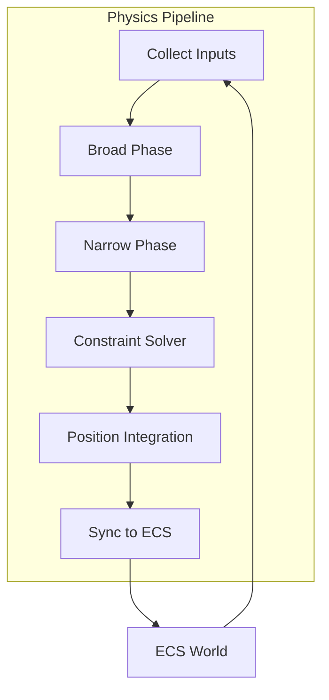

# Physics System

The AstraWeave physics system provides comprehensive 3D physics simulation through integration with [Rapier](https://rapier.rs/), a high-performance physics engine written in Rust.

## Overview

```admonish info
The physics system runs at a fixed 60Hz tick rate to ensure deterministic simulation.
```

Key features:

- **Rigid Body Dynamics** - Full 3D rigid body simulation
- **Character Controllers** - Player and NPC movement with collision
- **Collision Detection** - Broad and narrow phase collision
- **Spatial Queries** - Raycasting, shape casting, overlap tests
- **Joints & Constraints** - Connect bodies with various joint types
- **Continuous Collision Detection** - Prevents tunneling for fast objects

## Architecture



## Core Components

### RigidBody

Represents a physics-simulated body:

```rust
use astraweave_physics::{RigidBody, RigidBodyType};

let body = RigidBody {
    body_type: RigidBodyType::Dynamic,
    mass: 1.0,
    linear_damping: 0.1,
    angular_damping: 0.1,
    gravity_scale: 1.0,
    ..Default::default()
};
```

Body types:
- `Dynamic` - Fully simulated, responds to forces
- `Static` - Immovable, used for environment
- `Kinematic` - Moved by code, pushes dynamic bodies

### Collider

Defines collision shapes:

```rust
use astraweave_physics::{Collider, ColliderShape};

let collider = Collider {
    shape: ColliderShape::Box { half_extents: Vec3::new(1.0, 1.0, 1.0) },
    friction: 0.5,
    restitution: 0.3,
    sensor: false,
    ..Default::default()
};
```

Available shapes:
- `Box` - Axis-aligned box
- `Sphere` - Perfect sphere
- `Capsule` - Cylinder with spherical caps
- `Cylinder` - Circular cylinder
- `ConvexHull` - Convex mesh
- `TriMesh` - Triangle mesh (static only)
- `HeightField` - Terrain heightmap

### CharacterController

Handles player/NPC movement:

```rust
use astraweave_physics::CharacterController;

let controller = CharacterController {
    height: 1.8,
    radius: 0.3,
    step_height: 0.3,
    max_slope: 45.0_f32.to_radians(),
    ..Default::default()
};
```

## Spatial Queries

### Raycasting

```rust
use astraweave_physics::{RaycastQuery, RaycastHit};

let query = RaycastQuery {
    origin: Vec3::new(0.0, 5.0, 0.0),
    direction: Vec3::NEG_Y,
    max_distance: 100.0,
    filter: CollisionFilter::default(),
};

if let Some(hit) = physics.raycast(&query) {
    println!("Hit entity {:?} at distance {}", hit.entity, hit.distance);
}
```

### Shape Casting

```rust
use astraweave_physics::{ShapeCastQuery, ColliderShape};

let query = ShapeCastQuery {
    shape: ColliderShape::Sphere { radius: 0.5 },
    origin: start_pos,
    direction: velocity.normalize(),
    max_distance: velocity.length(),
};

let hits = physics.shape_cast(&query);
```

### Overlap Tests

```rust
use astraweave_physics::OverlapQuery;

let query = OverlapQuery {
    shape: ColliderShape::Sphere { radius: 5.0 },
    position: explosion_center,
    filter: CollisionFilter::default(),
};

for entity in physics.overlap(&query) {
    apply_explosion_damage(entity);
}
```

## Collision Filtering

Control which objects can collide:

```rust
use astraweave_physics::{CollisionFilter, CollisionGroup};

let player_filter = CollisionFilter {
    membership: CollisionGroup::PLAYER,
    filter: CollisionGroup::WORLD | CollisionGroup::ENEMY | CollisionGroup::PROJECTILE,
};
```

## Performance Optimization

### Spatial Hash

The physics system uses a spatial hash for broad-phase acceleration:

```rust
use astraweave_physics::SpatialHash;

let spatial = SpatialHash::new(10.0);
spatial.insert(entity, aabb);

let nearby = spatial.query_aabb(&query_aabb);
```

### Async Scheduling

For large simulations, physics can run asynchronously:

```rust
use astraweave_physics::AsyncPhysicsScheduler;

let scheduler = AsyncPhysicsScheduler::new(4);
scheduler.step(&mut physics_world, delta_time).await;
```

## Integration with ECS

Physics components sync automatically with ECS transforms:

```rust
fn physics_sync_system(
    query: Query<(&mut Transform, &RigidBodyHandle)>,
    physics: Res<PhysicsWorld>,
) {
    for (mut transform, handle) in query.iter_mut() {
        if let Some(body) = physics.get_body(*handle) {
            transform.translation = body.position();
            transform.rotation = body.rotation();
        }
    }
}
```

## See Also

- [API Documentation](../api/index.md) - `astraweave_physics` API
- [Character Controller Tutorial](../game-dev/first-game.md)
- [Navigation System](./navigation.md) - Pathfinding integration
- [Deterministic Simulation](../architecture/deterministic.md)
