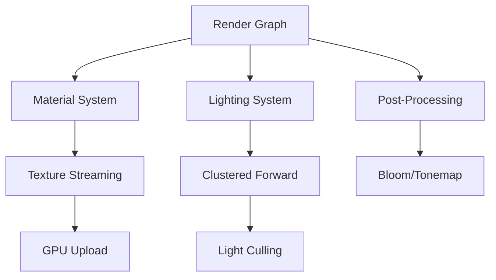
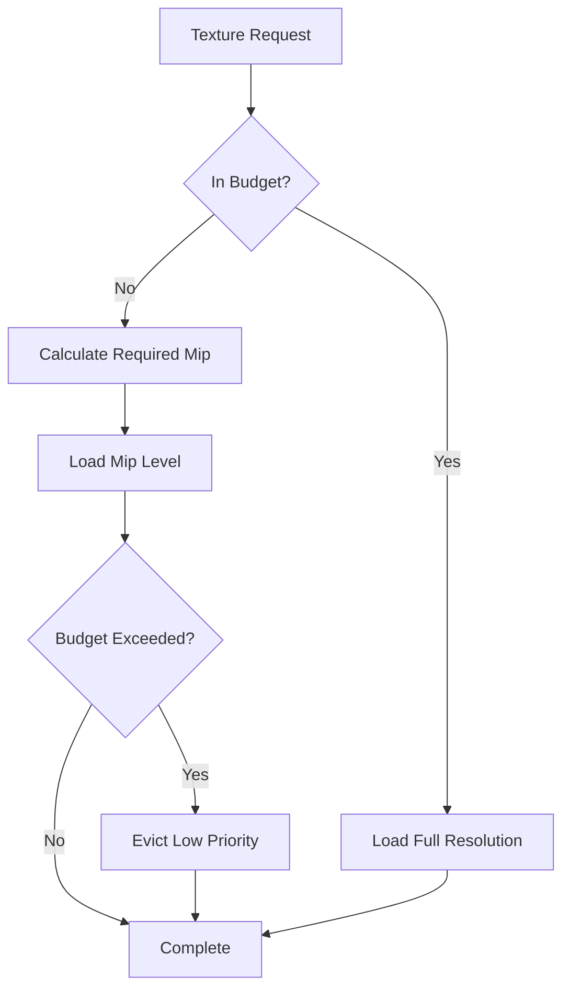

# Rendering System

AstraWeave's rendering system is built on top of WGPU, providing a modern, high-performance graphics pipeline with support for physically-based rendering (PBR), advanced lighting techniques, and post-processing effects.

## Architecture Overview

The rendering system follows a modular architecture with clear separation of concerns:



### Key Components

- **Render Graph**: Declarative frame composition with automatic resource barriers
- **Material System**: PBR materials with metallic-roughness workflow
- **Lighting**: Clustered forward rendering supporting thousands of dynamic lights
- **Texture Streaming**: Virtual texture system with priority-based loading
- **Post-Processing**: Modular effects stack (bloom, tonemap, FXAA, etc.)

```admonish info
The rendering system is designed to scale from integrated graphics to high-end GPUs, with automatic quality adaptation based on detected hardware capabilities.
```

## WGPU-Based Renderer

AstraWeave uses WGPU as its graphics abstraction layer, providing cross-platform support for Vulkan, Metal, DirectX 12, and WebGPU.

### Initialization

```rust
use astraweave_render::{RenderContext, RenderConfig};

// Initialize the renderer
let config = RenderConfig {
    width: 1920,
    height: 1080,
    vsync: true,
    msaa_samples: 4,
    ..Default::default()
};

let render_ctx = RenderContext::new(&window, config).await?;
```

### Device and Queue Management

The render context manages the WGPU device and queue lifecycle:

```rust
// Access device for resource creation
let device = render_ctx.device();
let queue = render_ctx.queue();

// Create a texture
let texture = device.create_texture(&wgpu::TextureDescriptor {
    label: Some("game_texture"),
    size: wgpu::Extent3d {
        width: 1024,
        height: 1024,
        depth_or_array_layers: 1,
    },
    mip_level_count: 1,
    sample_count: 1,
    dimension: wgpu::TextureDimension::D2,
    format: wgpu::TextureFormat::Rgba8UnormSrgb,
    usage: wgpu::TextureUsages::TEXTURE_BINDING | wgpu::TextureUsages::COPY_DST,
    view_formats: &[],
});
```

## PBR Materials and Lighting

AstraWeave implements a complete PBR pipeline based on the metallic-roughness workflow, closely following theglTF 2.0 specification.

### Material Definition

```rust
use astraweave_render::material::{Material, PbrMaterial};

let material = PbrMaterial {
    base_color: [1.0, 1.0, 1.0, 1.0],
    base_color_texture: Some(texture_handle),
    metallic: 0.0,
    roughness: 0.5,
    metallic_roughness_texture: Some(mr_texture),
    normal_texture: Some(normal_map),
    emissive: [0.0, 0.0, 0.0],
    emissive_texture: None,
    occlusion_texture: Some(ao_map),
    alpha_mode: AlphaMode::Opaque,
    double_sided: false,
};

// Register material with renderer
let material_id = render_ctx.register_material(material);
```

### Material Properties

| Property | Type | Description |
|----------|------|-------------|
| `base_color` | `[f32; 4]` | RGB color with alpha channel |
| `metallic` | `f32` | Metallic factor (0 = dielectric, 1 = metal) |
| `roughness` | `f32` | Surface roughness (0 = smooth, 1 = rough) |
| `emissive` | `[f32; 3]` | Emissive color (HDR) |
| `normal_texture` | `Option<Handle>` | Tangent-space normal map |
| `occlusion_texture` | `Option<Handle>` | Ambient occlusion map |

```admonish tip
Use texture packing to reduce memory bandwidth: combine metallic (B channel), roughness (G channel), and occlusion (R channel) into a single texture.
```

### Lighting Model

The PBR shader implements a Cook-Torrance BRDF with:

- **Diffuse**: Lambertian diffuse term
- **Specular**: GGX/Trowbridge-Reitz normal distribution
- **Fresnel**: Schlick's approximation
- **Geometry**: Smith's shadowing-masking function

```rust
// BRDF calculation (shader pseudo-code)
fn pbr_brdf(
    N: vec3<f32>,  // Normal
    V: vec3<f32>,  // View direction
    L: vec3<f32>,  // Light direction
    F0: vec3<f32>, // Fresnel reflectance at 0°
    roughness: f32,
    metallic: f32,
) -> vec3<f32> {
    let H = normalize(V + L);
    let NdotH = max(dot(N, H), 0.0);
    let NdotV = max(dot(N, V), 0.0);
    let NdotL = max(dot(N, L), 0.0);
    
    // Distribution term (GGX)
    let D = distribution_ggx(NdotH, roughness);
    
    // Geometry term (Smith)
    let G = geometry_smith(NdotV, NdotL, roughness);
    
    // Fresnel term (Schlick)
    let F = fresnel_schlick(max(dot(H, V), 0.0), F0);
    
    // Cook-Torrance BRDF
    let specular = (D * G * F) / (4.0 * NdotV * NdotL + 0.0001);
    
    let kD = (vec3(1.0) - F) * (1.0 - metallic);
    let diffuse = kD * base_color.rgb / PI;
    
    return (diffuse + specular) * radiance * NdotL;
}
```

## Clustered Forward Rendering

Clustered forward rendering divides the view frustum into a 3D grid of clusters, assigning lights to clusters for efficient culling.

### Cluster Configuration

```rust
use astraweave_render::lighting::{ClusteredLightingConfig, LightCluster};

let cluster_config = ClusteredLightingConfig {
    tile_size_x: 16,
    tile_size_y: 16,
    z_slices: 24,
    max_lights_per_cluster: 256,
};

render_ctx.configure_clustered_lighting(cluster_config);
```

### Cluster Grid


The frustum is divided into:
- **XY tiles**: Screen-space subdivision (typically 16x16 pixels)
- **Z slices**: Exponential depth slices for better near-field distribution

### Adding Lights

```rust
use astraweave_render::lighting::{PointLight, SpotLight, DirectionalLight};

// Point light
let point_light = PointLight {
    position: [0.0, 5.0, 0.0],
    color: [1.0, 0.9, 0.8],
    intensity: 100.0,
    radius: 10.0,
    falloff: 2.0, // Inverse square falloff
};

render_ctx.add_light(point_light);

// Directional light (sun)
let sun = DirectionalLight {
    direction: [-0.3, -1.0, -0.5],
    color: [1.0, 0.95, 0.9],
    intensity: 5.0,
    cast_shadows: true,
    shadow_cascade_count: 4,
};

render_ctx.set_directional_light(sun);
```

### Light Culling

The system performs GPU-based light culling using a compute shader:

```rust
// Compute shader for light culling (WGSL)
@compute @workgroup_size(16, 16, 1)
fn cull_lights(
    @builtin(global_invocation_id) global_id: vec3<u32>,
) {
    let cluster_id = compute_cluster_id(global_id);
    let cluster_aabb = get_cluster_bounds(cluster_id);
    
    var light_count: u32 = 0u;
    for (var i = 0u; i < light_buffer.count; i++) {
        let light = light_buffer.lights[i];
        if (sphere_aabb_intersection(light.position, light.radius, cluster_aabb)) {
            light_indices[cluster_id * MAX_LIGHTS + light_count] = i;
            light_count++;
        }
    }
    
    cluster_light_counts[cluster_id] = light_count;
}
```

```admonish warning
Clustered forward rendering requires compute shader support. Fallback to traditional forward rendering is provided for older hardware.
```

## Post-Processing Effects

AstraWeave provides a flexible post-processing stack with composable effects.

### Effect Pipeline

```rust
use astraweave_render::post::{PostProcessStack, BloomEffect, TonemapEffect, FxaaEffect};

let mut post_stack = PostProcessStack::new();

// Add bloom
post_stack.add_effect(BloomEffect {
    threshold: 1.0,
    intensity: 0.5,
    blur_passes: 5,
});

// Add tonemapping
post_stack.add_effect(TonemapEffect {
    exposure: 1.0,
    operator: TonemapOperator::AcesFilmic,
});

// Add anti-aliasing
post_stack.add_effect(FxaaEffect {
    quality: FxaaQuality::High,
});

render_ctx.set_post_processing(post_stack);
```

### Available Effects

| Effect | Description | Performance Impact |
|--------|-------------|-------------------|
| **Bloom** | HDR glow effect | Medium |
| **Tonemap** | HDR to LDR mapping | Low |
| **FXAA** | Fast approximate anti-aliasing | Low |
| **SMAA** | Subpixel morphological anti-aliasing | Medium |
| **Depth of Field** | Bokeh blur based on depth | High |
| **Motion Blur** | Velocity-based blur | Medium |
| **Color Grading** | LUT-based color correction | Low |

### Custom Post-Processing Effects

```rust
use astraweave_render::post::{PostEffect, PostEffectContext};

struct CustomVignetteEffect {
    intensity: f32,
    radius: f32,
}

impl PostEffect for CustomVignetteEffect {
    fn apply(&self, ctx: &mut PostEffectContext) -> Result<()> {
        let shader = ctx.load_shader("vignette.wgsl")?;
        
        ctx.bind_uniform("intensity", &self.intensity);
        ctx.bind_uniform("radius", &self.radius);
        ctx.bind_texture(0, ctx.input_texture());
        
        ctx.dispatch_fullscreen(shader)?;
        
        Ok(())
    }
}
```

## Texture Streaming

The texture streaming system manages GPU memory efficiently by loading textures on-demand with priority-based eviction.

### Virtual Texture System

```rust
use astraweave_render::texture::{TextureStreamingConfig, VirtualTexture};

let streaming_config = TextureStreamingConfig {
    budget_mb: 512,
    min_mip_level: 0,
    max_mip_level: 12,
    load_bias: 0.0,
    anisotropy: 16,
};

render_ctx.configure_texture_streaming(streaming_config);
```

### Loading Textures

```rust
use astraweave_render::texture::TextureLoader;

// Load texture with streaming
let texture = TextureLoader::new()
    .with_streaming(true)
    .with_mip_levels(8)
    .with_compression(TextureCompression::BC7)
    .load("assets/textures/ground_albedo.png")?;

// Set priority (higher = load sooner)
texture.set_priority(1.0);
```

### Mip Streaming

The system automatically selects mip levels based on:
- Distance to camera
- Screen coverage
- Available GPU memory
- User-defined priority



```admonish tip
Pre-generate mip chains offline and compress textures to reduce load times. AstraWeave supports BC1-BC7, ASTC, and ETC2 compression formats.
```

## Performance Optimization

### GPU Profiling

```rust
use astraweave_render::profiling::GpuProfiler;

let profiler = GpuProfiler::new(&render_ctx);

profiler.begin_frame();
{
    profiler.begin_scope("Shadow Pass");
    render_shadows(&mut render_ctx);
    profiler.end_scope();
    
    profiler.begin_scope("Main Pass");
    render_main_scene(&mut render_ctx);
    profiler.end_scope();
    
    profiler.begin_scope("Post Processing");
    apply_post_effects(&mut render_ctx);
    profiler.end_scope();
}
profiler.end_frame();

// Print timing report
println!("{}", profiler.report());
```

### Instancing

Use GPU instancing for rendering many identical meshes:

```rust
use astraweave_render::mesh::InstancedMesh;

let instances: Vec<InstanceData> = trees
    .iter()
    .map(|tree| InstanceData {
        transform: tree.transform.matrix(),
        color: tree.color,
    })
    .collect();

render_ctx.draw_instanced(tree_mesh, &instances);
```

### Occlusion Culling

```rust
use astraweave_render::culling::OcclusionCulling;

let mut occlusion = OcclusionCulling::new(&render_ctx);

// First pass: render occluders
occlusion.render_occluders(&occluder_meshes);

// Second pass: test visibility
let visible_objects = occlusion.test_visibility(&all_objects);

// Third pass: render only visible objects
render_objects(&visible_objects);
```

## Code Examples

### Complete Rendering Loop

```rust
use astraweave_render::{RenderContext, Camera, Scene};
use winit::event_loop::EventLoop;

fn main() -> Result<()> {
    let event_loop = EventLoop::new();
    let window = Window::new(&event_loop)?;
    
    let mut render_ctx = RenderContext::new(&window, Default::default()).await?;
    let mut scene = Scene::new();
    let mut camera = Camera::perspective(60.0, 16.0 / 9.0, 0.1, 1000.0);
    
    event_loop.run(move |event, _, control_flow| {
        match event {
            Event::RedrawRequested(_) => {
                // Update camera
                camera.update(&input_state);
                
                // Begin frame
                let mut frame = render_ctx.begin_frame().unwrap();
                
                // Render scene
                frame.render_scene(&scene, &camera);
                
                // Present
                frame.present();
            }
            _ => {}
        }
    });
}
```

### Dynamic Material Updates

```rust
// Update material properties at runtime
let material = render_ctx.get_material_mut(material_id)?;
material.base_color = [1.0, 0.0, 0.0, 1.0]; // Change to red
material.roughness = 0.8; // Make rougher
render_ctx.mark_material_dirty(material_id);
```

## Related Documentation

- [Asset Pipeline](../pipeline/assets.md) - Asset loading and preprocessing
- [Scene Graph](../ecs/scene-graph.md) - Scene organization and transforms
- [Editor Integration](../editor/rendering.md) - Editor viewport rendering
- [Performance Guide](../optimization/rendering.md) - Advanced optimization techniques

## API Reference

For complete API documentation, see:
- [astraweave_render API docs](https://docs.rs/astraweave-render)
- [WGPU documentation](https://wgpu.rs)
