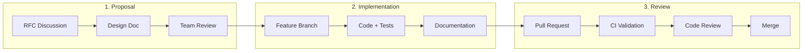

# Adding New Features

This guide walks you through the process of contributing new features to AstraWeave, from initial proposal through implementation, testing, and documentation.

## Feature Development Workflow



## Phase 1: Proposal

### Feature Request Format

Before implementing a significant feature, create a discussion or RFC:

```markdown
## Feature: [Name]

### Summary
One paragraph describing the feature.

### Motivation
- Why is this needed?
- What problem does it solve?
- Who benefits?

### Design Overview
- High-level approach
- Key components affected
- API surface changes

### Alternatives Considered
- Option A: ...
- Option B: ...
- Why chosen approach is better

### Breaking Changes
- None / List any breaking changes

### Implementation Plan
1. Step 1
2. Step 2
3. ...
```

### Design Document

For complex features, create a design document in `docs/design/`:

```markdown
# Design: [Feature Name]

## Goals
- Primary objective
- Secondary objectives

## Non-Goals
- Explicitly out of scope

## Architecture

[Mermaid diagram or description]

## API Design

```rust
// Public API examples
```

## Migration Path
How existing code adapts to the new feature.

## Testing Strategy
How the feature will be tested.

## Timeline
Estimated implementation phases.
```

## Phase 2: Implementation

### Branch Setup

```bash
git checkout main
git pull origin main
git checkout -b feature/my-feature-name
```

### Project Structure

Understand where your feature belongs:

```
astraweave/
├── astraweave-ecs/          # Core ECS (rare modifications)
├── astraweave-ai/           # AI systems
├── astraweave-render/       # Rendering
├── astraweave-physics/      # Physics
├── astraweave-gameplay/     # Gameplay systems
├── astraweave-*/            # Other subsystems
└── examples/                # Feature examples
```

### Creating a New Crate

For substantial features, create a new crate:

```bash
cargo new --lib astraweave-myfeature
```

**Cargo.toml template:**

```toml
[package]
name = "astraweave-myfeature"
version = "0.1.0"
edition = "2021"
license = "MIT OR Apache-2.0"
description = "Brief description"
repository = "https://github.com/astraweave/astraweave"
keywords = ["gamedev", "astraweave"]

[dependencies]
astraweave-ecs = { path = "../astraweave-ecs" }

[dev-dependencies]
criterion = "0.5"

[features]
default = []

[[bench]]
name = "my_benchmark"
harness = false
```

### Adding to Workspace

Update root `Cargo.toml`:

```toml
[workspace]
members = [
    # ... existing crates
    "astraweave-myfeature",
]
```

### Module Structure

Follow the standard module layout:

```
astraweave-myfeature/
├── src/
│   ├── lib.rs           # Public API, re-exports
│   ├── prelude.rs       # Common imports
│   ├── component.rs     # ECS components
│   ├── system.rs        # ECS systems
│   ├── resource.rs      # ECS resources
│   └── internal/        # Private implementation
│       └── mod.rs
├── tests/
│   └── integration.rs   # Integration tests
├── benches/
│   └── benchmark.rs     # Performance benchmarks
└── Cargo.toml
```

### Implementation Guidelines

#### Public API Design

```rust
pub mod prelude {
    pub use crate::MyComponent;
    pub use crate::MyResource;
    pub use crate::my_system;
}

#[derive(Component, Debug, Clone)]
pub struct MyComponent {
    pub visible_field: f32,
}

impl MyComponent {
    pub fn new(value: f32) -> Self {
        Self { visible_field: value }
    }
    
    pub fn with_option(mut self, option: bool) -> Self {
        self
    }
}

#[derive(Resource, Default)]
pub struct MyResource {
    config: MyConfig,
}

pub fn my_system(
    query: Query<&MyComponent>,
    resource: Res<MyResource>,
) {
    for component in query.iter() {
        // Implementation
    }
}
```

#### Error Handling

Define clear error types:

```rust
#[derive(Debug, thiserror::Error)]
pub enum MyFeatureError {
    #[error("Invalid configuration: {0}")]
    InvalidConfig(String),
    
    #[error("Resource not found: {0}")]
    NotFound(String),
    
    #[error("Operation failed: {0}")]
    OperationFailed(#[from] std::io::Error),
}

pub type Result<T> = std::result::Result<T, MyFeatureError>;
```

#### Feature Flags

Use feature flags for optional functionality:

```toml
[features]
default = ["standard"]
standard = []
advanced = ["dep:optional-crate"]
serde = ["dep:serde"]

[dependencies]
optional-crate = { version = "1.0", optional = true }
serde = { version = "1.0", features = ["derive"], optional = true }
```

```rust
#[cfg(feature = "advanced")]
pub mod advanced {
    pub fn advanced_function() {
        // Only available with "advanced" feature
    }
}

#[cfg(feature = "serde")]
impl serde::Serialize for MyComponent {
    // Serialization implementation
}
```

## Phase 3: Testing

### Unit Tests

Include tests alongside implementation:

```rust
#[cfg(test)]
mod tests {
    use super::*;
    
    #[test]
    fn test_component_creation() {
        let component = MyComponent::new(42.0);
        assert_eq!(component.visible_field, 42.0);
    }
    
    #[test]
    fn test_builder_pattern() {
        let component = MyComponent::new(1.0)
            .with_option(true);
        // Assertions
    }
    
    #[test]
    #[should_panic(expected = "Invalid value")]
    fn test_invalid_input() {
        MyComponent::new(-1.0);
    }
}
```

### Integration Tests

Create `tests/integration.rs`:

```rust
use astraweave_ecs::prelude::*;
use astraweave_myfeature::prelude::*;

#[test]
fn test_system_integration() {
    let mut world = World::new();
    
    world.spawn(MyComponent::new(10.0));
    world.insert_resource(MyResource::default());
    
    let mut schedule = Schedule::default();
    schedule.add_system(my_system);
    schedule.run(&mut world);
    
    // Verify results
}

#[test]
fn test_full_workflow() {
    // Test complete feature workflow
}
```

### Benchmarks

Create `benches/benchmark.rs`:

```rust
use criterion::{criterion_group, criterion_main, Criterion, BenchmarkId};
use astraweave_myfeature::*;

fn benchmark_creation(c: &mut Criterion) {
    c.bench_function("component_create", |b| {
        b.iter(|| MyComponent::new(42.0))
    });
}

fn benchmark_system(c: &mut Criterion) {
    let mut group = c.benchmark_group("system_throughput");
    
    for count in [100, 1000, 10000].iter() {
        group.bench_with_input(
            BenchmarkId::from_parameter(count),
            count,
            |b, &count| {
                let mut world = setup_world(count);
                let mut schedule = setup_schedule();
                
                b.iter(|| schedule.run(&mut world));
            },
        );
    }
    
    group.finish();
}

criterion_group!(benches, benchmark_creation, benchmark_system);
criterion_main!(benches);
```

Run benchmarks:

```bash
cargo bench -p astraweave-myfeature
```

## Phase 4: Documentation

### API Documentation

Document all public items:

```rust
/// A component that tracks feature state.
///
/// # Examples
///
/// ```rust
/// use astraweave_myfeature::MyComponent;
///
/// let component = MyComponent::new(42.0);
/// assert_eq!(component.visible_field, 42.0);
/// ```
///
/// # Panics
///
/// Panics if `value` is negative.
#[derive(Component)]
pub struct MyComponent {
    /// The primary value tracked by this component.
    pub visible_field: f32,
}

/// Creates a new component with the given value.
///
/// # Arguments
///
/// * `value` - The initial value (must be non-negative)
///
/// # Returns
///
/// A new `MyComponent` instance.
///
/// # Examples
///
/// ```rust
/// let component = MyComponent::new(10.0);
/// ```
impl MyComponent {
    pub fn new(value: f32) -> Self {
        assert!(value >= 0.0, "Invalid value");
        Self { visible_field: value }
    }
}
```

### User Guide

Add documentation to `docs/src/`:

```markdown
# My Feature

Brief introduction explaining what the feature does.

## Quick Start

```rust
use astraweave_myfeature::prelude::*;

// Minimal example
```

## Concepts

Explain key concepts and terminology.

## Usage

### Basic Usage

Step-by-step instructions.

### Advanced Usage

More complex scenarios.

## Configuration

Available options and settings.

## Best Practices

Tips for effective use.

## Related

- [Related Feature](link)
- [API Reference](link)
```

### Update SUMMARY.md

Add your documentation to `docs/src/SUMMARY.md`:

```markdown
- [Core Systems](core-systems/index.md)
    - [My Feature](core-systems/myfeature.md)  # Add here
```

## Phase 5: Pull Request

### Pre-Submit Checklist

Before opening a PR:

```bash
cargo fmt --all
cargo clippy --all-targets --all-features -- -D warnings
cargo test --all
cargo doc --no-deps --all-features
```

### PR Template

```markdown
## Summary

Brief description of changes.

## Changes

- Added `MyComponent` for tracking X
- Implemented `my_system` for processing Y
- Added benchmarks for performance validation

## Testing

- [x] Unit tests added
- [x] Integration tests added
- [x] Benchmarks added
- [x] Manual testing completed

## Documentation

- [x] API docs complete
- [x] User guide added
- [x] SUMMARY.md updated

## Breaking Changes

None / List any breaking changes.

## Related Issues

Fixes #123
Related to #456
```

### CI Requirements

Your PR must pass:

1. **Format check**: `cargo fmt --check`
2. **Lint check**: `cargo clippy`
3. **Test suite**: `cargo test --all`
4. **Doc generation**: `cargo doc`
5. **Benchmark regression**: No significant slowdowns

### Code Review

Expect reviewers to check:

- API design and ergonomics
- Performance implications
- Test coverage
- Documentation quality
- Breaking change management

## Best Practices

```admonish tip title="Feature Development Tips"
1. **Start Small**: Begin with minimal viable feature, iterate
2. **Design for Extension**: Make it easy to add functionality later
3. **Follow Conventions**: Match existing code style and patterns
4. **Test Edge Cases**: Cover error conditions and boundaries
5. **Document Intent**: Explain why, not just what
```

```admonish warning title="Common Mistakes"
- **Scope Creep**: Resist adding "just one more thing"
- **Missing Tests**: Every public function needs tests
- **Breaking Changes**: Avoid unless absolutely necessary
- **Performance Regression**: Always benchmark critical paths
```

## Example: Adding a New System

Here's a complete example of adding a health regeneration system:

```rust
// astraweave-gameplay/src/health_regen.rs

use astraweave_ecs::prelude::*;

/// Configuration for health regeneration.
#[derive(Resource)]
pub struct HealthRegenConfig {
    /// Base regeneration rate (HP per second).
    pub base_rate: f32,
    /// Delay before regeneration starts after damage.
    pub regen_delay: f32,
}

impl Default for HealthRegenConfig {
    fn default() -> Self {
        Self {
            base_rate: 5.0,
            regen_delay: 3.0,
        }
    }
}

/// Enables health regeneration on an entity.
#[derive(Component)]
pub struct HealthRegen {
    /// Multiplier applied to base regeneration rate.
    pub rate_multiplier: f32,
    /// Time since last damage taken.
    pub time_since_damage: f32,
}

impl Default for HealthRegen {
    fn default() -> Self {
        Self {
            rate_multiplier: 1.0,
            time_since_damage: 0.0,
        }
    }
}

/// System that regenerates health over time.
pub fn health_regen_system(
    config: Res<HealthRegenConfig>,
    time: Res<Time>,
    mut query: Query<(&mut Health, &mut HealthRegen)>,
) {
    let dt = time.delta_seconds();
    
    for (mut health, mut regen) in query.iter_mut() {
        regen.time_since_damage += dt;
        
        if regen.time_since_damage >= config.regen_delay {
            let regen_amount = config.base_rate * regen.rate_multiplier * dt;
            health.current = (health.current + regen_amount).min(health.max);
        }
    }
}

#[cfg(test)]
mod tests {
    use super::*;
    
    #[test]
    fn test_regen_after_delay() {
        // Test implementation
    }
}
```

## Related Documentation

- [Contributing Guide](contributing.md) - General contribution guidelines
- [Code Style](code-style.md) - Coding standards
- [Testing Guide](testing.md) - Testing practices
- [Building](building.md) - Build instructions
