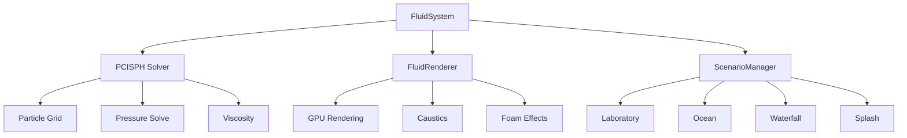

# Fluids Demo

Interactive demonstration of AstraWeave's PCISPH-based fluid simulation system with real-time rendering, multiple scenarios, and egui-powered controls.

```admonish info title="Run This Example"
cargo run -p fluids_demo --release
```

## Overview

The fluids demo showcases:

- **Real-time particle-based fluid simulation** using PCISPH solver
- **Multiple simulation scenarios** (laboratory, ocean, waterfall, splash)
- **Interactive controls** for spawning particles and adjusting parameters
- **Advanced rendering** with caustics, foam, and refraction effects
- **LOD optimization** for performance scaling

## Quick Start

```bash
# Run the demo
cargo run -p fluids_demo --release

# Controls:
# WASD      - Move camera
# Mouse     - Rotate camera
# LMB       - Spawn particles at cursor
# RMB       - Apply force to particles
# Tab       - Switch scenario
# F3        - Toggle debug panel
```

## Architecture



## Scenarios

### Laboratory Scenario

Controlled environment for testing fluid behavior:

- Bounded container simulation
- Particle spawning controls
- Parameter visualization
- Ideal for learning system behavior

### Ocean Scenario

Large-scale ocean wave simulation:

- Skybox environment (HDR-based)
- Wave dynamics
- Foam generation
- Infinite horizon effect

### Waterfall Scenario

Vertical fluid flow demonstration:

- Gravity-driven particle flow
- Splash effects at base
- Continuous particle recycling

### Splash Scenario

High-energy impact simulation:

- Droplet spawning
- Surface tension effects
- Spray particle generation

## Configuration

### Fluid System Parameters

The demo exposes all major fluid parameters through the debug panel:

```rust
// From the demo - actual parameter configuration
fluid_system.smoothing_radius = 0.5;    // SPH kernel radius
fluid_system.target_density = 1.0;       // Rest density
fluid_system.pressure_multiplier = 100.0; // Stiffness
fluid_system.viscosity = 0.01;           // Fluid thickness
fluid_system.gravity = -9.81;            // Gravity strength
fluid_system.cell_size = 1.2;            // Spatial hash cell size
fluid_system.grid_width = 64;            // Grid dimensions
fluid_system.grid_height = 64;
fluid_system.grid_depth = 64;
```

### Quality Presets

The demo includes 4 quality levels (selectable in UI):

| Preset | Particles | Cell Size | Target FPS |
|--------|-----------|-----------|------------|
| Low    | 5,000     | 2.0       | 60+        |
| Medium | 10,000    | 1.5       | 60         |
| High   | 20,000    | 1.2       | 45-60      |
| Ultra  | 50,000    | 1.0       | 30-45      |

## Interactive Features

### Particle Spawning

Left-click in the viewport to spawn particles:

```rust
// Demo implementation - ray-plane intersection for spawn position
fn spawn_particles_at_cursor(&mut self) {
    let (origin, dir) = self.screen_to_world_ray(
        self.mouse_pos[0], 
        self.mouse_pos[1]
    );
    
    // Intersect with Y=5 plane (fluid center height)
    if let Some(hit_pos) = self.ray_plane_intersection(origin, dir, 5.0) {
        let positions: Vec<[f32; 3]> = (0..count)
            .map(|i| {
                let angle = (i as f32 / count as f32) * TAU;
                let radius = (i as f32 * 0.1).sin() * 0.5;
                [hit_pos.x + angle.cos() * radius, 
                 hit_pos.y + 0.5, 
                 hit_pos.z + angle.sin() * radius]
            })
            .collect();
        
        self.fluid_system.spawn_particles(&queue, &positions, &velocities, colors);
    }
}
```

### Force Application

Right-click and drag to apply forces:

- Drag direction determines force vector
- Force magnitude scales with drag distance
- Affects all particles in a configurable radius

### Debug Panel

Press F3 to toggle the debug panel (egui-based):

- Real-time particle count
- FPS / frame time graph
- Simulation step timing
- LOD level indicator
- Parameter sliders

## LOD System

The demo uses `FluidLodManager` and `FluidOptimizationController` for dynamic quality scaling:

```rust
// LOD configuration from demo
let lod_config = FluidLodConfig {
    target_fps: 60.0,
    min_particles: 1000,
    max_particles: 50000,
    lod_levels: vec![
        LodLevel { distance: 10.0, particle_scale: 1.0 },
        LodLevel { distance: 25.0, particle_scale: 0.5 },
        LodLevel { distance: 50.0, particle_scale: 0.25 },
    ],
};

// Controller maintains target FPS
optimization_controller.update(last_frame_time_ms);
let suggested_count = optimization_controller.suggested_particle_count();
```

## Rendering Pipeline

### GPU-Accelerated Rendering

The demo uses wgpu 25 for all rendering:

```rust
// Render pass structure
let fluid_renderer = FluidRenderer::new(&device, width, height, format);

// Each frame:
// 1. Render skybox to scene texture (if ocean scenario)
// 2. Render fluid particles with refraction
// 3. Apply caustics and foam effects
// 4. Composite to swapchain
// 5. Render egui overlay
```

### Shader Features

The demo includes multiple WGSL shaders:

- `fluid.wgsl` - Main particle rendering
- `ocean.wgsl` - Ocean surface simulation
- `skybox.wgsl` - HDR environment mapping
- `glass.wgsl` - Refraction effects

## Performance Tips

### Achieving 60 FPS

1. **Reduce particle count** - Start with Medium preset
2. **Increase cell size** - Fewer neighbor lookups
3. **Use LOD** - Enable optimization controller
4. **Disable foam** - Reduces particle overhead

### Profiling

Enable Tracy profiling:

```bash
cargo run -p fluids_demo --release --features profiling
```

Key spans to watch:
- `fluid_system.step()` - Physics simulation
- `fluid_renderer.render()` - GPU draw calls
- `egui.render()` - UI overhead

## Dependencies

```toml
[dependencies]
astraweave-physics = { path = "../../astraweave-physics" }
astraweave-fluids = { path = "../../astraweave-fluids" }
winit = { workspace = true }
wgpu = { workspace = true }
glam = { workspace = true }
egui = { workspace = true }
egui-wgpu = { workspace = true }
egui-winit = { workspace = true }
```

## Related Documentation

- [Fluids System Guide](../core-systems/fluids.md) - Core fluids architecture
- [Fluids API Reference](../api/fluids.md) - Complete API documentation
- [Performance Optimization](../performance/optimization.md) - General optimization strategies

## Troubleshooting

### Low FPS

**Symptom**: Frame rate drops below 30 FPS

**Solutions**:
1. Switch to Low quality preset
2. Reduce `spawn_burst_size` in debug panel
3. Close other GPU-intensive applications
4. Check GPU driver is up to date

### No Particles Visible

**Symptom**: Scene renders but no fluid particles

**Solutions**:
1. Check scenario is initialized (Tab to switch)
2. Click LMB to spawn particles manually
3. Verify camera position (reset with R key)

### Skybox Not Loading

**Symptom**: Ocean scenario shows black sky

**Cause**: Missing HDR file at `assets/hdri/polyhaven/kloppenheim_02_puresky_2k.hdr`

**Solution**: Download from [Poly Haven](https://polyhaven.com/) or disable skybox feature

### wgpu Adapter Errors

**Symptom**: "No suitable adapter found"

**Solutions**:
1. Update GPU drivers
2. Try different backend: `WGPU_BACKEND=vulkan cargo run -p fluids_demo`
3. Ensure system meets minimum requirements (DX12 or Vulkan 1.1 capable GPU)
