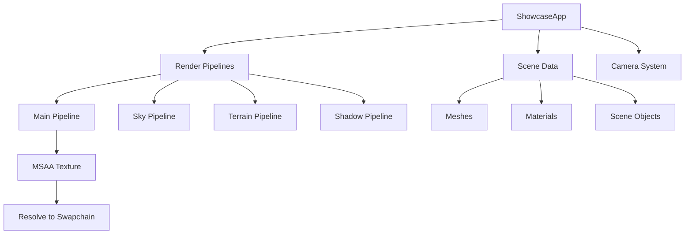

# Unified Showcase

A comprehensive rendering demonstration combining shadows, terrain, GLTF models, and skybox rendering in a self-contained wgpu application.

```admonish info title="Run This Example"
cargo run -p unified_showcase --release
```

## Overview

The unified showcase demonstrates:

- **Shadow mapping** with 2048×2048 depth textures
- **GLTF model loading** with materials and transforms
- **Procedural terrain** with multi-texture blending
- **HDR skybox** rendering
- **4× MSAA** antialiasing
- **First-person camera** controls

This is a standalone renderer example that doesn't depend on engine render crates—ideal for learning wgpu patterns.

## Quick Start

```bash
# Run the showcase
cargo run -p unified_showcase --release

# Controls:
# WASD      - Move camera
# Mouse     - Look around (click to capture)
# Escape    - Release mouse
# Space     - Move up
# Shift     - Move down
```

## Features

### Shadow Mapping

Real-time shadow casting with PCF (Percentage Closer Filtering):

```rust
// Shadow texture configuration
let shadow_texture = device.create_texture(&wgpu::TextureDescriptor {
    label: Some("Shadow Texture"),
    size: wgpu::Extent3d {
        width: 2048,
        height: 2048,
        depth_or_array_layers: 1,
    },
    format: wgpu::TextureFormat::Depth32Float,
    usage: TextureUsages::RENDER_ATTACHMENT | TextureUsages::TEXTURE_BINDING,
    ...
});

// Comparison sampler for PCF
let shadow_sampler = device.create_sampler(&wgpu::SamplerDescriptor {
    compare: Some(wgpu::CompareFunction::Less),
    mag_filter: wgpu::FilterMode::Linear,
    min_filter: wgpu::FilterMode::Linear,
    ...
});
```

### GLTF Model Loading

The demo includes a custom GLTF loader for scene objects:

```rust
// Load and render GLTF models
mod gltf_loader;

// Material indices for different model parts
pine_bark_mat: usize,
pine_leaves_mat: usize,
tower_wood_mat: usize,
tower_stone_mat: usize,
```

Supported GLTF features:
- Mesh geometry (positions, normals, UVs)
- Base color textures
- Transform hierarchies
- Multiple materials per model

### Terrain Rendering

Procedural terrain with height-based texture blending:

- **Grass texture** - Low elevation areas
- **Rock texture** - Steep slopes
- **Snow texture** - High elevation peaks
- **Normal mapping** - Surface detail
- **Triplanar projection** - Seamless texturing on steep surfaces

```wgsl
// terrain.wgsl - height-based texture blending
fn blend_terrain_textures(height: f32, slope: f32) -> vec4<f32> {
    let grass_weight = smoothstep(0.0, 0.3, 1.0 - slope);
    let rock_weight = smoothstep(0.2, 0.5, slope);
    let snow_weight = smoothstep(0.7, 1.0, height);
    
    return grass * grass_weight + rock * rock_weight + snow * snow_weight;
}
```

### Skybox

HDR-based environment rendering:

```rust
// Skybox pipeline - renders at depth 1.0 (far plane)
let sky_pipeline = device.create_render_pipeline(&wgpu::RenderPipelineDescriptor {
    depth_stencil: Some(wgpu::DepthStencilState {
        depth_write_enabled: false,
        depth_compare: wgpu::CompareFunction::LessEqual,
        ...
    }),
    ...
});
```

### MSAA

4× multisampling for smooth edges:

```rust
multisample: wgpu::MultisampleState {
    count: 4,
    mask: !0,
    alpha_to_coverage_enabled: false,
}
```

## Architecture



### Render Pass Order

1. **Shadow Pass** - Render scene from light perspective
2. **Skybox Pass** - Render environment (no depth write)
3. **Terrain Pass** - Render ground with shadows
4. **Object Pass** - Render GLTF models with shadows
5. **MSAA Resolve** - Resolve 4× samples to swapchain

## Pipeline Details

### Main Render Pipeline

```rust
let render_pipeline = device.create_render_pipeline(&wgpu::RenderPipelineDescriptor {
    layout: Some(&render_pipeline_layout),
    vertex: wgpu::VertexState {
        module: &shader,
        entry_point: Some("vs_main"),
        buffers: &[Vertex::desc()],
    },
    fragment: Some(wgpu::FragmentState {
        module: &shader,
        entry_point: Some("fs_main"),
        targets: &[Some(wgpu::ColorTargetState {
            format: config.format,
            blend: Some(wgpu::BlendState::ALPHA_BLENDING),
            write_mask: wgpu::ColorWrites::ALL,
        })],
    }),
    primitive: wgpu::PrimitiveState {
        topology: wgpu::PrimitiveTopology::TriangleList,
        front_face: wgpu::FrontFace::Ccw,
        cull_mode: Some(wgpu::Face::Back),
    },
    depth_stencil: Some(wgpu::DepthStencilState {
        format: wgpu::TextureFormat::Depth32Float,
        depth_write_enabled: true,
        depth_compare: wgpu::CompareFunction::Less,
    }),
    multisample: wgpu::MultisampleState { count: 4, ... },
});
```

### Bind Group Layouts

The showcase uses 4 main bind group layouts:

| Slot | Name | Contents |
|------|------|----------|
| 0 | Camera | View-projection matrix, camera position |
| 1 | Light | Light view-projection, position, color, shadow map |
| 2 | Material | Albedo texture, sampler |
| 3 | Model | Per-object transform matrix |

### Vertex Format

```rust
#[repr(C)]
struct Vertex {
    position: [f32; 3],
    normal: [f32; 3],
    uv: [f32; 2],
    color: [f32; 4],
    tangent: [f32; 4],
}
```

## Shaders

### Main Shader (shader_v2.wgsl)

```wgsl
@vertex
fn vs_main(in: VertexInput) -> VertexOutput {
    var out: VertexOutput;
    let world_pos = model.model * vec4<f32>(in.position, 1.0);
    out.clip_position = camera.view_proj * world_pos;
    out.world_position = world_pos.xyz;
    out.world_normal = normalize((model.model * vec4<f32>(in.normal, 0.0)).xyz);
    out.uv = in.uv;
    out.shadow_position = light.view_proj * world_pos;
    return out;
}

@fragment
fn fs_main(in: VertexOutput) -> @location(0) vec4<f32> {
    let shadow = calculate_shadow(in.shadow_position);
    let albedo = textureSample(t_diffuse, s_diffuse, in.uv);
    let lighting = calculate_lighting(in.world_normal, light.position, shadow);
    return vec4<f32>(albedo.rgb * lighting, albedo.a);
}
```

### Shadow Shader

Minimal shader for depth-only rendering:

```wgsl
@vertex
fn vs_main(in: VertexInput) -> @builtin(position) vec4<f32> {
    return light.view_proj * model.model * vec4<f32>(in.position, 1.0);
}
```

## Dependencies

```toml
[dependencies]
winit = { workspace = true }
wgpu = { workspace = true }
glam = { workspace = true }
pollster = { workspace = true }
bytemuck = { workspace = true }
image = { version = "0.25", features = ["png", "jpeg", "hdr", "webp"] }
gltf = { version = "1.4", features = ["utils", "KHR_materials_unlit"] }
```

Note: This example is **self-contained** and doesn't use `astraweave-render` crates. It's designed as a clean reference implementation.

## Asset Requirements

The demo expects assets in the following locations:

```
assets/
├── models/
│   ├── pine_tree.glb
│   └── watch_tower.glb
├── textures/
│   ├── grass_albedo.png
│   ├── rock_albedo.png
│   └── snow_albedo.png
└── hdri/
    └── polyhaven/
        └── kloppenheim_02_puresky_2k.hdr
```

## Performance

Typical performance on mid-range hardware:

| Metric | Value |
|--------|-------|
| Shadow Resolution | 2048×2048 |
| MSAA | 4× |
| Draw Calls | 10-50 (scene dependent) |
| Frame Time | 8-12 ms (60-80+ FPS) |
| VRAM | ~200-500 MB |

### Optimization Opportunities

For production use, consider:

1. **Cascaded Shadow Maps** - Multiple shadow cascades for large scenes
2. **Instanced Rendering** - Batch similar objects
3. **Frustum Culling** - Skip off-screen objects
4. **LOD System** - Distance-based mesh simplification

## Learning Value

This example teaches:

1. **wgpu Pipeline Creation** - Complete setup from device to swapchain
2. **Bind Group Management** - Proper resource binding patterns
3. **Shadow Mapping** - Light-space rendering and PCF sampling
4. **GLTF Integration** - Loading and rendering real 3D assets
5. **Multi-Pass Rendering** - Coordinating multiple render passes
6. **MSAA Setup** - Multisampling with resolve

## Related Documentation

- [Rendering System Guide](../core-systems/rendering.md) - Engine rendering architecture
- [Render API Reference](../api/render.md) - Complete rendering API
- [Performance Optimization](../performance/optimization.md) - General optimization

## Troubleshooting

### Black Screen

**Symptom**: Window opens but shows only black

**Solutions**:
1. Check GPU supports wgpu backends (Vulkan/DX12/Metal)
2. Update graphics drivers
3. Enable logging: `RUST_LOG=info cargo run -p unified_showcase`

### Missing Textures

**Symptom**: Models render as solid colors

**Cause**: Asset files not found

**Solution**: Ensure `assets/` directory contains required textures

### Slow Performance

**Symptom**: FPS below 30

**Solutions**:
1. Reduce shadow map resolution (edit source)
2. Disable MSAA (change count to 1)
3. Close other GPU applications
4. Try different wgpu backend: `WGPU_BACKEND=dx12`

### GLTF Load Errors

**Symptom**: Panic on startup with GLTF error

**Solutions**:
1. Verify GLTF files exist in `assets/models/`
2. Check GLTF files are valid (test in Blender)
3. Ensure GLTF uses supported features only
