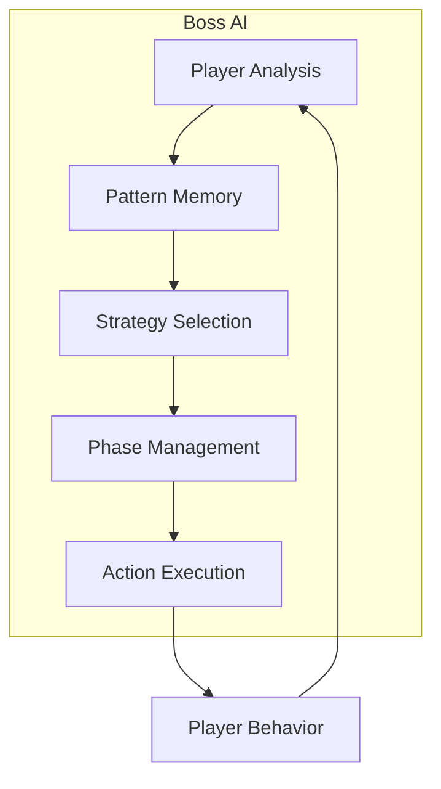

# Adaptive Bosses

Adaptive bosses in AstraWeave learn from player behavior and adjust their strategies in real-time. Unlike scripted boss encounters, these AI-driven enemies create unique, memorable fights that evolve with each attempt.

```admonish info title="AI-Native Bosses"
Bosses use the same AI architecture as companions - perception, planning, and validated tools - but with combat-focused behaviors and learning capabilities.
```

## Boss Architecture



## Creating an Adaptive Boss

### Basic Boss Setup

```rust
use astraweave_ai::prelude::*;
use astraweave_gameplay::boss::*;

fn spawn_adaptive_boss(world: &mut World) -> Entity {
    world.spawn((
        Name::new("The Hollow Knight"),
        Transform::from_xyz(0.0, 2.0, 0.0),
        
        BossAi::new()
            .with_phases(3)
            .with_adaptation_rate(0.3)
            .with_pattern_memory(50),
        
        BossHealth {
            current: 10000.0,
            max: 10000.0,
            phase_thresholds: vec![0.7, 0.4, 0.15],
        },
        
        AvailableTools::new(vec![
            Tool::melee_combo(),
            Tool::ranged_attack(),
            Tool::area_attack(),
            Tool::summon_minions(),
            Tool::teleport(),
            Tool::enrage(),
        ]),
        
        PlayerAnalyzer::default(),
        StrategySelector::default(),
        
        RigidBody::Dynamic,
        Collider::capsule(1.0, 4.0),
        NavAgent::default(),
    ))
}
```

### Phase Configuration

```rust
#[derive(Component)]
struct BossPhaseConfig {
    phases: Vec<BossPhase>,
    current_phase: usize,
}

struct BossPhase {
    name: String,
    health_threshold: f32,
    available_attacks: Vec<AttackPattern>,
    behavior_modifiers: BehaviorModifiers,
    transition_animation: Option<AnimationId>,
}

let phase_config = BossPhaseConfig {
    phases: vec![
        BossPhase {
            name: "Cautious".into(),
            health_threshold: 1.0,
            available_attacks: vec![
                AttackPattern::SingleSlash,
                AttackPattern::Thrust,
                AttackPattern::Sidestep,
            ],
            behavior_modifiers: BehaviorModifiers {
                aggression: 0.3,
                defense: 0.7,
                patience: 0.8,
            },
            transition_animation: None,
        },
        BossPhase {
            name: "Aggressive".into(),
            health_threshold: 0.6,
            available_attacks: vec![
                AttackPattern::TripleCombo,
                AttackPattern::SpinAttack,
                AttackPattern::LeapSlam,
                AttackPattern::Thrust,
            ],
            behavior_modifiers: BehaviorModifiers {
                aggression: 0.7,
                defense: 0.3,
                patience: 0.4,
            },
            transition_animation: Some(AnimationId::Enrage),
        },
        BossPhase {
            name: "Desperate".into(),
            health_threshold: 0.25,
            available_attacks: vec![
                AttackPattern::FuryCombo,
                AttackPattern::ShadowClones,
                AttackPattern::AreaDenial,
                AttackPattern::GrabAttack,
            ],
            behavior_modifiers: BehaviorModifiers {
                aggression: 1.0,
                defense: 0.1,
                patience: 0.1,
            },
            transition_animation: Some(AnimationId::Transform),
        },
    ],
    current_phase: 0,
};
```

## Player Analysis

Bosses track player behavior to counter their strategies:

```rust
#[derive(Component, Default)]
struct PlayerAnalyzer {
    dodge_pattern: DodgePattern,
    attack_timing: AttackTiming,
    positioning_preference: PositioningStyle,
    heal_threshold: f32,
    aggression_level: f32,
    pattern_history: VecDeque<PlayerAction>,
}

#[derive(Default)]
struct DodgePattern {
    left_count: u32,
    right_count: u32,
    back_count: u32,
    roll_timing: Vec<f32>,
}

fn analyze_player_system(
    mut analyzers: Query<&mut PlayerAnalyzer, With<BossAi>>,
    player_actions: EventReader<PlayerActionEvent>,
) {
    for action in player_actions.read() {
        for mut analyzer in analyzers.iter_mut() {
            analyzer.pattern_history.push_back(action.clone());
            
            if analyzer.pattern_history.len() > 100 {
                analyzer.pattern_history.pop_front();
            }
            
            match action {
                PlayerActionEvent::Dodge(direction) => {
                    match direction {
                        Direction::Left => analyzer.dodge_pattern.left_count += 1,
                        Direction::Right => analyzer.dodge_pattern.right_count += 1,
                        Direction::Back => analyzer.dodge_pattern.back_count += 1,
                        _ => {}
                    }
                }
                PlayerActionEvent::Attack(timing) => {
                    analyzer.attack_timing.record(*timing);
                }
                PlayerActionEvent::Heal => {
                    analyzer.heal_threshold = calculate_heal_threshold(&analyzer);
                }
                _ => {}
            }
        }
    }
}
```

## Strategy Adaptation

```rust
#[derive(Component)]
struct StrategySelector {
    current_strategy: BossStrategy,
    strategy_effectiveness: HashMap<BossStrategy, f32>,
    adaptation_cooldown: Timer,
}

#[derive(Clone, Copy, Hash, Eq, PartialEq)]
enum BossStrategy {
    Aggressive,
    Defensive,
    Counter,
    Pressure,
    Bait,
    Mixed,
}

fn adapt_strategy_system(
    mut bosses: Query<(&PlayerAnalyzer, &mut StrategySelector, &BossHealth)>,
    time: Res<Time>,
) {
    for (analyzer, mut selector, health) in bosses.iter_mut() {
        selector.adaptation_cooldown.tick(time.delta());
        
        if selector.adaptation_cooldown.finished() {
            let new_strategy = select_counter_strategy(analyzer);
            
            if new_strategy != selector.current_strategy {
                let old_effectiveness = selector.strategy_effectiveness
                    .get(&selector.current_strategy)
                    .copied()
                    .unwrap_or(0.5);
                
                selector.strategy_effectiveness
                    .insert(selector.current_strategy, old_effectiveness * 0.9);
                
                selector.current_strategy = new_strategy;
                selector.adaptation_cooldown.reset();
            }
        }
    }
}

fn select_counter_strategy(analyzer: &PlayerAnalyzer) -> BossStrategy {
    if analyzer.aggression_level > 0.7 {
        BossStrategy::Counter
    } else if analyzer.dodge_pattern.is_predictable() {
        BossStrategy::Bait
    } else if analyzer.heal_threshold > 0.5 {
        BossStrategy::Pressure
    } else {
        BossStrategy::Mixed
    }
}
```

## Attack Patterns

```rust
fn boss_attack_system(
    mut bosses: Query<(
        &BossAi,
        &StrategySelector,
        &PlayerAnalyzer,
        &Transform,
        &mut ActionQueue,
    )>,
    player: Query<&Transform, With<Player>>,
) {
    let player_pos = player.single().translation;
    
    for (boss, strategy, analyzer, transform, mut actions) in bosses.iter_mut() {
        let distance = transform.translation.distance(player_pos);
        
        let attack = match strategy.current_strategy {
            BossStrategy::Aggressive => {
                select_aggressive_attack(distance, boss.current_phase)
            }
            BossStrategy::Counter => {
                if analyzer.is_player_attacking() {
                    Some(AttackPattern::Parry)
                } else {
                    Some(AttackPattern::Wait)
                }
            }
            BossStrategy::Bait => {
                let predicted_dodge = analyzer.predict_dodge_direction();
                Some(AttackPattern::DelayedStrike(predicted_dodge.opposite()))
            }
            BossStrategy::Pressure => {
                Some(AttackPattern::RelentlessCombo)
            }
            _ => {
                select_random_attack(boss.current_phase)
            }
        };
        
        if let Some(pattern) = attack {
            actions.push(Action::ExecutePattern(pattern));
        }
    }
}
```

## Learning Between Attempts

Bosses can remember strategies across player deaths:

```rust
#[derive(Resource)]
struct BossMemory {
    player_deaths: u32,
    successful_attacks: HashMap<AttackPattern, u32>,
    failed_attacks: HashMap<AttackPattern, u32>,
    player_weaknesses: Vec<Weakness>,
}

impl BossMemory {
    fn record_attack_result(&mut self, pattern: AttackPattern, hit: bool) {
        if hit {
            *self.successful_attacks.entry(pattern).or_default() += 1;
        } else {
            *self.failed_attacks.entry(pattern).or_default() += 1;
        }
    }
    
    fn get_attack_priority(&self, pattern: AttackPattern) -> f32 {
        let successes = self.successful_attacks.get(&pattern).copied().unwrap_or(0) as f32;
        let failures = self.failed_attacks.get(&pattern).copied().unwrap_or(0) as f32;
        
        if successes + failures < 3.0 {
            return 0.5;
        }
        
        successes / (successes + failures)
    }
}
```

## Example: The Hollow Knight

A complete adaptive boss implementation:

```rust
pub fn spawn_hollow_knight(world: &mut World) -> Entity {
    let boss = world.spawn((
        Name::new("The Hollow Knight"),
        Transform::from_xyz(0.0, 2.0, -20.0),
        
        BossAi::new()
            .with_phases(4)
            .with_adaptation_rate(0.25),
        
        BossHealth::new(15000.0)
            .with_phases(vec![0.75, 0.5, 0.25]),
        
        PlayerAnalyzer::default(),
        StrategySelector::new(BossStrategy::Defensive),
        
        AttackPatterns::new(vec![
            ("slash", AttackPattern::Slash { damage: 80.0, range: 3.0 }),
            ("thrust", AttackPattern::Thrust { damage: 100.0, range: 5.0 }),
            ("spin", AttackPattern::Spin { damage: 60.0, radius: 4.0 }),
            ("leap", AttackPattern::LeapSlam { damage: 120.0, radius: 6.0 }),
            ("shadow", AttackPattern::ShadowDash { damage: 50.0, distance: 10.0 }),
        ]),
        
        RigidBody::Dynamic,
        Collider::capsule(1.2, 3.5),
        NavAgent::default(),
    ));
    
    world.send_event(BossSpawnedEvent { boss });
    boss
}
```

## Best Practices

```admonish tip title="Design Tips"
- Start with simpler patterns, add complexity in later phases
- Ensure all attacks are telegraphed and fair
- Test adaptation rates - too fast feels unfair, too slow feels scripted
- Provide recovery windows between attack chains
```

```admonish warning title="Balance Considerations"
- Adaptation should challenge, not frustrate
- Preserve attack patterns that players can learn
- Don't punish the same mistake indefinitely
- Allow multiple valid strategies
```

## See Also

- [AI System](../core-systems/ai/index.md) - Core AI architecture
- [AI Companions](./companions.md) - Friendly AI patterns
- [Combat System](./crafting-combat.md) - Combat mechanics
