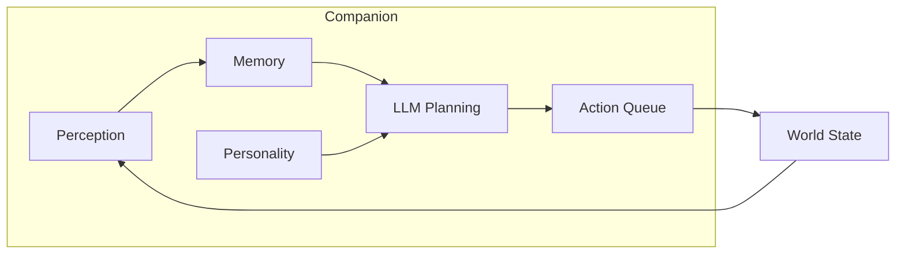

# AI Companions

AI companions are a signature feature of AstraWeave. Unlike scripted NPCs in traditional engines, companions in AstraWeave use LLM-powered planning to make intelligent decisions while respecting game rules through tool validation.

```admonish info title="AI-Native Companions"
Companions cannot cheat - they perceive the world, plan actions, and execute through the same validated systems as players.
```

## Companion Architecture



## Creating a Companion

### Basic Companion Setup

```rust
use astraweave_ai::prelude::*;
use astraweave_ecs::prelude::*;

fn spawn_companion(world: &mut World, name: &str, personality: &str) -> Entity {
    world.spawn((
        Name::new(name),
        Transform::from_xyz(0.0, 0.0, 0.0),
        
        AiAgent::new()
            .with_personality(personality)
            .with_perception_radius(20.0)
            .with_memory_capacity(100),
        
        CompanionBehavior {
            follow_distance: 3.0,
            engage_distance: 10.0,
            flee_health_threshold: 0.2,
        },
        
        AvailableTools::new(vec![
            Tool::move_to(),
            Tool::follow(),
            Tool::attack(),
            Tool::defend(),
            Tool::use_item(),
            Tool::speak(),
            Tool::investigate(),
        ]),
        
        PerceptionState::default(),
        NavAgent::default(),
        DialogueCapable::default(),
        Health::new(100.0),
    ))
}
```

### Personality Configuration

Companions have distinct personalities that influence their decisions:

```rust
let warrior_companion = AiAgent::new()
    .with_personality("brave and protective warrior who prioritizes the player's safety")
    .with_traits(vec![
        Trait::Brave,
        Trait::Protective,
        Trait::DirectCommunicator,
    ])
    .with_knowledge(vec![
        "I am a seasoned warrior".into(),
        "I protect my allies at all costs".into(),
        "I prefer melee combat".into(),
    ]);

let scholar_companion = AiAgent::new()
    .with_personality("curious scholar who loves discovering secrets and solving puzzles")
    .with_traits(vec![
        Trait::Curious,
        Trait::Analytical,
        Trait::Cautious,
    ])
    .with_knowledge(vec![
        "I study ancient texts and artifacts".into(),
        "I prefer avoiding combat when possible".into(),
        "I excel at puzzle-solving".into(),
    ]);
```

## Companion Behaviors

### Following the Player

```rust
fn companion_follow_system(
    player: Query<&Transform, With<Player>>,
    mut companions: Query<(&mut NavAgent, &CompanionBehavior, &Transform), With<AiAgent>>,
    navmesh: Res<NavMesh>,
) {
    let player_pos = player.single().translation;
    
    for (mut nav, behavior, transform) in companions.iter_mut() {
        let distance = transform.translation.distance(player_pos);
        
        if distance > behavior.follow_distance {
            let target = calculate_follow_position(player_pos, transform.translation, behavior.follow_distance);
            
            if let Some(path) = navmesh.find_path(transform.translation, target) {
                nav.set_path(path);
            }
        } else {
            nav.stop();
        }
    }
}
```

### Combat Assistance

```rust
fn companion_combat_system(
    mut companions: Query<(&AiAgent, &mut ActionQueue, &Transform, &Health)>,
    enemies: Query<(Entity, &Transform, &Health), With<Enemy>>,
    player: Query<&Transform, With<Player>>,
) {
    let player_pos = player.single().translation;
    
    for (agent, mut actions, companion_pos, health) in companions.iter_mut() {
        if health.percentage() < agent.flee_threshold {
            actions.push(Action::Flee);
            continue;
        }
        
        let nearest_enemy = enemies.iter()
            .filter(|(_, t, h)| h.current > 0.0)
            .min_by_key(|(_, t, _)| {
                (t.translation.distance(player_pos) * 100.0) as i32
            });
        
        if let Some((enemy_entity, enemy_pos, _)) = nearest_enemy {
            let distance = companion_pos.translation.distance(enemy_pos.translation);
            
            if distance < agent.engage_distance {
                actions.push(Action::Attack(enemy_entity));
            } else {
                actions.push(Action::MoveTo(enemy_pos.translation));
            }
        }
    }
}
```

### Dialogue Interaction

```rust
fn companion_dialogue_system(
    mut events: EventReader<DialogueRequest>,
    mut companions: Query<(&AiAgent, &PerceptionState, &mut DialogueState)>,
    llm: Res<LlmClient>,
    mut responses: EventWriter<DialogueResponse>,
) {
    for request in events.read() {
        if let Ok((agent, perception, mut dialogue)) = companions.get_mut(request.target) {
            let context = build_dialogue_context(agent, perception, &dialogue.history);
            
            let prompt = format!(
                "{}\n\nThe player says: '{}'\n\nRespond in character:",
                context,
                request.message
            );
            
            match llm.generate(&prompt) {
                Ok(response) => {
                    dialogue.history.push(DialogueEntry {
                        speaker: "Player".into(),
                        text: request.message.clone(),
                    });
                    dialogue.history.push(DialogueEntry {
                        speaker: agent.name.clone(),
                        text: response.clone(),
                    });
                    
                    responses.send(DialogueResponse {
                        speaker: agent.name.clone(),
                        text: response,
                    });
                }
                Err(_) => {
                    responses.send(DialogueResponse {
                        speaker: agent.name.clone(),
                        text: "Hmm, let me think about that...".into(),
                    });
                }
            }
        }
    }
}
```

## Memory System

Companions remember past events and use them in decision-making:

```rust
#[derive(Component)]
struct CompanionMemory {
    short_term: VecDeque<MemoryEntry>,
    long_term: Vec<MemoryEntry>,
    capacity: usize,
}

impl CompanionMemory {
    fn remember(&mut self, event: MemoryEntry) {
        self.short_term.push_back(event);
        
        if self.short_term.len() > self.capacity {
            if let Some(old) = self.short_term.pop_front() {
                if old.importance >= 0.7 {
                    self.long_term.push(old);
                }
            }
        }
    }
    
    fn recall(&self, query: &str, limit: usize) -> Vec<&MemoryEntry> {
        self.long_term.iter()
            .chain(self.short_term.iter())
            .filter(|m| m.matches(query))
            .take(limit)
            .collect()
    }
}

#[derive(Clone)]
struct MemoryEntry {
    timestamp: GameTime,
    event_type: EventType,
    description: String,
    importance: f32,
    entities: Vec<Entity>,
    location: Vec3,
}
```

## Companion Commands

Players can issue commands to companions:

```rust
#[derive(Event)]
enum CompanionCommand {
    Follow,
    Stay,
    Attack(Entity),
    Investigate(Vec3),
    UseAbility(AbilityId),
    ToggleAggressive,
}

fn handle_companion_commands(
    mut commands: EventReader<CompanionCommand>,
    mut companions: Query<(&mut CompanionBehavior, &mut ActionQueue)>,
) {
    for command in commands.read() {
        for (mut behavior, mut actions) in companions.iter_mut() {
            match command {
                CompanionCommand::Follow => {
                    behavior.mode = CompanionMode::Follow;
                    actions.clear();
                }
                CompanionCommand::Stay => {
                    behavior.mode = CompanionMode::Stay;
                    actions.clear();
                }
                CompanionCommand::Attack(target) => {
                    actions.push(Action::Attack(*target));
                }
                CompanionCommand::Investigate(pos) => {
                    actions.push(Action::MoveTo(*pos));
                    actions.push(Action::Investigate);
                }
                CompanionCommand::UseAbility(ability) => {
                    actions.push(Action::UseAbility(*ability));
                }
                CompanionCommand::ToggleAggressive => {
                    behavior.aggressive = !behavior.aggressive;
                }
            }
        }
    }
}
```

## Configuration

### Companion Presets

```rust
pub fn create_healer_companion(world: &mut World) -> Entity {
    spawn_companion(world, "Luna", "compassionate healer who prioritizes keeping allies alive")
        .with(AvailableTools::new(vec![
            Tool::heal(),
            Tool::cure_status(),
            Tool::buff(),
            Tool::follow(),
            Tool::flee(),
        ]))
        .with(CompanionBehavior {
            follow_distance: 5.0,
            engage_distance: 15.0,
            flee_health_threshold: 0.3,
            mode: CompanionMode::Support,
        })
}

pub fn create_tank_companion(world: &mut World) -> Entity {
    spawn_companion(world, "Grimjaw", "fearless guardian who draws enemy attention")
        .with(AvailableTools::new(vec![
            Tool::taunt(),
            Tool::block(),
            Tool::attack(),
            Tool::charge(),
            Tool::protect_ally(),
        ]))
        .with(CompanionBehavior {
            follow_distance: 2.0,
            engage_distance: 8.0,
            flee_health_threshold: 0.1,
            mode: CompanionMode::Aggressive,
        })
}
```

## Best Practices

```admonish tip title="Performance Tips"
- Limit perception radius for better performance
- Use plan caching to reduce LLM calls
- Batch companion updates in the scheduler
```

```admonish warning title="Common Pitfalls"
- Don't give companions tools they shouldn't have
- Always define fallback behaviors for LLM timeouts
- Test personality prompts for consistent behavior
```

## See Also

- [AI System](../core-systems/ai/index.md) - Core AI architecture
- [Adaptive Bosses](./bosses.md) - Enemy AI patterns
- [Dialogue Systems](./dialogue.md) - Conversation implementation
- [Tool Validation](../architecture/tool-validation.md) - How actions are validated
