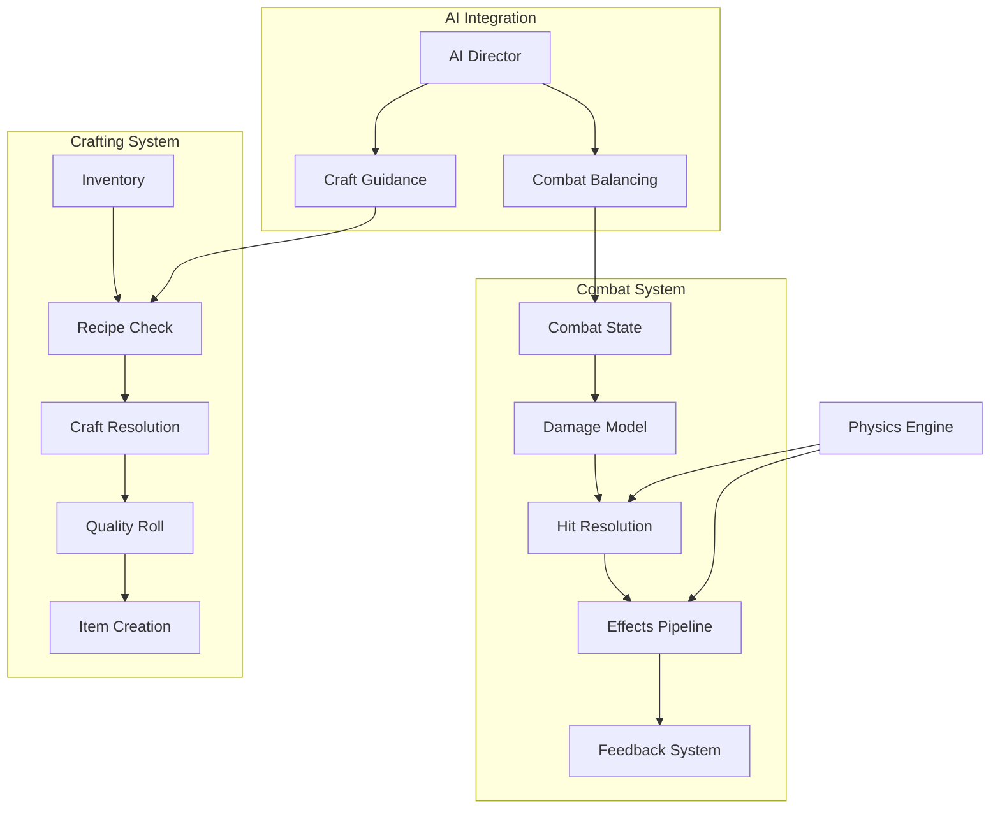

# Crafting & Combat Systems

AstraWeave provides a unified crafting and combat framework that integrates with the AI systems for dynamic, adaptive gameplay. This guide covers implementing both systems with physics integration, AI-driven balancing, and procedural content generation.

## Architecture Overview



## Combat System

### Combat Components

Define the core components for combat entities:

```rust
use astraweave_ecs::prelude::*;
use astraweave_physics::prelude::*;

#[derive(Component, Debug, Clone)]
pub struct CombatStats {
    pub health: f32,
    pub max_health: f32,
    pub stamina: f32,
    pub max_stamina: f32,
    pub poise: f32,
    pub max_poise: f32,
}

impl Default for CombatStats {
    fn default() -> Self {
        Self {
            health: 100.0,
            max_health: 100.0,
            stamina: 100.0,
            max_stamina: 100.0,
            poise: 50.0,
            max_poise: 50.0,
        }
    }
}

#[derive(Component, Debug, Clone)]
pub struct DamageResistances {
    pub physical: f32,
    pub fire: f32,
    pub ice: f32,
    pub lightning: f32,
    pub poison: f32,
}

#[derive(Component, Debug, Clone)]
pub struct WeaponStats {
    pub base_damage: f32,
    pub damage_type: DamageType,
    pub attack_speed: f32,
    pub reach: f32,
    pub stamina_cost: f32,
    pub poise_damage: f32,
}

#[derive(Debug, Clone, Copy, PartialEq)]
pub enum DamageType {
    Physical,
    Fire,
    Ice,
    Lightning,
    Poison,
}

#[derive(Component, Debug)]
pub struct CombatState {
    pub stance: CombatStance,
    pub combo_count: u32,
    pub combo_timer: f32,
    pub stagger_timer: f32,
    pub invincibility_frames: f32,
}

#[derive(Debug, Clone, Copy, PartialEq)]
pub enum CombatStance {
    Neutral,
    Attacking,
    Blocking,
    Dodging,
    Staggered,
    Recovering,
}
```

### Attack System

Implement the attack resolution with physics-based hit detection:

```rust
use astraweave_physics::collision::*;

#[derive(Debug, Clone)]
pub struct AttackEvent {
    pub attacker: Entity,
    pub weapon: Entity,
    pub attack_type: AttackType,
    pub direction: Vec3,
}

#[derive(Debug, Clone, Copy)]
pub enum AttackType {
    Light,
    Heavy,
    Special,
    Charged { charge_time: f32 },
}

pub fn attack_system(
    mut commands: Commands,
    mut attack_events: EventReader<AttackEvent>,
    mut combat_query: Query<(&mut CombatState, &mut CombatStats, &Transform)>,
    weapon_query: Query<&WeaponStats>,
    physics: Res<PhysicsWorld>,
) {
    for event in attack_events.iter() {
        let Ok((mut state, mut stats, transform)) = combat_query.get_mut(event.attacker) else {
            continue;
        };
        
        if stats.stamina < get_stamina_cost(&event.attack_type) {
            continue;
        }
        
        let Ok(weapon) = weapon_query.get(event.weapon) else {
            continue;
        };
        
        stats.stamina -= weapon.stamina_cost * get_attack_multiplier(&event.attack_type);
        state.stance = CombatStance::Attacking;
        
        let hitbox = create_attack_hitbox(transform, weapon, &event.attack_type);
        
        commands.spawn((
            hitbox,
            AttackHitbox {
                owner: event.attacker,
                damage: calculate_attack_damage(weapon, &event.attack_type, state.combo_count),
                damage_type: weapon.damage_type,
                poise_damage: weapon.poise_damage,
                knockback: event.direction * 5.0,
            },
            Lifetime { remaining: 0.2 },
        ));
        
        state.combo_count = (state.combo_count + 1).min(5);
        state.combo_timer = 1.5;
    }
}

fn calculate_attack_damage(weapon: &WeaponStats, attack_type: &AttackType, combo: u32) -> f32 {
    let base = weapon.base_damage;
    let type_mult = match attack_type {
        AttackType::Light => 1.0,
        AttackType::Heavy => 1.8,
        AttackType::Special => 2.5,
        AttackType::Charged { charge_time } => 1.0 + (charge_time * 0.5).min(2.0),
    };
    let combo_mult = 1.0 + (combo as f32 * 0.1);
    
    base * type_mult * combo_mult
}

fn create_attack_hitbox(
    transform: &Transform,
    weapon: &WeaponStats,
    attack_type: &AttackType,
) -> Collider {
    let size = match attack_type {
        AttackType::Light => Vec3::new(weapon.reach * 0.8, 1.0, weapon.reach * 0.8),
        AttackType::Heavy => Vec3::new(weapon.reach * 1.2, 1.5, weapon.reach * 1.2),
        AttackType::Special => Vec3::new(weapon.reach * 2.0, 2.0, weapon.reach * 2.0),
        AttackType::Charged { .. } => Vec3::new(weapon.reach * 1.5, 1.2, weapon.reach * 1.5),
    };
    
    Collider::cuboid(size.x, size.y, size.z)
        .with_offset(transform.forward() * (weapon.reach * 0.5))
}
```

### Damage Resolution

Process hits and apply damage with resistance calculations:

```rust
#[derive(Component)]
pub struct AttackHitbox {
    pub owner: Entity,
    pub damage: f32,
    pub damage_type: DamageType,
    pub poise_damage: f32,
    pub knockback: Vec3,
}

pub fn damage_resolution_system(
    mut commands: Commands,
    hitbox_query: Query<(Entity, &AttackHitbox, &CollidingEntities)>,
    mut target_query: Query<(
        &mut CombatStats,
        &mut CombatState,
        &DamageResistances,
        &mut Transform,
    )>,
    mut damage_events: EventWriter<DamageEvent>,
) {
    for (hitbox_entity, hitbox, colliding) in hitbox_query.iter() {
        for &target in colliding.iter() {
            if target == hitbox.owner {
                continue;
            }
            
            let Ok((mut stats, mut state, resistances, mut transform)) = 
                target_query.get_mut(target) else {
                continue;
            };
            
            if state.invincibility_frames > 0.0 {
                continue;
            }
            
            let resistance = get_resistance(resistances, hitbox.damage_type);
            let final_damage = hitbox.damage * (1.0 - resistance);
            
            stats.health = (stats.health - final_damage).max(0.0);
            stats.poise -= hitbox.poise_damage;
            
            if stats.poise <= 0.0 {
                state.stance = CombatStance::Staggered;
                state.stagger_timer = 1.5;
                stats.poise = stats.max_poise * 0.5;
            }
            
            transform.translation += hitbox.knockback * 0.1;
            
            damage_events.send(DamageEvent {
                target,
                attacker: hitbox.owner,
                damage: final_damage,
                damage_type: hitbox.damage_type,
                was_critical: false,
            });
            
            state.invincibility_frames = 0.15;
        }
        
        commands.entity(hitbox_entity).despawn();
    }
}

fn get_resistance(resistances: &DamageResistances, damage_type: DamageType) -> f32 {
    match damage_type {
        DamageType::Physical => resistances.physical,
        DamageType::Fire => resistances.fire,
        DamageType::Ice => resistances.ice,
        DamageType::Lightning => resistances.lightning,
        DamageType::Poison => resistances.poison,
    }.clamp(0.0, 0.9)
}
```

### Combat AI Integration

Leverage the AI system for dynamic combat behavior:

```rust
use astraweave_ai::prelude::*;

#[derive(Component)]
pub struct CombatAI {
    pub aggression: f32,
    pub patience: f32,
    pub preferred_range: f32,
    pub combo_tendency: f32,
}

pub fn ai_combat_decision_system(
    mut ai_query: Query<(
        Entity,
        &CombatAI,
        &CombatStats,
        &CombatState,
        &Transform,
        &mut AiPlanner,
    )>,
    target_query: Query<(&CombatStats, &CombatState, &Transform), Without<CombatAI>>,
    mut attack_events: EventWriter<AttackEvent>,
) {
    for (entity, ai, stats, state, transform, mut planner) in ai_query.iter_mut() {
        if state.stance != CombatStance::Neutral {
            continue;
        }
        
        let Some(target) = find_nearest_target(transform, &target_query) else {
            continue;
        };
        
        let (target_stats, target_state, target_transform) = target_query.get(target).unwrap();
        let distance = transform.translation.distance(target_transform.translation);
        let direction = (target_transform.translation - transform.translation).normalize();
        
        let decision = evaluate_combat_options(
            ai,
            stats,
            target_stats,
            target_state,
            distance,
        );
        
        match decision {
            CombatDecision::Attack(attack_type) => {
                attack_events.send(AttackEvent {
                    attacker: entity,
                    weapon: entity,
                    attack_type,
                    direction,
                });
            }
            CombatDecision::Reposition(target_distance) => {
                let goal_pos = target_transform.translation - direction * target_distance;
                planner.set_goal(AiGoal::MoveTo { position: goal_pos });
            }
            CombatDecision::Defend => {
                planner.set_goal(AiGoal::Custom("block".into()));
            }
            CombatDecision::Wait => {}
        }
    }
}

#[derive(Debug)]
enum CombatDecision {
    Attack(AttackType),
    Reposition(f32),
    Defend,
    Wait,
}

fn evaluate_combat_options(
    ai: &CombatAI,
    stats: &CombatStats,
    target_stats: &CombatStats,
    target_state: &CombatState,
    distance: f32,
) -> CombatDecision {
    let health_ratio = stats.health / stats.max_health;
    let stamina_ratio = stats.stamina / stats.max_stamina;
    let target_health_ratio = target_stats.health / target_stats.max_health;
    
    if target_state.stance == CombatStance::Staggered && distance < 3.0 {
        return CombatDecision::Attack(AttackType::Heavy);
    }
    
    if health_ratio < 0.3 && ai.patience > 0.5 {
        return CombatDecision::Reposition(ai.preferred_range * 1.5);
    }
    
    if distance > ai.preferred_range * 1.2 {
        return CombatDecision::Reposition(ai.preferred_range);
    }
    
    if target_state.stance == CombatStance::Attacking && ai.patience > 0.7 {
        return CombatDecision::Defend;
    }
    
    if stamina_ratio > 0.3 && distance < ai.preferred_range {
        let attack_type = if ai.aggression > 0.7 && stamina_ratio > 0.6 {
            AttackType::Heavy
        } else {
            AttackType::Light
        };
        return CombatDecision::Attack(attack_type);
    }
    
    CombatDecision::Wait
}
```

## Crafting System

### Inventory and Items

Define the item and inventory structures:

```rust
#[derive(Component, Debug, Clone)]
pub struct Item {
    pub id: ItemId,
    pub name: String,
    pub item_type: ItemType,
    pub rarity: ItemRarity,
    pub stack_size: u32,
    pub max_stack: u32,
}

#[derive(Debug, Clone, Copy, PartialEq, Eq, Hash)]
pub struct ItemId(pub u64);

#[derive(Debug, Clone, Copy, PartialEq)]
pub enum ItemType {
    Material,
    Consumable,
    Weapon,
    Armor,
    Accessory,
    Tool,
    QuestItem,
}

#[derive(Debug, Clone, Copy, PartialEq, Ord, PartialOrd, Eq)]
pub enum ItemRarity {
    Common,
    Uncommon,
    Rare,
    Epic,
    Legendary,
}

#[derive(Component, Debug)]
pub struct Inventory {
    pub slots: Vec<Option<InventorySlot>>,
    pub max_slots: usize,
    pub weight_limit: f32,
    pub current_weight: f32,
}

#[derive(Debug, Clone)]
pub struct InventorySlot {
    pub item: Item,
    pub quantity: u32,
}

impl Inventory {
    pub fn new(max_slots: usize, weight_limit: f32) -> Self {
        Self {
            slots: vec![None; max_slots],
            max_slots,
            weight_limit,
            current_weight: 0.0,
        }
    }
    
    pub fn add_item(&mut self, item: Item, quantity: u32) -> Result<(), InventoryError> {
        for slot in self.slots.iter_mut() {
            if let Some(ref mut existing) = slot {
                if existing.item.id == item.id && existing.quantity < item.max_stack {
                    let space = item.max_stack - existing.quantity;
                    let add = quantity.min(space);
                    existing.quantity += add;
                    if add == quantity {
                        return Ok(());
                    }
                }
            }
        }
        
        for slot in self.slots.iter_mut() {
            if slot.is_none() {
                *slot = Some(InventorySlot {
                    item: item.clone(),
                    quantity: quantity.min(item.max_stack),
                });
                return Ok(());
            }
        }
        
        Err(InventoryError::Full)
    }
    
    pub fn remove_item(&mut self, item_id: ItemId, quantity: u32) -> Result<u32, InventoryError> {
        let mut remaining = quantity;
        
        for slot in self.slots.iter_mut() {
            if remaining == 0 {
                break;
            }
            
            if let Some(ref mut existing) = slot {
                if existing.item.id == item_id {
                    let remove = remaining.min(existing.quantity);
                    existing.quantity -= remove;
                    remaining -= remove;
                    
                    if existing.quantity == 0 {
                        *slot = None;
                    }
                }
            }
        }
        
        if remaining > 0 {
            Err(InventoryError::InsufficientItems)
        } else {
            Ok(quantity)
        }
    }
    
    pub fn count_item(&self, item_id: ItemId) -> u32 {
        self.slots
            .iter()
            .filter_map(|s| s.as_ref())
            .filter(|s| s.item.id == item_id)
            .map(|s| s.quantity)
            .sum()
    }
}

#[derive(Debug)]
pub enum InventoryError {
    Full,
    InsufficientItems,
    WeightExceeded,
}
```

### Recipe System

Define recipes and crafting requirements:

```rust
#[derive(Debug, Clone)]
pub struct Recipe {
    pub id: RecipeId,
    pub name: String,
    pub ingredients: Vec<RecipeIngredient>,
    pub outputs: Vec<RecipeOutput>,
    pub crafting_time: f32,
    pub required_station: Option<CraftingStation>,
    pub required_skill: Option<(SkillType, u32)>,
}

#[derive(Debug, Clone, Copy, PartialEq, Eq, Hash)]
pub struct RecipeId(pub u64);

#[derive(Debug, Clone)]
pub struct RecipeIngredient {
    pub item_id: ItemId,
    pub quantity: u32,
    pub consumed: bool,
}

#[derive(Debug, Clone)]
pub struct RecipeOutput {
    pub item_id: ItemId,
    pub base_quantity: u32,
    pub quality_scaling: bool,
}

#[derive(Debug, Clone, Copy, PartialEq)]
pub enum CraftingStation {
    Workbench,
    Forge,
    Alchemy,
    Enchanting,
    Cooking,
}

#[derive(Debug, Clone, Copy, PartialEq)]
pub enum SkillType {
    Smithing,
    Alchemy,
    Enchanting,
    Cooking,
    Woodworking,
}

#[derive(Resource)]
pub struct RecipeRegistry {
    recipes: HashMap<RecipeId, Recipe>,
    by_station: HashMap<Option<CraftingStation>, Vec<RecipeId>>,
    by_output: HashMap<ItemId, Vec<RecipeId>>,
}

impl RecipeRegistry {
    pub fn new() -> Self {
        Self {
            recipes: HashMap::new(),
            by_station: HashMap::new(),
            by_output: HashMap::new(),
        }
    }
    
    pub fn register(&mut self, recipe: Recipe) {
        let id = recipe.id;
        
        self.by_station
            .entry(recipe.required_station)
            .or_default()
            .push(id);
        
        for output in &recipe.outputs {
            self.by_output
                .entry(output.item_id)
                .or_default()
                .push(id);
        }
        
        self.recipes.insert(id, recipe);
    }
    
    pub fn get(&self, id: RecipeId) -> Option<&Recipe> {
        self.recipes.get(&id)
    }
    
    pub fn available_at_station(&self, station: Option<CraftingStation>) -> &[RecipeId] {
        self.by_station.get(&station).map(|v| v.as_slice()).unwrap_or(&[])
    }
    
    pub fn recipes_for_item(&self, item_id: ItemId) -> &[RecipeId] {
        self.by_output.get(&item_id).map(|v| v.as_slice()).unwrap_or(&[])
    }
}
```

### Crafting Execution

Process crafting with quality calculations:

```rust
#[derive(Debug)]
pub struct CraftRequest {
    pub crafter: Entity,
    pub recipe_id: RecipeId,
    pub station: Option<Entity>,
}

#[derive(Debug)]
pub struct CraftResult {
    pub success: bool,
    pub items: Vec<(ItemId, u32, ItemRarity)>,
    pub experience: u32,
}

pub fn crafting_system(
    mut craft_requests: EventReader<CraftRequest>,
    mut craft_results: EventWriter<CraftResult>,
    registry: Res<RecipeRegistry>,
    mut crafter_query: Query<(&mut Inventory, Option<&CrafterSkills>)>,
    station_query: Query<&CraftingStationComponent>,
    item_registry: Res<ItemRegistry>,
) {
    for request in craft_requests.iter() {
        let Some(recipe) = registry.get(request.recipe_id) else {
            continue;
        };
        
        let Ok((mut inventory, skills)) = crafter_query.get_mut(request.crafter) else {
            continue;
        };
        
        if let Some(station_entity) = request.station {
            if let Ok(station) = station_query.get(station_entity) {
                if Some(station.station_type) != recipe.required_station {
                    continue;
                }
            }
        } else if recipe.required_station.is_some() {
            continue;
        }
        
        if !can_craft(&inventory, recipe) {
            continue;
        }
        
        if let Some((skill_type, level)) = recipe.required_skill {
            let crafter_level = skills
                .map(|s| s.get_level(skill_type))
                .unwrap_or(0);
            if crafter_level < level {
                continue;
            }
        }
        
        for ingredient in &recipe.ingredients {
            if ingredient.consumed {
                let _ = inventory.remove_item(ingredient.item_id, ingredient.quantity);
            }
        }
        
        let quality = calculate_craft_quality(skills, recipe);
        let rarity = quality_to_rarity(quality);
        
        let mut crafted_items = Vec::new();
        for output in &recipe.outputs {
            let quantity = if output.quality_scaling {
                (output.base_quantity as f32 * (1.0 + quality * 0.5)) as u32
            } else {
                output.base_quantity
            };
            
            if let Some(base_item) = item_registry.get(output.item_id) {
                let mut item = base_item.clone();
                item.rarity = rarity;
                let _ = inventory.add_item(item, quantity);
                crafted_items.push((output.item_id, quantity, rarity));
            }
        }
        
        craft_results.send(CraftResult {
            success: true,
            items: crafted_items,
            experience: calculate_craft_xp(recipe, quality),
        });
    }
}

fn can_craft(inventory: &Inventory, recipe: &Recipe) -> bool {
    recipe.ingredients.iter().all(|ing| {
        inventory.count_item(ing.item_id) >= ing.quantity
    })
}

fn calculate_craft_quality(skills: Option<&CrafterSkills>, recipe: &Recipe) -> f32 {
    let base_quality = 0.5;
    
    let skill_bonus = if let (Some(skills), Some((skill_type, required))) = (skills, recipe.required_skill) {
        let level = skills.get_level(skill_type) as f32;
        let excess = (level - required as f32).max(0.0);
        excess * 0.05
    } else {
        0.0
    };
    
    let random_factor = rand::random::<f32>() * 0.2;
    
    (base_quality + skill_bonus + random_factor).clamp(0.0, 1.0)
}

fn quality_to_rarity(quality: f32) -> ItemRarity {
    match quality {
        q if q >= 0.95 => ItemRarity::Legendary,
        q if q >= 0.8 => ItemRarity::Epic,
        q if q >= 0.6 => ItemRarity::Rare,
        q if q >= 0.4 => ItemRarity::Uncommon,
        _ => ItemRarity::Common,
    }
}
```

### AI-Assisted Crafting

Use AI to suggest recipes and optimize crafting:

```rust
use astraweave_llm::prelude::*;

pub struct CraftingAdvisor {
    llm: LlmClient,
}

impl CraftingAdvisor {
    pub async fn suggest_recipes(
        &self,
        inventory: &Inventory,
        goal: &str,
        registry: &RecipeRegistry,
    ) -> Vec<RecipeSuggestion> {
        let available_items: Vec<_> = inventory.slots
            .iter()
            .filter_map(|s| s.as_ref())
            .map(|s| format!("{} x{}", s.item.name, s.quantity))
            .collect();
        
        let prompt = format!(
            r#"Given these materials: {}
            
Player goal: {}

Suggest the best crafting recipes to achieve this goal.
Return as JSON array of recipe suggestions."#,
            available_items.join(", "),
            goal
        );
        
        let response = self.llm.complete(&prompt).await;
        parse_suggestions(&response, registry)
    }
    
    pub async fn optimize_craft_order(
        &self,
        target_item: ItemId,
        inventory: &Inventory,
        registry: &RecipeRegistry,
    ) -> Vec<RecipeId> {
        let mut order = Vec::new();
        let mut simulated_inventory = inventory.clone();
        
        self.build_craft_tree(target_item, &mut simulated_inventory, registry, &mut order);
        
        order
    }
    
    fn build_craft_tree(
        &self,
        target: ItemId,
        inventory: &mut Inventory,
        registry: &RecipeRegistry,
        order: &mut Vec<RecipeId>,
    ) {
        let recipes = registry.recipes_for_item(target);
        
        for &recipe_id in recipes {
            if let Some(recipe) = registry.get(recipe_id) {
                let mut can_craft = true;
                
                for ingredient in &recipe.ingredients {
                    let have = inventory.count_item(ingredient.item_id);
                    if have < ingredient.quantity {
                        self.build_craft_tree(
                            ingredient.item_id,
                            inventory,
                            registry,
                            order,
                        );
                        
                        if inventory.count_item(ingredient.item_id) < ingredient.quantity {
                            can_craft = false;
                            break;
                        }
                    }
                }
                
                if can_craft {
                    order.push(recipe_id);
                    return;
                }
            }
        }
    }
}

#[derive(Debug)]
pub struct RecipeSuggestion {
    pub recipe_id: RecipeId,
    pub reason: String,
    pub priority: u32,
}
```

## Combat-Crafting Integration

### Weapon Modification

Allow runtime weapon customization:

```rust
#[derive(Component, Debug)]
pub struct ModifiableWeapon {
    pub base: WeaponStats,
    pub modifications: Vec<WeaponMod>,
    pub max_mods: usize,
}

#[derive(Debug, Clone)]
pub struct WeaponMod {
    pub mod_type: WeaponModType,
    pub value: f32,
    pub item_source: ItemId,
}

#[derive(Debug, Clone, Copy, PartialEq)]
pub enum WeaponModType {
    DamageBonus,
    ElementalDamage(DamageType),
    AttackSpeed,
    CriticalChance,
    CriticalDamage,
    LifeSteal,
    PoiseDamage,
}

impl ModifiableWeapon {
    pub fn calculate_stats(&self) -> WeaponStats {
        let mut stats = self.base.clone();
        
        for modification in &self.modifications {
            match modification.mod_type {
                WeaponModType::DamageBonus => {
                    stats.base_damage *= 1.0 + modification.value;
                }
                WeaponModType::AttackSpeed => {
                    stats.attack_speed *= 1.0 + modification.value;
                }
                WeaponModType::PoiseDamage => {
                    stats.poise_damage *= 1.0 + modification.value;
                }
                _ => {}
            }
        }
        
        stats
    }
    
    pub fn add_mod(&mut self, modification: WeaponMod) -> Result<(), &'static str> {
        if self.modifications.len() >= self.max_mods {
            return Err("Maximum modifications reached");
        }
        
        let same_type_count = self.modifications
            .iter()
            .filter(|m| std::mem::discriminant(&m.mod_type) == std::mem::discriminant(&modification.mod_type))
            .count();
        
        if same_type_count >= 2 {
            return Err("Cannot stack more than 2 of the same mod type");
        }
        
        self.modifications.push(modification);
        Ok(())
    }
}

pub fn apply_weapon_mods_system(
    mut weapons: Query<(&ModifiableWeapon, &mut WeaponStats), Changed<ModifiableWeapon>>,
) {
    for (modifiable, mut stats) in weapons.iter_mut() {
        *stats = modifiable.calculate_stats();
    }
}
```

### Combat Loot System

Generate loot based on combat performance:

```rust
#[derive(Component)]
pub struct LootTable {
    pub entries: Vec<LootEntry>,
    pub guaranteed: Vec<ItemId>,
}

#[derive(Debug, Clone)]
pub struct LootEntry {
    pub item_id: ItemId,
    pub weight: f32,
    pub min_quantity: u32,
    pub max_quantity: u32,
    pub min_rarity: ItemRarity,
}

pub fn combat_loot_system(
    mut death_events: EventReader<EntityDeathEvent>,
    loot_query: Query<&LootTable>,
    combat_log: Res<CombatLog>,
    mut loot_events: EventWriter<LootDropEvent>,
) {
    for event in death_events.iter() {
        let Ok(loot_table) = loot_query.get(event.entity) else {
            continue;
        };
        
        let performance = combat_log.get_performance(event.killer, event.entity);
        let luck_bonus = calculate_luck_bonus(&performance);
        
        let mut drops = Vec::new();
        
        for item_id in &loot_table.guaranteed {
            drops.push((*item_id, 1, ItemRarity::Common));
        }
        
        let roll_count = 1 + (luck_bonus * 2.0) as usize;
        for _ in 0..roll_count {
            if let Some(entry) = roll_loot(loot_table, luck_bonus) {
                let quantity = rand::thread_rng()
                    .gen_range(entry.min_quantity..=entry.max_quantity);
                let rarity = roll_rarity(entry.min_rarity, luck_bonus);
                drops.push((entry.item_id, quantity, rarity));
            }
        }
        
        loot_events.send(LootDropEvent {
            position: event.position,
            drops,
        });
    }
}

fn calculate_luck_bonus(performance: &CombatPerformance) -> f32 {
    let mut bonus = 0.0;
    
    if performance.no_damage_taken {
        bonus += 0.3;
    }
    
    if performance.time_to_kill < 30.0 {
        bonus += 0.2;
    }
    
    if performance.parries > 0 {
        bonus += performance.parries as f32 * 0.05;
    }
    
    bonus.min(1.0)
}
```

## Best Practices

```admonish tip title="Combat Design Tips"
1. **Balance Stamina Economy**: Ensure attacks have meaningful stamina costs to create decision points
2. **Poise Windows**: Use stagger states to create openings for both players and AI
3. **Readable Attacks**: Give clear visual tells before powerful attacks
4. **Combo Depth**: Reward skill with combo multipliers but keep basic attacks viable
```

```admonish warning title="Common Pitfalls"
- **Damage Sponges**: Avoid enemies that just have more health; vary resistances and mechanics
- **Inventory Overflow**: Always handle full inventory gracefully
- **Recipe Bloat**: Curate recipes to avoid overwhelming players
- **Mod Stacking**: Prevent multiplicative mod abuse
```

## Related Documentation

- [AI Companions](companions.md) - Combat companion behaviors
- [Adaptive Bosses](bosses.md) - Advanced boss combat AI
- [Physics Integration](../core-systems/physics/index.md) - Combat physics
- [Configuration Reference](../reference/configuration.md) - Combat tuning parameters
