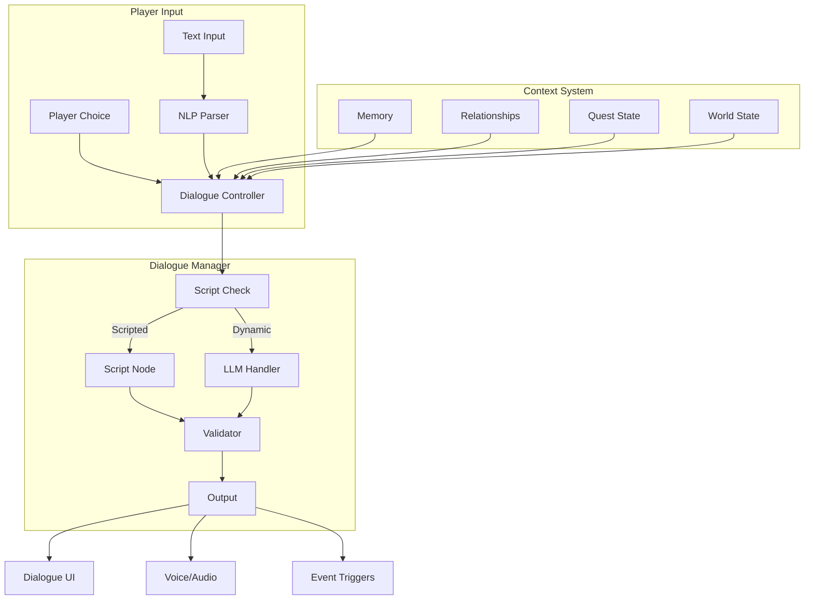

# Dialogue Systems

AstraWeave's dialogue system combines traditional branching dialogue with LLM-powered dynamic conversations, enabling NPCs to engage in contextual, personality-driven interactions while maintaining narrative coherence.

## Architecture Overview



## Core Components

### Dialogue Node System

Define structured dialogue with branching paths:

```rust
use astraweave_ecs::prelude::*;
use std::collections::HashMap;

#[derive(Debug, Clone)]
pub struct DialogueTree {
    pub id: DialogueId,
    pub nodes: HashMap<NodeId, DialogueNode>,
    pub entry_node: NodeId,
    pub metadata: DialogueMetadata,
}

#[derive(Debug, Clone, Copy, PartialEq, Eq, Hash)]
pub struct DialogueId(pub u64);

#[derive(Debug, Clone, Copy, PartialEq, Eq, Hash)]
pub struct NodeId(pub u32);

#[derive(Debug, Clone)]
pub struct DialogueNode {
    pub id: NodeId,
    pub speaker: SpeakerId,
    pub content: DialogueContent,
    pub responses: Vec<DialogueResponse>,
    pub conditions: Vec<DialogueCondition>,
    pub effects: Vec<DialogueEffect>,
}

#[derive(Debug, Clone)]
pub enum DialogueContent {
    Text(String),
    Localized { key: String, fallback: String },
    Dynamic { prompt_template: String },
    Voice { text: String, audio_id: String },
}

#[derive(Debug, Clone)]
pub struct DialogueResponse {
    pub text: String,
    pub next_node: Option<NodeId>,
    pub conditions: Vec<DialogueCondition>,
    pub effects: Vec<DialogueEffect>,
    pub tone: ResponseTone,
}

#[derive(Debug, Clone, Copy, PartialEq)]
pub enum ResponseTone {
    Neutral,
    Friendly,
    Hostile,
    Curious,
    Sarcastic,
    Romantic,
}

#[derive(Debug, Clone)]
pub enum DialogueCondition {
    QuestState { quest_id: u64, state: String },
    RelationshipMin { npc_id: u64, value: i32 },
    HasItem { item_id: u64, quantity: u32 },
    PlayerStat { stat: String, min: i32 },
    Flag { name: String, value: bool },
    TimeOfDay { start: u32, end: u32 },
    Custom { script: String },
}

#[derive(Debug, Clone)]
pub enum DialogueEffect {
    SetFlag { name: String, value: bool },
    ModifyRelationship { npc_id: u64, delta: i32 },
    GiveItem { item_id: u64, quantity: u32 },
    TakeItem { item_id: u64, quantity: u32 },
    StartQuest { quest_id: u64 },
    AdvanceQuest { quest_id: u64, stage: String },
    TriggerEvent { event_name: String },
    PlayAnimation { animation: String },
}
```

### Dialogue Controller

Manage dialogue state and flow:

```rust
#[derive(Component)]
pub struct DialogueController {
    pub active_dialogue: Option<ActiveDialogue>,
    pub history: Vec<DialogueHistoryEntry>,
    pub context: DialogueContext,
}

#[derive(Debug)]
pub struct ActiveDialogue {
    pub tree: DialogueTree,
    pub current_node: NodeId,
    pub participants: Vec<Entity>,
    pub started_at: f64,
}

#[derive(Debug, Clone)]
pub struct DialogueHistoryEntry {
    pub node_id: NodeId,
    pub speaker: SpeakerId,
    pub text: String,
    pub timestamp: f64,
    pub response_chosen: Option<usize>,
}

#[derive(Debug, Default)]
pub struct DialogueContext {
    pub player_name: String,
    pub location: String,
    pub time_of_day: String,
    pub recent_events: Vec<String>,
    pub custom_vars: HashMap<String, String>,
}

impl DialogueController {
    pub fn start_dialogue(&mut self, tree: DialogueTree, participants: Vec<Entity>, time: f64) {
        self.active_dialogue = Some(ActiveDialogue {
            current_node: tree.entry_node,
            tree,
            participants,
            started_at: time,
        });
    }
    
    pub fn get_current_node(&self) -> Option<&DialogueNode> {
        self.active_dialogue.as_ref().and_then(|active| {
            active.tree.nodes.get(&active.current_node)
        })
    }
    
    pub fn select_response(&mut self, index: usize, time: f64) -> Option<Vec<DialogueEffect>> {
        let active = self.active_dialogue.as_mut()?;
        let node = active.tree.nodes.get(&active.current_node)?;
        let response = node.responses.get(index)?;
        
        self.history.push(DialogueHistoryEntry {
            node_id: active.current_node,
            speaker: node.speaker,
            text: match &node.content {
                DialogueContent::Text(t) => t.clone(),
                DialogueContent::Localized { fallback, .. } => fallback.clone(),
                DialogueContent::Dynamic { .. } => "[Dynamic]".into(),
                DialogueContent::Voice { text, .. } => text.clone(),
            },
            timestamp: time,
            response_chosen: Some(index),
        });
        
        if let Some(next) = response.next_node {
            active.current_node = next;
            Some(response.effects.clone())
        } else {
            let effects = response.effects.clone();
            self.active_dialogue = None;
            Some(effects)
        }
    }
    
    pub fn end_dialogue(&mut self) {
        self.active_dialogue = None;
    }
}
```

### Dialogue System

Process dialogue logic each frame:

```rust
pub fn dialogue_system(
    mut dialogue_query: Query<&mut DialogueController>,
    mut effect_events: EventWriter<DialogueEffectEvent>,
    conditions: Res<ConditionEvaluator>,
    time: Res<Time>,
) {
    for mut controller in dialogue_query.iter_mut() {
        let Some(active) = &controller.active_dialogue else {
            continue;
        };
        
        let Some(node) = active.tree.nodes.get(&active.current_node) else {
            controller.end_dialogue();
            continue;
        };
        
        if !conditions.evaluate_all(&node.conditions) {
            if let Some(fallback) = find_fallback_node(&active.tree, &conditions) {
                if let Some(active) = controller.active_dialogue.as_mut() {
                    active.current_node = fallback;
                }
            } else {
                controller.end_dialogue();
            }
            continue;
        }
        
        for effect in &node.effects {
            effect_events.send(DialogueEffectEvent {
                effect: effect.clone(),
                timestamp: time.elapsed_seconds_f64(),
            });
        }
    }
}

pub fn dialogue_effect_system(
    mut effect_events: EventReader<DialogueEffectEvent>,
    mut quest_events: EventWriter<QuestEvent>,
    mut inventory_events: EventWriter<InventoryEvent>,
    mut relationship_events: EventWriter<RelationshipEvent>,
    mut flags: ResMut<GameFlags>,
) {
    for event in effect_events.iter() {
        match &event.effect {
            DialogueEffect::SetFlag { name, value } => {
                flags.set(name.clone(), *value);
            }
            DialogueEffect::ModifyRelationship { npc_id, delta } => {
                relationship_events.send(RelationshipEvent::Modify {
                    npc_id: *npc_id,
                    delta: *delta,
                });
            }
            DialogueEffect::GiveItem { item_id, quantity } => {
                inventory_events.send(InventoryEvent::Add {
                    item_id: *item_id,
                    quantity: *quantity,
                });
            }
            DialogueEffect::StartQuest { quest_id } => {
                quest_events.send(QuestEvent::Start { quest_id: *quest_id });
            }
            DialogueEffect::AdvanceQuest { quest_id, stage } => {
                quest_events.send(QuestEvent::Advance {
                    quest_id: *quest_id,
                    stage: stage.clone(),
                });
            }
            _ => {}
        }
    }
}
```

## LLM-Powered Dialogue

### Dynamic Conversation Handler

Enable free-form AI conversations:

```rust
use astraweave_llm::prelude::*;

#[derive(Component)]
pub struct DynamicDialogue {
    pub npc_persona: NpcPersona,
    pub conversation_history: Vec<ConversationTurn>,
    pub memory_context: Vec<String>,
    pub allowed_topics: Vec<String>,
    pub forbidden_topics: Vec<String>,
    pub max_history: usize,
}

#[derive(Debug, Clone)]
pub struct NpcPersona {
    pub name: String,
    pub personality: String,
    pub background: String,
    pub speaking_style: String,
    pub knowledge: Vec<String>,
    pub goals: Vec<String>,
    pub relationships: HashMap<String, String>,
}

#[derive(Debug, Clone)]
pub struct ConversationTurn {
    pub role: ConversationRole,
    pub content: String,
    pub timestamp: f64,
}

#[derive(Debug, Clone, Copy, PartialEq)]
pub enum ConversationRole {
    Player,
    Npc,
    System,
}

impl DynamicDialogue {
    pub fn new(persona: NpcPersona) -> Self {
        Self {
            npc_persona: persona,
            conversation_history: Vec::new(),
            memory_context: Vec::new(),
            allowed_topics: Vec::new(),
            forbidden_topics: Vec::new(),
            max_history: 20,
        }
    }
    
    pub fn add_turn(&mut self, role: ConversationRole, content: String, time: f64) {
        self.conversation_history.push(ConversationTurn {
            role,
            content,
            timestamp: time,
        });
        
        if self.conversation_history.len() > self.max_history {
            self.conversation_history.remove(0);
        }
    }
    
    pub fn build_prompt(&self, player_input: &str, context: &DialogueContext) -> String {
        let mut prompt = format!(
            r#"You are {}, an NPC in a fantasy game.

Personality: {}
Background: {}
Speaking style: {}

Current situation:
- Location: {}
- Time: {}
- Recent events: {}

Knowledge you have:
{}

Your goals:
{}

"#,
            self.npc_persona.name,
            self.npc_persona.personality,
            self.npc_persona.background,
            self.npc_persona.speaking_style,
            context.location,
            context.time_of_day,
            context.recent_events.join(", "),
            self.npc_persona.knowledge.join("\n- "),
            self.npc_persona.goals.join("\n- "),
        );
        
        if !self.memory_context.is_empty() {
            prompt.push_str("Relevant memories:\n");
            for memory in &self.memory_context {
                prompt.push_str(&format!("- {}\n", memory));
            }
            prompt.push('\n');
        }
        
        prompt.push_str("Conversation so far:\n");
        for turn in &self.conversation_history {
            let speaker = match turn.role {
                ConversationRole::Player => &context.player_name,
                ConversationRole::Npc => &self.npc_persona.name,
                ConversationRole::System => "[System]",
            };
            prompt.push_str(&format!("{}: {}\n", speaker, turn.content));
        }
        
        prompt.push_str(&format!("\n{}: {}\n", context.player_name, player_input));
        prompt.push_str(&format!("\nRespond as {}. Stay in character. Keep response under 100 words.", 
            self.npc_persona.name));
        
        prompt
    }
}
```

### LLM Dialogue System

Process dynamic dialogue requests:

```rust
pub struct LlmDialogueSystem {
    llm: LlmClient,
    validator: DialogueValidator,
}

impl LlmDialogueSystem {
    pub async fn generate_response(
        &self,
        dialogue: &mut DynamicDialogue,
        player_input: &str,
        context: &DialogueContext,
    ) -> Result<String, DialogueError> {
        dialogue.add_turn(
            ConversationRole::Player, 
            player_input.to_string(), 
            0.0
        );
        
        let prompt = dialogue.build_prompt(player_input, context);
        
        let response = self.llm.complete(&prompt).await
            .map_err(|e| DialogueError::LlmError(e.to_string()))?;
        
        let validated = self.validator.validate_response(
            &response,
            &dialogue.forbidden_topics,
            &dialogue.npc_persona,
        )?;
        
        dialogue.add_turn(ConversationRole::Npc, validated.clone(), 0.0);
        
        Ok(validated)
    }
}

pub struct DialogueValidator {
    blocked_patterns: Vec<regex::Regex>,
}

impl DialogueValidator {
    pub fn validate_response(
        &self,
        response: &str,
        forbidden_topics: &[String],
        persona: &NpcPersona,
    ) -> Result<String, DialogueError> {
        if response.len() > 500 {
            return Err(DialogueError::ResponseTooLong);
        }
        
        for pattern in &self.blocked_patterns {
            if pattern.is_match(response) {
                return Err(DialogueError::BlockedContent);
            }
        }
        
        for topic in forbidden_topics {
            if response.to_lowercase().contains(&topic.to_lowercase()) {
                return Err(DialogueError::ForbiddenTopic(topic.clone()));
            }
        }
        
        Ok(response.trim().to_string())
    }
}

#[derive(Debug)]
pub enum DialogueError {
    LlmError(String),
    ResponseTooLong,
    BlockedContent,
    ForbiddenTopic(String),
    ValidationFailed,
}
```

### Tool-Based Dialogue Actions

Allow NPCs to take actions during conversation:

```rust
use astraweave_ai::tools::*;

pub fn create_dialogue_tools() -> Vec<AiTool> {
    vec![
        AiTool {
            name: "give_item".into(),
            description: "Give an item to the player as a gift or quest reward".into(),
            parameters: json!({
                "type": "object",
                "properties": {
                    "item_name": { "type": "string" },
                    "quantity": { "type": "integer", "minimum": 1 },
                    "reason": { "type": "string" }
                },
                "required": ["item_name", "quantity"]
            }),
            handler: Box::new(|params| {
                let item = params["item_name"].as_str().unwrap();
                let qty = params["quantity"].as_i64().unwrap() as u32;
                ToolResult::Success(json!({
                    "action": "give_item",
                    "item": item,
                    "quantity": qty
                }))
            }),
        },
        AiTool {
            name: "share_rumor".into(),
            description: "Share a rumor or piece of information with the player".into(),
            parameters: json!({
                "type": "object",
                "properties": {
                    "rumor_id": { "type": "string" },
                    "importance": { "type": "string", "enum": ["minor", "major", "critical"] }
                },
                "required": ["rumor_id"]
            }),
            handler: Box::new(|params| {
                let rumor = params["rumor_id"].as_str().unwrap();
                ToolResult::Success(json!({
                    "action": "share_rumor",
                    "rumor": rumor,
                    "unlocked": true
                }))
            }),
        },
        AiTool {
            name: "offer_quest".into(),
            description: "Offer a quest to the player".into(),
            parameters: json!({
                "type": "object",
                "properties": {
                    "quest_id": { "type": "string" },
                    "urgency": { "type": "string", "enum": ["low", "medium", "high"] }
                },
                "required": ["quest_id"]
            }),
            handler: Box::new(|params| {
                let quest = params["quest_id"].as_str().unwrap();
                ToolResult::Success(json!({
                    "action": "offer_quest",
                    "quest": quest
                }))
            }),
        },
        AiTool {
            name: "express_emotion".into(),
            description: "Show an emotional reaction through animation".into(),
            parameters: json!({
                "type": "object",
                "properties": {
                    "emotion": { 
                        "type": "string", 
                        "enum": ["happy", "sad", "angry", "surprised", "fearful", "disgusted"]
                    },
                    "intensity": { "type": "number", "minimum": 0, "maximum": 1 }
                },
                "required": ["emotion"]
            }),
            handler: Box::new(|params| {
                let emotion = params["emotion"].as_str().unwrap();
                let intensity = params.get("intensity")
                    .and_then(|v| v.as_f64())
                    .unwrap_or(0.5);
                ToolResult::Success(json!({
                    "action": "express_emotion",
                    "emotion": emotion,
                    "intensity": intensity
                }))
            }),
        },
    ]
}
```

## Relationship System

### Relationship Tracking

Track player-NPC relationships:

```rust
#[derive(Component)]
pub struct RelationshipTracker {
    pub relationships: HashMap<Entity, Relationship>,
}

#[derive(Debug, Clone)]
pub struct Relationship {
    pub affinity: i32,
    pub trust: i32,
    pub fear: i32,
    pub respect: i32,
    pub romantic_interest: i32,
    pub interaction_count: u32,
    pub last_interaction: f64,
    pub memories: Vec<RelationshipMemory>,
}

#[derive(Debug, Clone)]
pub struct RelationshipMemory {
    pub event: String,
    pub impact: i32,
    pub timestamp: f64,
}

impl Relationship {
    pub fn new() -> Self {
        Self {
            affinity: 0,
            trust: 0,
            fear: 0,
            respect: 0,
            romantic_interest: 0,
            interaction_count: 0,
            last_interaction: 0.0,
            memories: Vec::new(),
        }
    }
    
    pub fn get_disposition(&self) -> Disposition {
        let total = self.affinity + self.trust + self.respect - self.fear;
        match total {
            t if t >= 50 => Disposition::Friendly,
            t if t >= 20 => Disposition::Warm,
            t if t >= -20 => Disposition::Neutral,
            t if t >= -50 => Disposition::Cool,
            _ => Disposition::Hostile,
        }
    }
    
    pub fn modify(&mut self, event: &str, changes: RelationshipChanges, time: f64) {
        self.affinity = (self.affinity + changes.affinity).clamp(-100, 100);
        self.trust = (self.trust + changes.trust).clamp(-100, 100);
        self.fear = (self.fear + changes.fear).clamp(0, 100);
        self.respect = (self.respect + changes.respect).clamp(-100, 100);
        self.romantic_interest = (self.romantic_interest + changes.romantic).clamp(0, 100);
        
        self.interaction_count += 1;
        self.last_interaction = time;
        
        let impact = changes.affinity + changes.trust + changes.respect;
        if impact.abs() >= 5 {
            self.memories.push(RelationshipMemory {
                event: event.to_string(),
                impact,
                timestamp: time,
            });
            
            if self.memories.len() > 20 {
                self.memories.sort_by(|a, b| b.impact.abs().cmp(&a.impact.abs()));
                self.memories.truncate(10);
            }
        }
    }
}

#[derive(Debug, Clone, Copy, PartialEq)]
pub enum Disposition {
    Hostile,
    Cool,
    Neutral,
    Warm,
    Friendly,
}

#[derive(Debug, Clone, Default)]
pub struct RelationshipChanges {
    pub affinity: i32,
    pub trust: i32,
    pub fear: i32,
    pub respect: i32,
    pub romantic: i32,
}
```

### Relationship-Aware Dialogue

Modify dialogue based on relationship:

```rust
pub fn relationship_dialogue_modifier(
    dialogue: &mut DynamicDialogue,
    relationship: &Relationship,
) {
    let disposition = relationship.get_disposition();
    
    let style_modifier = match disposition {
        Disposition::Hostile => "Be cold and dismissive. Keep responses short. Show distrust.",
        Disposition::Cool => "Be polite but distant. Don't volunteer extra information.",
        Disposition::Neutral => "Be professional and helpful when asked.",
        Disposition::Warm => "Be friendly and open. Share more freely.",
        Disposition::Friendly => "Be warm and trusting. Treat them as a close friend.",
    };
    
    dialogue.npc_persona.speaking_style.push_str(&format!("\n{}", style_modifier));
    
    for memory in &relationship.memories {
        dialogue.memory_context.push(format!(
            "{} (impact: {:+})",
            memory.event,
            memory.impact
        ));
    }
}
```

## Voice Integration

### Text-to-Speech Support

Generate voice output for dialogue:

```rust
use astraweave_audio::prelude::*;

#[derive(Component)]
pub struct VoiceDialogue {
    pub voice_id: String,
    pub pitch: f32,
    pub speed: f32,
    pub volume: f32,
}

pub struct VoiceSynthesizer {
    tts_endpoint: String,
}

impl VoiceSynthesizer {
    pub async fn synthesize(
        &self,
        text: &str,
        voice: &VoiceDialogue,
    ) -> Result<AudioBuffer, VoiceError> {
        let request = VoiceSynthRequest {
            text: text.to_string(),
            voice_id: voice.voice_id.clone(),
            pitch: voice.pitch,
            speed: voice.speed,
        };
        
        let response = reqwest::Client::new()
            .post(&self.tts_endpoint)
            .json(&request)
            .send()
            .await?
            .bytes()
            .await?;
        
        Ok(AudioBuffer::from_bytes(&response))
    }
}

pub fn dialogue_voice_system(
    dialogue_query: Query<(&DialogueController, &VoiceDialogue)>,
    synthesizer: Res<VoiceSynthesizer>,
    mut audio_events: EventWriter<PlayAudioEvent>,
    runtime: Res<TokioRuntime>,
) {
    for (controller, voice) in dialogue_query.iter() {
        if let Some(node) = controller.get_current_node() {
            if let DialogueContent::Voice { text, audio_id } = &node.content {
                if let Some(cached) = try_get_cached_audio(audio_id) {
                    audio_events.send(PlayAudioEvent {
                        buffer: cached,
                        volume: voice.volume,
                        spatial: false,
                    });
                } else {
                    let text = text.clone();
                    let voice = voice.clone();
                    runtime.spawn(async move {
                        if let Ok(buffer) = synthesizer.synthesize(&text, &voice).await {
                            cache_audio(audio_id, buffer);
                        }
                    });
                }
            }
        }
    }
}
```

## Dialogue UI

### Dialogue Display Component

```rust
use astraweave_ui::prelude::*;

#[derive(Component)]
pub struct DialogueUI {
    pub visible: bool,
    pub speaker_name: String,
    pub current_text: String,
    pub responses: Vec<String>,
    pub selected_response: usize,
    pub text_progress: f32,
    pub chars_per_second: f32,
}

impl DialogueUI {
    pub fn show(&mut self, speaker: &str, text: &str, responses: Vec<String>) {
        self.visible = true;
        self.speaker_name = speaker.to_string();
        self.current_text = text.to_string();
        self.responses = responses;
        self.selected_response = 0;
        self.text_progress = 0.0;
    }
    
    pub fn get_visible_text(&self) -> &str {
        let char_count = (self.current_text.len() as f32 * self.text_progress) as usize;
        &self.current_text[..char_count.min(self.current_text.len())]
    }
    
    pub fn is_text_complete(&self) -> bool {
        self.text_progress >= 1.0
    }
    
    pub fn skip_to_end(&mut self) {
        self.text_progress = 1.0;
    }
}

pub fn dialogue_ui_system(
    mut ui_query: Query<&mut DialogueUI>,
    dialogue_query: Query<&DialogueController>,
    input: Res<Input>,
    time: Res<Time>,
    npc_query: Query<&NpcInfo>,
) {
    for (mut ui, controller) in ui_query.iter_mut().zip(dialogue_query.iter()) {
        if let Some(node) = controller.get_current_node() {
            let speaker_name = npc_query
                .get(node.speaker.0)
                .map(|n| n.name.clone())
                .unwrap_or_else(|_| "Unknown".to_string());
            
            let text = match &node.content {
                DialogueContent::Text(t) => t.clone(),
                DialogueContent::Localized { fallback, .. } => fallback.clone(),
                _ => String::new(),
            };
            
            let responses: Vec<String> = node.responses
                .iter()
                .map(|r| r.text.clone())
                .collect();
            
            if !ui.visible || ui.current_text != text {
                ui.show(&speaker_name, &text, responses);
            }
            
            if !ui.is_text_complete() {
                ui.text_progress += time.delta_seconds() * ui.chars_per_second 
                    / ui.current_text.len() as f32;
                ui.text_progress = ui.text_progress.min(1.0);
            }
            
            if input.just_pressed(KeyCode::Space) || input.just_pressed(MouseButton::Left) {
                if !ui.is_text_complete() {
                    ui.skip_to_end();
                }
            }
            
            if ui.is_text_complete() {
                if input.just_pressed(KeyCode::Up) {
                    ui.selected_response = ui.selected_response.saturating_sub(1);
                }
                if input.just_pressed(KeyCode::Down) {
                    ui.selected_response = (ui.selected_response + 1).min(ui.responses.len() - 1);
                }
            }
        } else {
            ui.visible = false;
        }
    }
}
```

## Best Practices

```admonish tip title="Dialogue Design Tips"
1. **Blend Scripted and Dynamic**: Use scripted dialogue for critical story beats, dynamic for flavor
2. **Maintain Consistency**: Ensure LLM responses align with established NPC personality
3. **Respect Player Time**: Keep responses concise; players can ask for details
4. **Branch Meaningfully**: Only offer choices that have real consequences
```

```admonish warning title="Common Pitfalls"
- **Context Window Overflow**: Trim conversation history to prevent LLM context issues
- **Hallucination**: Validate LLM outputs against game state to prevent impossible claims
- **Tone Whiplash**: Ensure relationship state affects dialogue tone gradually
- **Dead Ends**: Always provide a way to exit or continue dialogue
```

## Related Documentation

- [AI Companions](companions.md) - Companion dialogue integration
- [AI System Overview](../core-systems/ai/index.md) - LLM configuration
- [Quest Systems](../core-systems/quests.md) - Dialogue-quest integration
- [Audio Systems](../core-systems/audio/index.md) - Voice synthesis setup
