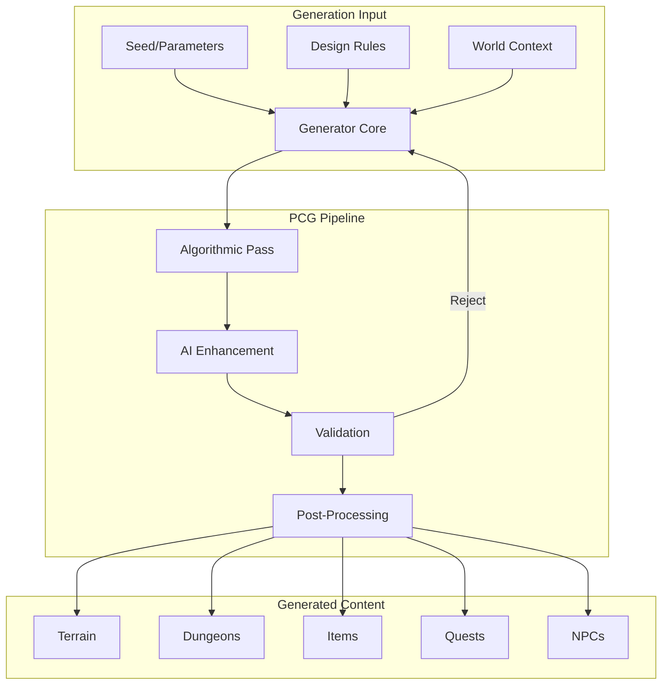

# Procedural Content Generation

AstraWeave's PCG system combines traditional algorithmic generation with AI-driven content creation, enabling infinite variety while maintaining coherent, designer-guided output.

## Architecture Overview



## Core PCG Framework

### Generator Trait

Define the common interface for all generators:

```rust
use astraweave_ecs::prelude::*;
use std::hash::{Hash, Hasher};

pub trait Generator<T> {
    fn generate(&self, params: &GenerationParams) -> GenerationResult<T>;
    fn validate(&self, output: &T, params: &GenerationParams) -> ValidationResult;
    fn seed_from_hash<H: Hash>(&self, hashable: H) -> u64;
}

#[derive(Debug, Clone)]
pub struct GenerationParams {
    pub seed: u64,
    pub difficulty: f32,
    pub density: f32,
    pub theme: String,
    pub constraints: Vec<GenerationConstraint>,
    pub context: GenerationContext,
}

#[derive(Debug, Clone)]
pub struct GenerationContext {
    pub world_position: Vec3,
    pub biome: String,
    pub player_level: u32,
    pub story_stage: String,
    pub nearby_content: Vec<String>,
}

#[derive(Debug, Clone)]
pub enum GenerationConstraint {
    MinSize(f32),
    MaxSize(f32),
    MustContain(String),
    MustNotContain(String),
    ConnectTo(Vec3),
    StyleMatch(String),
    Custom { name: String, value: String },
}

pub type GenerationResult<T> = Result<T, GenerationError>;

#[derive(Debug)]
pub enum GenerationError {
    InvalidParams(String),
    ConstraintViolation(String),
    MaxIterationsReached,
    ValidationFailed(String),
}

#[derive(Debug)]
pub enum ValidationResult {
    Valid,
    Invalid(String),
    NeedsAdjustment(Vec<String>),
}
```

### Seeded Random Generator

Deterministic random number generation:

```rust
use rand::{Rng, SeedableRng};
use rand_chacha::ChaCha8Rng;

pub struct SeededRng {
    rng: ChaCha8Rng,
    initial_seed: u64,
}

impl SeededRng {
    pub fn new(seed: u64) -> Self {
        Self {
            rng: ChaCha8Rng::seed_from_u64(seed),
            initial_seed: seed,
        }
    }
    
    pub fn from_position(x: i32, y: i32, z: i32, world_seed: u64) -> Self {
        let position_hash = ((x as u64) << 42) ^ ((y as u64) << 21) ^ (z as u64);
        Self::new(world_seed ^ position_hash)
    }
    
    pub fn next_float(&mut self) -> f32 {
        self.rng.gen()
    }
    
    pub fn next_range(&mut self, min: i32, max: i32) -> i32 {
        self.rng.gen_range(min..=max)
    }
    
    pub fn next_float_range(&mut self, min: f32, max: f32) -> f32 {
        self.rng.gen_range(min..=max)
    }
    
    pub fn choose<T: Clone>(&mut self, options: &[T]) -> Option<T> {
        if options.is_empty() {
            None
        } else {
            let index = self.rng.gen_range(0..options.len());
            Some(options[index].clone())
        }
    }
    
    pub fn weighted_choose<T: Clone>(&mut self, options: &[(T, f32)]) -> Option<T> {
        let total_weight: f32 = options.iter().map(|(_, w)| w).sum();
        let mut roll = self.next_float() * total_weight;
        
        for (item, weight) in options {
            roll -= weight;
            if roll <= 0.0 {
                return Some(item.clone());
            }
        }
        
        options.last().map(|(item, _)| item.clone())
    }
    
    pub fn fork(&mut self) -> Self {
        Self::new(self.rng.gen())
    }
}
```

## Terrain Generation

### Heightmap Generator

Generate terrain heightmaps with noise:

```rust
use noise::{NoiseFn, Perlin, Fbm, MultiFractal};

pub struct TerrainGenerator {
    base_noise: Fbm<Perlin>,
    detail_noise: Perlin,
    erosion_passes: u32,
}

impl TerrainGenerator {
    pub fn new(seed: u64) -> Self {
        let mut fbm = Fbm::new(seed as u32);
        fbm.octaves = 6;
        fbm.frequency = 0.005;
        fbm.lacunarity = 2.0;
        fbm.persistence = 0.5;
        
        Self {
            base_noise: fbm,
            detail_noise: Perlin::new(seed as u32 + 1),
            erosion_passes: 50,
        }
    }
    
    pub fn generate_chunk(&self, chunk_x: i32, chunk_z: i32, size: usize) -> Heightmap {
        let mut heights = vec![vec![0.0f32; size]; size];
        
        for z in 0..size {
            for x in 0..size {
                let world_x = (chunk_x * size as i32 + x as i32) as f64;
                let world_z = (chunk_z * size as i32 + z as i32) as f64;
                
                let base = self.base_noise.get([world_x, world_z]) as f32;
                
                let detail = self.detail_noise.get([world_x * 0.1, world_z * 0.1]) as f32 * 0.1;
                
                heights[z][x] = (base + detail + 1.0) * 0.5 * 256.0;
            }
        }
        
        self.apply_erosion(&mut heights);
        
        Heightmap {
            data: heights,
            chunk_x,
            chunk_z,
            size,
        }
    }
    
    fn apply_erosion(&self, heights: &mut Vec<Vec<f32>>) {
        let size = heights.len();
        let mut water = vec![vec![0.0f32; size]; size];
        let mut sediment = vec![vec![0.0f32; size]; size];
        
        for _ in 0..self.erosion_passes {
            for z in 1..size - 1 {
                for x in 1..size - 1 {
                    let current = heights[z][x];
                    
                    let neighbors = [
                        (heights[z - 1][x], 0, -1),
                        (heights[z + 1][x], 0, 1),
                        (heights[z][x - 1], -1, 0),
                        (heights[z][x + 1], 1, 0),
                    ];
                    
                    if let Some((lowest, dx, dz)) = neighbors
                        .iter()
                        .filter(|(h, _, _)| *h < current)
                        .min_by(|a, b| a.0.partial_cmp(&b.0).unwrap())
                    {
                        let diff = current - lowest;
                        let transfer = diff * 0.1;
                        
                        heights[z][x] -= transfer * 0.5;
                        heights[(z as i32 + dz) as usize][(x as i32 + dx) as usize] += transfer * 0.3;
                    }
                }
            }
        }
    }
}

#[derive(Debug)]
pub struct Heightmap {
    pub data: Vec<Vec<f32>>,
    pub chunk_x: i32,
    pub chunk_z: i32,
    pub size: usize,
}

impl Heightmap {
    pub fn get_height(&self, x: usize, z: usize) -> f32 {
        self.data.get(z).and_then(|row| row.get(x)).copied().unwrap_or(0.0)
    }
    
    pub fn get_normal(&self, x: usize, z: usize) -> Vec3 {
        let h_l = self.get_height(x.saturating_sub(1), z);
        let h_r = self.get_height((x + 1).min(self.size - 1), z);
        let h_d = self.get_height(x, z.saturating_sub(1));
        let h_u = self.get_height(x, (z + 1).min(self.size - 1));
        
        Vec3::new(h_l - h_r, 2.0, h_d - h_u).normalize()
    }
}
```

### Biome Assignment

Assign biomes based on terrain properties:

```rust
#[derive(Debug, Clone, Copy, PartialEq, Eq, Hash)]
pub enum Biome {
    Ocean,
    Beach,
    Plains,
    Forest,
    Desert,
    Tundra,
    Mountains,
    Swamp,
    Jungle,
    Volcanic,
}

pub struct BiomeGenerator {
    temperature_noise: Perlin,
    moisture_noise: Perlin,
}

impl BiomeGenerator {
    pub fn new(seed: u64) -> Self {
        Self {
            temperature_noise: Perlin::new(seed as u32 + 100),
            moisture_noise: Perlin::new(seed as u32 + 200),
        }
    }
    
    pub fn get_biome(&self, x: f64, z: f64, height: f32) -> Biome {
        if height < 10.0 {
            return Biome::Ocean;
        }
        if height < 15.0 {
            return Biome::Beach;
        }
        if height > 200.0 {
            return Biome::Mountains;
        }
        
        let temp = (self.temperature_noise.get([x * 0.001, z * 0.001]) + 1.0) * 0.5;
        let moisture = (self.moisture_noise.get([x * 0.001, z * 0.001]) + 1.0) * 0.5;
        
        let temp = temp as f32 - (height - 50.0) * 0.002;
        
        match (temp, moisture as f32) {
            (t, _) if t < 0.2 => Biome::Tundra,
            (t, m) if t > 0.8 && m < 0.3 => Biome::Desert,
            (t, m) if t > 0.7 && m > 0.7 => Biome::Jungle,
            (_, m) if m > 0.8 => Biome::Swamp,
            (_, m) if m > 0.5 => Biome::Forest,
            _ => Biome::Plains,
        }
    }
    
    pub fn get_biome_properties(&self, biome: Biome) -> BiomeProperties {
        match biome {
            Biome::Ocean => BiomeProperties {
                tree_density: 0.0,
                grass_density: 0.0,
                rock_density: 0.1,
                enemy_level_mod: 0.8,
                ambient_sound: "ocean".into(),
            },
            Biome::Forest => BiomeProperties {
                tree_density: 0.7,
                grass_density: 0.8,
                rock_density: 0.2,
                enemy_level_mod: 1.0,
                ambient_sound: "forest".into(),
            },
            Biome::Desert => BiomeProperties {
                tree_density: 0.02,
                grass_density: 0.05,
                rock_density: 0.4,
                enemy_level_mod: 1.2,
                ambient_sound: "desert".into(),
            },
            Biome::Mountains => BiomeProperties {
                tree_density: 0.1,
                grass_density: 0.2,
                rock_density: 0.8,
                enemy_level_mod: 1.5,
                ambient_sound: "wind".into(),
            },
            _ => BiomeProperties::default(),
        }
    }
}

#[derive(Debug, Clone)]
pub struct BiomeProperties {
    pub tree_density: f32,
    pub grass_density: f32,
    pub rock_density: f32,
    pub enemy_level_mod: f32,
    pub ambient_sound: String,
}
```

## Dungeon Generation

### Room-Based Dungeon Generator

Generate dungeons using room placement:

```rust
#[derive(Debug, Clone)]
pub struct DungeonLayout {
    pub rooms: Vec<Room>,
    pub corridors: Vec<Corridor>,
    pub entry_room: usize,
    pub boss_room: usize,
    pub width: i32,
    pub height: i32,
}

#[derive(Debug, Clone)]
pub struct Room {
    pub id: usize,
    pub bounds: Rect,
    pub room_type: RoomType,
    pub connections: Vec<usize>,
    pub content: RoomContent,
}

#[derive(Debug, Clone, Copy, PartialEq)]
pub enum RoomType {
    Entry,
    Normal,
    Treasure,
    Boss,
    Secret,
    Shop,
    Shrine,
}

#[derive(Debug, Clone)]
pub struct RoomContent {
    pub enemies: Vec<EnemySpawn>,
    pub items: Vec<ItemSpawn>,
    pub props: Vec<PropSpawn>,
    pub triggers: Vec<TriggerSpawn>,
}

#[derive(Debug, Clone)]
pub struct Corridor {
    pub from_room: usize,
    pub to_room: usize,
    pub path: Vec<(i32, i32)>,
    pub width: i32,
}

pub struct DungeonGenerator {
    min_rooms: usize,
    max_rooms: usize,
    room_size_range: (i32, i32),
    room_templates: Vec<RoomTemplate>,
}

impl DungeonGenerator {
    pub fn generate(&self, params: &GenerationParams) -> GenerationResult<DungeonLayout> {
        let mut rng = SeededRng::new(params.seed);
        let room_count = rng.next_range(self.min_rooms as i32, self.max_rooms as i32) as usize;
        
        let mut rooms = Vec::new();
        let mut attempts = 0;
        let max_attempts = room_count * 100;
        
        while rooms.len() < room_count && attempts < max_attempts {
            let width = rng.next_range(self.room_size_range.0, self.room_size_range.1);
            let height = rng.next_range(self.room_size_range.0, self.room_size_range.1);
            let x = rng.next_range(0, 100 - width);
            let y = rng.next_range(0, 100 - height);
            
            let bounds = Rect { x, y, width, height };
            
            if !rooms.iter().any(|r: &Room| r.bounds.intersects_padded(&bounds, 2)) {
                let room_type = if rooms.is_empty() {
                    RoomType::Entry
                } else {
                    self.choose_room_type(&mut rng, rooms.len(), room_count)
                };
                
                rooms.push(Room {
                    id: rooms.len(),
                    bounds,
                    room_type,
                    connections: Vec::new(),
                    content: RoomContent::default(),
                });
            }
            
            attempts += 1;
        }
        
        if rooms.len() < self.min_rooms {
            return Err(GenerationError::MaxIterationsReached);
        }
        
        let corridors = self.connect_rooms(&mut rooms, &mut rng);
        
        let boss_room = rooms.iter()
            .enumerate()
            .filter(|(_, r)| r.room_type != RoomType::Entry)
            .max_by_key(|(_, r)| self.distance_from_entry(&rooms, r.id))
            .map(|(i, _)| i)
            .unwrap_or(rooms.len() - 1);
        
        rooms[boss_room].room_type = RoomType::Boss;
        
        for room in &mut rooms {
            room.content = self.generate_room_content(room, params, &mut rng);
        }
        
        Ok(DungeonLayout {
            rooms,
            corridors,
            entry_room: 0,
            boss_room,
            width: 100,
            height: 100,
        })
    }
    
    fn connect_rooms(&self, rooms: &mut [Room], rng: &mut SeededRng) -> Vec<Corridor> {
        let mut corridors = Vec::new();
        let mut connected = vec![false; rooms.len()];
        connected[0] = true;
        
        while connected.iter().any(|&c| !c) {
            let mut best_pair = None;
            let mut best_dist = f32::MAX;
            
            for (i, room_a) in rooms.iter().enumerate() {
                if !connected[i] {
                    continue;
                }
                
                for (j, room_b) in rooms.iter().enumerate() {
                    if connected[j] {
                        continue;
                    }
                    
                    let dist = room_a.bounds.center_distance(&room_b.bounds);
                    if dist < best_dist {
                        best_dist = dist;
                        best_pair = Some((i, j));
                    }
                }
            }
            
            if let Some((from, to)) = best_pair {
                let path = self.create_corridor_path(
                    rooms[from].bounds.center(),
                    rooms[to].bounds.center(),
                    rng,
                );
                
                rooms[from].connections.push(to);
                rooms[to].connections.push(from);
                connected[to] = true;
                
                corridors.push(Corridor {
                    from_room: from,
                    to_room: to,
                    path,
                    width: 2,
                });
            } else {
                break;
            }
        }
        
        corridors
    }
    
    fn create_corridor_path(
        &self,
        start: (i32, i32),
        end: (i32, i32),
        rng: &mut SeededRng,
    ) -> Vec<(i32, i32)> {
        let mut path = Vec::new();
        let (mut x, mut y) = start;
        
        if rng.next_float() > 0.5 {
            while x != end.0 {
                path.push((x, y));
                x += (end.0 - x).signum();
            }
            while y != end.1 {
                path.push((x, y));
                y += (end.1 - y).signum();
            }
        } else {
            while y != end.1 {
                path.push((x, y));
                y += (end.1 - y).signum();
            }
            while x != end.0 {
                path.push((x, y));
                x += (end.0 - x).signum();
            }
        }
        
        path.push(end);
        path
    }
    
    fn choose_room_type(&self, rng: &mut SeededRng, current: usize, total: usize) -> RoomType {
        let options = [
            (RoomType::Normal, 10.0),
            (RoomType::Treasure, 2.0),
            (RoomType::Secret, 1.0),
            (RoomType::Shop, 1.5),
            (RoomType::Shrine, 1.0),
        ];
        
        rng.weighted_choose(&options).unwrap_or(RoomType::Normal)
    }
    
    fn generate_room_content(
        &self,
        room: &Room,
        params: &GenerationParams,
        rng: &mut SeededRng,
    ) -> RoomContent {
        let mut content = RoomContent::default();
        
        match room.room_type {
            RoomType::Entry => {}
            RoomType::Normal => {
                let enemy_count = rng.next_range(1, 4);
                for _ in 0..enemy_count {
                    content.enemies.push(EnemySpawn {
                        position: room.bounds.random_point(rng),
                        enemy_type: "skeleton".into(),
                        level: params.context.player_level,
                    });
                }
            }
            RoomType::Treasure => {
                content.items.push(ItemSpawn {
                    position: room.bounds.center(),
                    loot_table: "treasure_chest".into(),
                });
            }
            RoomType::Boss => {
                content.enemies.push(EnemySpawn {
                    position: room.bounds.center(),
                    enemy_type: "boss".into(),
                    level: params.context.player_level + 5,
                });
            }
            _ => {}
        }
        
        content
    }
}
```

## Item Generation

### Procedural Item Generator

Generate items with random properties:

```rust
#[derive(Debug, Clone)]
pub struct GeneratedItem {
    pub base_type: ItemBaseType,
    pub name: String,
    pub rarity: ItemRarity,
    pub level: u32,
    pub stats: ItemStats,
    pub affixes: Vec<ItemAffix>,
    pub special_ability: Option<SpecialAbility>,
}

#[derive(Debug, Clone)]
pub struct ItemStats {
    pub damage: Option<(f32, f32)>,
    pub armor: Option<f32>,
    pub durability: f32,
    pub weight: f32,
}

#[derive(Debug, Clone)]
pub struct ItemAffix {
    pub affix_type: AffixType,
    pub tier: u32,
    pub value: f32,
}

#[derive(Debug, Clone, Copy)]
pub enum AffixType {
    Strength,
    Agility,
    Intelligence,
    Vitality,
    FireDamage,
    IceDamage,
    LightningDamage,
    LifeSteal,
    CriticalChance,
    CriticalDamage,
    AttackSpeed,
    MovementSpeed,
}

pub struct ItemGenerator {
    name_generator: NameGenerator,
    affix_pool: Vec<AffixTemplate>,
}

impl ItemGenerator {
    pub fn generate(&self, params: &ItemGenParams, rng: &mut SeededRng) -> GeneratedItem {
        let rarity = self.roll_rarity(params.base_rarity_chance, rng);
        let affix_count = self.affix_count_for_rarity(rarity);
        
        let base = &params.base_type;
        let mut stats = self.roll_base_stats(base, params.level, rng);
        
        let mut affixes = Vec::new();
        for _ in 0..affix_count {
            if let Some(affix) = self.roll_affix(params.level, &affixes, rng) {
                affixes.push(affix);
            }
        }
        
        for affix in &affixes {
            self.apply_affix_to_stats(&mut stats, affix);
        }
        
        let special = if rarity >= ItemRarity::Epic && rng.next_float() > 0.5 {
            Some(self.generate_special_ability(params.level, rng))
        } else {
            None
        };
        
        let name = self.generate_name(base, &affixes, rarity, rng);
        
        GeneratedItem {
            base_type: base.clone(),
            name,
            rarity,
            level: params.level,
            stats,
            affixes,
            special_ability: special,
        }
    }
    
    fn roll_rarity(&self, base_chance: f32, rng: &mut SeededRng) -> ItemRarity {
        let roll = rng.next_float() * base_chance;
        match roll {
            r if r > 0.99 => ItemRarity::Legendary,
            r if r > 0.95 => ItemRarity::Epic,
            r if r > 0.85 => ItemRarity::Rare,
            r if r > 0.65 => ItemRarity::Uncommon,
            _ => ItemRarity::Common,
        }
    }
    
    fn affix_count_for_rarity(&self, rarity: ItemRarity) -> usize {
        match rarity {
            ItemRarity::Common => 0,
            ItemRarity::Uncommon => 1,
            ItemRarity::Rare => 2,
            ItemRarity::Epic => 3,
            ItemRarity::Legendary => 4,
        }
    }
    
    fn roll_affix(
        &self,
        level: u32,
        existing: &[ItemAffix],
        rng: &mut SeededRng,
    ) -> Option<ItemAffix> {
        let available: Vec<_> = self.affix_pool
            .iter()
            .filter(|a| a.min_level <= level)
            .filter(|a| !existing.iter().any(|e| e.affix_type == a.affix_type))
            .collect();
        
        if available.is_empty() {
            return None;
        }
        
        let template = rng.choose(&available)?;
        let tier = rng.next_range(1, template.max_tier as i32) as u32;
        let value = template.base_value * (1.0 + tier as f32 * 0.25);
        
        Some(ItemAffix {
            affix_type: template.affix_type,
            tier,
            value,
        })
    }
    
    fn generate_name(
        &self,
        base: &ItemBaseType,
        affixes: &[ItemAffix],
        rarity: ItemRarity,
        rng: &mut SeededRng,
    ) -> String {
        if rarity >= ItemRarity::Legendary {
            return self.name_generator.generate_legendary_name(base, rng);
        }
        
        let prefix = affixes.first().map(|a| self.affix_to_prefix(a));
        let suffix = affixes.get(1).map(|a| self.affix_to_suffix(a));
        
        match (prefix, suffix) {
            (Some(p), Some(s)) => format!("{} {} {}", p, base.display_name(), s),
            (Some(p), None) => format!("{} {}", p, base.display_name()),
            (None, Some(s)) => format!("{} {}", base.display_name(), s),
            (None, None) => base.display_name().to_string(),
        }
    }
}
```

## AI-Enhanced Generation

### LLM-Powered Content Creation

Use AI for narrative content:

```rust
use astraweave_llm::prelude::*;

pub struct AiContentGenerator {
    llm: LlmClient,
    templates: ContentTemplates,
}

impl AiContentGenerator {
    pub async fn generate_quest(
        &self,
        context: &QuestGenContext,
    ) -> Result<GeneratedQuest, GenerationError> {
        let prompt = format!(
            r#"Generate a side quest for a fantasy RPG.

Setting: {}
Player level: {}
Available NPCs: {}
Recent events: {}
Theme: {}

Generate a quest with:
1. Title (catchy, thematic)
2. Description (2-3 sentences)
3. Objectives (3-5 steps)
4. Rewards (appropriate for level)
5. Optional twist or complication

Return as JSON."#,
            context.location,
            context.player_level,
            context.available_npcs.join(", "),
            context.recent_events.join(", "),
            context.theme
        );
        
        let response = self.llm.complete(&prompt).await
            .map_err(|e| GenerationError::InvalidParams(e.to_string()))?;
        
        self.parse_quest_response(&response)
    }
    
    pub async fn generate_npc_backstory(
        &self,
        npc: &NpcGenContext,
    ) -> Result<NpcBackstory, GenerationError> {
        let prompt = format!(
            r#"Create a backstory for an NPC in a fantasy game.

Name: {}
Role: {}
Location: {}
Personality traits: {}

Generate:
1. Background (2-3 sentences)
2. Current motivation
3. Secret or hidden aspect
4. Connection to the world
5. Speech mannerism

Keep responses concise and game-appropriate."#,
            npc.name,
            npc.role,
            npc.location,
            npc.personality_traits.join(", ")
        );
        
        let response = self.llm.complete(&prompt).await
            .map_err(|e| GenerationError::InvalidParams(e.to_string()))?;
        
        self.parse_npc_response(&response)
    }
    
    pub async fn generate_location_description(
        &self,
        location: &LocationGenContext,
    ) -> Result<LocationDescription, GenerationError> {
        let prompt = format!(
            r#"Describe a location for a fantasy game.

Type: {}
Biome: {}
Key features: {}
Mood: {}

Provide:
1. Name (evocative)
2. Short description (1 sentence for UI)
3. Full description (2-3 sentences for exploration)
4. Notable elements (3-5 items)
5. Ambient sounds suggestion"#,
            location.location_type,
            location.biome,
            location.features.join(", "),
            location.mood
        );
        
        let response = self.llm.complete(&prompt).await
            .map_err(|e| GenerationError::InvalidParams(e.to_string()))?;
        
        self.parse_location_response(&response)
    }
}

#[derive(Debug)]
pub struct GeneratedQuest {
    pub title: String,
    pub description: String,
    pub objectives: Vec<QuestObjective>,
    pub rewards: Vec<QuestReward>,
    pub twist: Option<String>,
}

#[derive(Debug)]
pub struct NpcBackstory {
    pub background: String,
    pub motivation: String,
    pub secret: String,
    pub world_connection: String,
    pub speech_pattern: String,
}
```

## Validation and Constraints

### Content Validator

Ensure generated content meets requirements:

```rust
pub struct ContentValidator {
    rules: Vec<ValidationRule>,
}

pub enum ValidationRule {
    MinRooms(usize),
    MaxDeadEnds(usize),
    RequireRoomType(RoomType),
    MaxDifficulty(f32),
    Connectivity,
    NoOverlap,
    Custom(Box<dyn Fn(&DungeonLayout) -> ValidationResult>),
}

impl ContentValidator {
    pub fn validate_dungeon(&self, dungeon: &DungeonLayout) -> ValidationResult {
        for rule in &self.rules {
            match rule {
                ValidationRule::MinRooms(min) => {
                    if dungeon.rooms.len() < *min {
                        return ValidationResult::Invalid(
                            format!("Too few rooms: {} < {}", dungeon.rooms.len(), min)
                        );
                    }
                }
                ValidationRule::MaxDeadEnds(max) => {
                    let dead_ends = dungeon.rooms
                        .iter()
                        .filter(|r| r.connections.len() <= 1)
                        .count();
                    if dead_ends > *max {
                        return ValidationResult::Invalid(
                            format!("Too many dead ends: {} > {}", dead_ends, max)
                        );
                    }
                }
                ValidationRule::RequireRoomType(room_type) => {
                    if !dungeon.rooms.iter().any(|r| r.room_type == *room_type) {
                        return ValidationResult::Invalid(
                            format!("Missing required room type: {:?}", room_type)
                        );
                    }
                }
                ValidationRule::Connectivity => {
                    if !self.check_connectivity(dungeon) {
                        return ValidationResult::Invalid("Dungeon is not fully connected".into());
                    }
                }
                _ => {}
            }
        }
        
        ValidationResult::Valid
    }
    
    fn check_connectivity(&self, dungeon: &DungeonLayout) -> bool {
        if dungeon.rooms.is_empty() {
            return true;
        }
        
        let mut visited = vec![false; dungeon.rooms.len()];
        let mut stack = vec![0usize];
        
        while let Some(current) = stack.pop() {
            if visited[current] {
                continue;
            }
            visited[current] = true;
            
            for &connected in &dungeon.rooms[current].connections {
                if !visited[connected] {
                    stack.push(connected);
                }
            }
        }
        
        visited.iter().all(|&v| v)
    }
}
```

## Best Practices

```admonish tip title="PCG Design Tips"
1. **Seed Everything**: Use deterministic RNG for reproducible generation
2. **Validate Early**: Reject invalid content before expensive operations
3. **Layer Generation**: Start coarse, refine with detail passes
4. **Cache Results**: Store expensive generation results for reuse
```

```admonish warning title="Common Pitfalls"
- **Infinite Loops**: Always limit generation attempts
- **Memory Bloat**: Stream large content; don't hold everything in memory
- **Sameness**: Vary parameters enough to feel unique
- **Performance**: Profile generation; move to background threads if slow
```

## Related Documentation

- [Terrain System](../core-systems/terrain.md) - Terrain rendering integration
- [Quest Systems](../core-systems/quests.md) - Generated quest execution
- [AI System Overview](../core-systems/ai/index.md) - AI content enhancement
- [Configuration Reference](../reference/configuration.md) - PCG parameters
