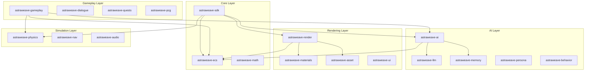
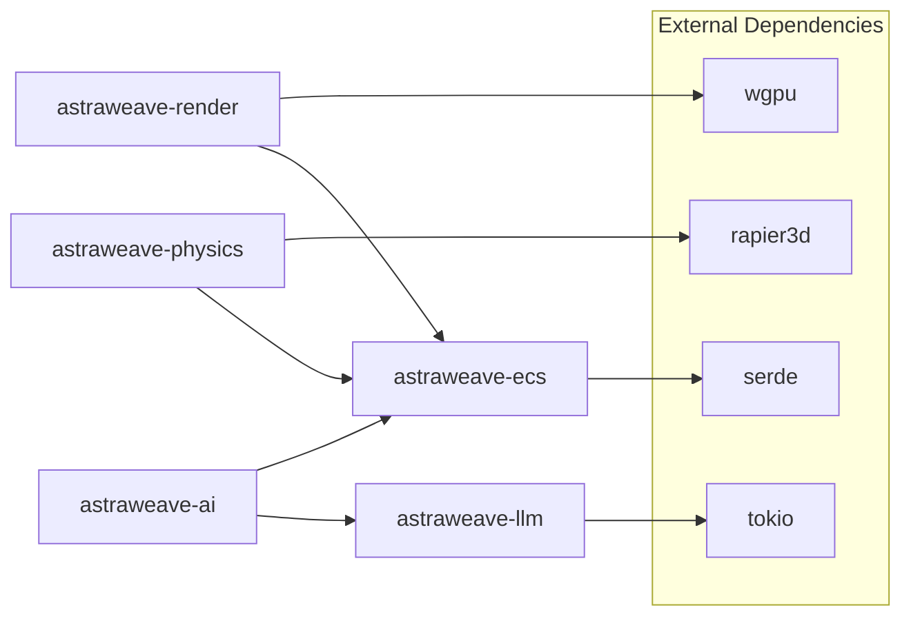

# Crate Reference

AstraWeave is organized as a workspace of interconnected crates, each providing focused functionality. This reference documents the crate hierarchy, dependencies, and public APIs.

## Workspace Overview



## Core Crates

### astraweave-ecs

The foundation Entity Component System providing deterministic, high-performance entity management.

```toml
[dependencies]
astraweave-ecs = "0.1"
```

**Key Types:**

| Type | Description |
|------|-------------|
| `World` | Container for all entities, components, and resources |
| `Entity` | Lightweight identifier for game objects |
| `Component` | Data attached to entities (derive macro available) |
| `Resource` | Singleton data shared across systems |
| `Query` | Efficient iteration over component combinations |
| `Commands` | Deferred entity/component modifications |

**Example:**

```rust
use astraweave_ecs::prelude::*;

#[derive(Component)]
struct Position(Vec3);

#[derive(Component)]
struct Velocity(Vec3);

fn movement_system(mut query: Query<(&mut Position, &Velocity)>) {
    for (mut pos, vel) in query.iter_mut() {
        pos.0 += vel.0;
    }
}
```

**Features:**
- `parallel` - Enable parallel system execution (default)
- `tracing` - Add performance tracing instrumentation
- `serde` - Serialization support for components

---

### astraweave-math

Mathematics library optimized for game development with SIMD acceleration.

```toml
[dependencies]
astraweave-math = "0.1"
```

**Key Types:**

| Type | Description |
|------|-------------|
| `Vec2`, `Vec3`, `Vec4` | Vector types with operator overloading |
| `Mat3`, `Mat4` | Matrix types for transforms |
| `Quat` | Quaternion for rotations |
| `Transform` | Position + rotation + scale |
| `Aabb` | Axis-aligned bounding box |
| `Ray` | Ray for intersection tests |

**Example:**

```rust
use astraweave_math::prelude::*;

let pos = Vec3::new(1.0, 2.0, 3.0);
let rotation = Quat::from_axis_angle(Vec3::Y, 45.0_f32.to_radians());
let transform = Transform::from_translation(pos).with_rotation(rotation);

let world_pos = transform.transform_point(Vec3::ZERO);
```

---

### astraweave-sdk

High-level SDK that re-exports commonly used types and provides convenience APIs.

```toml
[dependencies]
astraweave-sdk = "0.1"
```

**Re-exports:**

```rust
pub use astraweave_ecs::prelude::*;
pub use astraweave_ai::prelude::*;
pub use astraweave_render::prelude::*;
pub use astraweave_physics::prelude::*;
pub use astraweave_audio::prelude::*;
pub use astraweave_input::prelude::*;
```

**App Builder:**

```rust
use astraweave_sdk::prelude::*;

fn main() {
    App::new()
        .add_plugin(DefaultPlugins)
        .add_startup_system(setup)
        .add_system(game_logic)
        .run();
}
```

## AI Crates

### astraweave-ai

Core AI framework with perception, planning, and behavior systems.

```toml
[dependencies]
astraweave-ai = "0.1"
```

**Key Types:**

| Type | Description |
|------|-------------|
| `AiAgent` | AI-controlled entity component |
| `PerceptionBus` | Sensory input aggregation |
| `Planner` | Goal-oriented action planning |
| `BehaviorTree` | Behavior tree execution |
| `Blackboard` | Shared AI state storage |
| `AiTool` | Tool definition for LLM agents |

**Example:**

```rust
use astraweave_ai::prelude::*;

let mut agent = AiAgent::new()
    .with_perception_radius(50.0)
    .with_tick_budget_ms(8);

agent.add_goal(AiGoal::Patrol { 
    waypoints: vec![point_a, point_b, point_c] 
});
```

**Features:**
- `llm` - Enable LLM integration (requires `astraweave-llm`)
- `goap` - Goal-Oriented Action Planning
- `utility` - Utility AI scoring system

---

### astraweave-llm

LLM integration for AI agents with tool calling and validation.

```toml
[dependencies]
astraweave-llm = "0.1"
```

**Key Types:**

| Type | Description |
|------|-------------|
| `LlmClient` | HTTP client for LLM endpoints |
| `LlmConfig` | Configuration for model and endpoint |
| `ToolCall` | Structured tool invocation from LLM |
| `ToolResult` | Validated tool execution result |
| `PromptBuilder` | Fluent prompt construction |

**Example:**

```rust
use astraweave_llm::prelude::*;

let config = LlmConfig {
    endpoint: "http://localhost:11434".into(),
    model: "hermes2-pro-mistral".into(),
    temperature: 0.7,
    max_tokens: 256,
};

let client = LlmClient::new(config);
let response = client.complete("What should I do next?").await?;
```

**Supported Backends:**
- Ollama (local)
- OpenAI-compatible APIs
- Custom endpoints

---

### astraweave-memory

Memory systems for AI agents including short-term, long-term, and episodic memory.

```toml
[dependencies]
astraweave-memory = "0.1"
```

**Key Types:**

| Type | Description |
|------|-------------|
| `MemoryStore` | Central memory management |
| `ShortTermMemory` | Recent observations with decay |
| `LongTermMemory` | Persistent important memories |
| `EpisodicMemory` | Event sequences and narratives |
| `MemoryQuery` | Semantic memory retrieval |

---

### astraweave-behavior

Behavior tree implementation with visual editor support.

```toml
[dependencies]
astraweave-behavior = "0.1"
```

**Node Types:**

| Category | Nodes |
|----------|-------|
| Composite | `Sequence`, `Selector`, `Parallel`, `RandomSelector` |
| Decorator | `Inverter`, `Repeater`, `Succeeder`, `UntilFail` |
| Leaf | `Action`, `Condition`, `Wait`, `SubTree` |

**Example:**

```rust
use astraweave_behavior::prelude::*;

let tree = BehaviorTree::new(
    Selector::new(vec![
        Sequence::new(vec![
            Condition::new("has_target"),
            Action::new("attack_target"),
        ]).into(),
        Action::new("patrol").into(),
    ])
);
```

## Rendering Crates

### astraweave-render

GPU rendering with Vulkan/DX12/Metal backends via wgpu.

```toml
[dependencies]
astraweave-render = "0.1"
```

**Key Types:**

| Type | Description |
|------|-------------|
| `Renderer` | Main rendering context |
| `RenderPass` | Configurable render pass |
| `Mesh` | Vertex/index buffer pair |
| `Material` | Surface properties and shaders |
| `Camera` | View and projection configuration |
| `Light` | Point, directional, spot lights |

**Features:**
- `pbr` - Physically-based rendering (default)
- `shadows` - Shadow mapping with CSM
- `post-process` - Bloom, SSAO, tone mapping
- `skeletal` - Skeletal animation

---

### astraweave-materials

PBR material system with shader graph support.

```toml
[dependencies]
astraweave-materials = "0.1"
```

**Material Properties:**

| Property | Type | Description |
|----------|------|-------------|
| `albedo` | `Color` or `Texture` | Base color |
| `metallic` | `f32` or `Texture` | Metallic factor (0-1) |
| `roughness` | `f32` or `Texture` | Surface roughness (0-1) |
| `normal` | `Texture` | Normal map |
| `emission` | `Color` | Emissive color |
| `ao` | `Texture` | Ambient occlusion |

---

### astraweave-asset

Asset loading, caching, and hot-reloading.

```toml
[dependencies]
astraweave-asset = "0.1"
```

**Key Types:**

| Type | Description |
|------|-------------|
| `AssetServer` | Async asset loading |
| `Handle<T>` | Reference-counted asset handle |
| `AssetLoader` | Custom loader trait |
| `AssetEvent` | Load/unload notifications |

**Supported Formats:**
- **Meshes**: glTF 2.0, OBJ, FBX
- **Textures**: PNG, JPEG, KTX2, DDS
- **Audio**: WAV, OGG, MP3
- **Fonts**: TTF, OTF

---

### astraweave-ui

Immediate-mode UI with retained state for game interfaces.

```toml
[dependencies]
astraweave-ui = "0.1"
```

**Key Types:**

| Type | Description |
|------|-------------|
| `UiContext` | UI state and input handling |
| `Widget` | Base widget trait |
| `Layout` | Flexbox-style layout |
| `Style` | Visual styling properties |

**Built-in Widgets:**
- `Button`, `Label`, `TextInput`
- `Slider`, `Checkbox`, `RadioGroup`
- `Panel`, `ScrollView`, `Modal`
- `ProgressBar`, `Tooltip`

## Simulation Crates

### astraweave-physics

3D physics with Rapier backend.

```toml
[dependencies]
astraweave-physics = "0.1"
```

**Key Types:**

| Type | Description |
|------|-------------|
| `RigidBody` | Dynamic, kinematic, or static body |
| `Collider` | Collision shape |
| `PhysicsWorld` | Physics simulation context |
| `RayCast` | Ray intersection queries |
| `Joint` | Constraints between bodies |

**Collider Shapes:**
- `Ball`, `Cuboid`, `Capsule`, `Cylinder`
- `ConvexHull`, `TriMesh`, `HeightField`
- `Compound` (multiple shapes)

---

### astraweave-nav

Navigation mesh and pathfinding.

```toml
[dependencies]
astraweave-nav = "0.1"
```

**Key Types:**

| Type | Description |
|------|-------------|
| `NavMesh` | Navigation mesh geometry |
| `NavAgent` | Pathfinding agent component |
| `PathQuery` | Path computation request |
| `NavObstacle` | Dynamic obstacle |

**Features:**
- A* pathfinding with string pulling
- Dynamic obstacle avoidance
- Off-mesh links for jumps/ladders
- Hierarchical pathfinding for large worlds

---

### astraweave-audio

Spatial audio with multiple backends.

```toml
[dependencies]
astraweave-audio = "0.1"
```

**Key Types:**

| Type | Description |
|------|-------------|
| `AudioSource` | Positional audio emitter |
| `AudioListener` | Spatial audio receiver |
| `AudioClip` | Loaded audio data |
| `Mixer` | Audio mixing and effects |

**Features:**
- 3D spatial audio with HRTF
- Reverb zones
- Audio occlusion
- Streaming for music

## Gameplay Crates

### astraweave-gameplay

High-level gameplay systems and components.

```toml
[dependencies]
astraweave-gameplay = "0.1"
```

**Systems:**
- Combat and damage
- Inventory management
- Status effects
- Interactable objects
- Save/load integration

---

### astraweave-dialogue

Dialogue tree and conversation systems.

```toml
[dependencies]
astraweave-dialogue = "0.1"
```

**Key Types:**

| Type | Description |
|------|-------------|
| `DialogueTree` | Branching conversation graph |
| `DialogueNode` | Single dialogue entry |
| `DialogueController` | Runtime dialogue state |
| `DynamicDialogue` | LLM-powered conversations |

---

### astraweave-quests

Quest tracking and objective systems.

```toml
[dependencies]
astraweave-quests = "0.1"
```

**Key Types:**

| Type | Description |
|------|-------------|
| `Quest` | Quest definition |
| `QuestLog` | Player's active quests |
| `Objective` | Quest goal/task |
| `QuestEvent` | Quest state changes |

---

### astraweave-pcg

Procedural content generation framework.

```toml
[dependencies]
astraweave-pcg = "0.1"
```

**Generators:**
- Terrain heightmaps with erosion
- Dungeon layouts
- Item properties
- NPC backstories (AI-enhanced)
- Quest generation (AI-enhanced)

## Tool Crates

### aw_editor

Visual editor for scenes, behavior trees, and materials.

```bash
cargo run -p aw_editor
```

**Features:**
- Scene hierarchy view
- Component inspector
- Behavior tree editor
- Material graph editor
- Asset browser

---

### aw_asset_cli

Command-line asset processing.

```bash
cargo run -p aw_asset_cli -- --help
```

**Commands:**
- `import` - Convert assets to engine format
- `pack` - Create asset bundles
- `validate` - Check asset integrity
- `optimize` - Compress and optimize assets

---

### aw_debug

Runtime debugging tools.

```toml
[dependencies]
aw_debug = "0.1"
```

**Features:**
- Entity inspector overlay
- Performance graphs
- Physics debug visualization
- AI state visualization
- Console commands

## Feature Flags Summary

| Crate | Feature | Description |
|-------|---------|-------------|
| `astraweave-ecs` | `parallel` | Parallel system execution |
| `astraweave-ecs` | `tracing` | Performance instrumentation |
| `astraweave-ai` | `llm` | LLM integration |
| `astraweave-ai` | `goap` | Goal-oriented planning |
| `astraweave-render` | `pbr` | PBR materials |
| `astraweave-render` | `shadows` | Shadow mapping |
| `astraweave-physics` | `debug-render` | Physics visualization |
| `astraweave-audio` | `spatial` | 3D audio |

## Dependency Graph



## Related Documentation

- [Getting Started](../getting-started/installation.md) - Initial setup
- [Configuration Reference](configuration.md) - Runtime configuration
- [Building from Source](../dev/building.md) - Build instructions
- [Contributing](../dev/contributing.md) - Development guidelines
